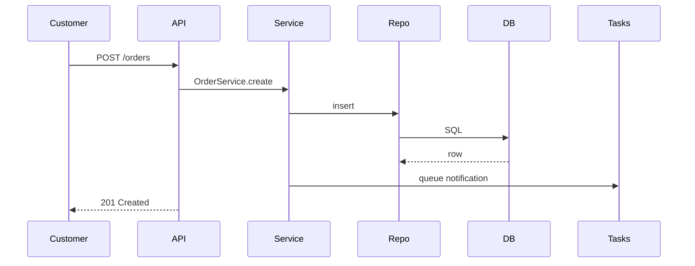

# Documentation Rules

## Principle

**Documentation lives next to code.** A feature is not done until its docs are updated.

## What to document

| Type                       | Where                                          |
| -------------------------- | ---------------------------------------------- |
| High-level architecture    | `docs/architecture/`                           |
| API endpoints (auto)       | FastAPI OpenAPI + `docs/api/`                  |
| Database schema            | `docs/database/`                               |
| Feature spec               | `docs/features/<feature>.md`                   |
| UI/UX guidelines           | `docs/ui-ux/`                                  |
| Business logic / rules     | `docs/business/`                               |
| Security model             | `docs/security/`                               |
| Testing strategy           | `docs/testing/`                                |
| Deployment runbooks        | `docs/deployment/`                             |
| Decisions (ADRs)           | `docs/decisions/ADR-<NNN>-<slug>.md`           |
| Roadmap                    | `docs/roadmap/`                                |
| Implementation tracker     | `logs/`                                        |

## Markdown style

- ATX headings (`#`, `##`, `###`).
- One H1 per file.
- Use tables for matrices, lists for enumerations.
- Code blocks always tagged with language.
- Internal links relative; external links absolute.
- Keep line length under 100 chars when comfortable.

## Per-feature doc template

```md
# <Feature name>

## Summary
One paragraph.

## Goals
- Bullet
- Bullet

## Non-goals
- Bullet
- Bullet

## User stories
- As a <persona>, I want to <action>, so that <outcome>.

## UX flow
Diagram / steps.

## API surface
- `POST /api/v1/...`
- `GET /api/v1/...`

## Data model
ERD / schema changes.

## Edge cases
- ...

## Metrics / acceptance criteria
- ...

## Open questions
- ...
```

## ADR (Architectural Decision Record)

```md
# ADR-<NNN>: <Title>

- Status: proposed | accepted | superseded
- Date: YYYY-MM-DD
- Deciders: <names>
- Related: ADR-XXX, issue #YYY

## Context
What forced the decision.

## Options considered
1. Option A — pros / cons
2. Option B — pros / cons
3. Option C — pros / cons

## Decision
What we picked and why.

## Consequences
Good and bad.
```

## Code-level docs

### Python docstrings (Google style)

```python
async def cancel_order(self, order_id: UUID, *, reason: str) -> Order:
    """Cancel an order if within the cancellation window.

    Args:
        order_id: Order identifier.
        reason: Customer-provided reason; logged for audit.

    Returns:
        The updated Order with status="cancelled".

    Raises:
        OrderNotFoundError: If no such order.
        OrderInvalidTransitionError: If the order can't be cancelled.
    """
```

### TS doc comments

```ts
/**
 * Returns the next status in the order lifecycle.
 *
 * @throws Will throw if `current` is a terminal status.
 */
export function nextOrderStatus(current: OrderStatus): OrderStatus { ... }
```

## README per package

Each workspace has its own README:

- `backend/README.md` — setup, scripts, project layout
- `frontend/README.md` — setup, scripts, project layout
- `docker/README.md` — image purposes
- `infrastructure/README.md` — provider configs
- `scripts/README.md` — what each script does

## Diagrams

- Prefer **Mermaid** in markdown for sequence/flow/ERDs.
- For richer visuals, store source (`*.excalidraw`, `*.draw.io`) under `docs/architecture/diagrams/`.



## What to update on every change

| Change kind                  | Update                                                   |
| ---------------------------- | -------------------------------------------------------- |
| New endpoint                 | `docs/api/`, `logs/implementation-log.md`                |
| Schema change                | `docs/database/schema.md`, ADR if structural             |
| New feature                  | `docs/features/<f>.md`, `logs/feature-progress.md`       |
| UI pattern change            | `docs/ui-ux/`                                            |
| Security change              | `docs/security/`, `logs/security-log.md`                 |
| Deployment / infra change    | `docs/deployment/`, `logs/deployment-log.md`             |
| Refactor                     | `logs/refactor-log.md`                                   |
| Perf improvement             | `logs/performance-log.md`                                |

## Style guide

- Active voice. "We use…" not "It is used…".
- Concrete > abstract. Examples > prose.
- Don't repeat what's in code. Explain the **why**.
- No marketing language inside engineering docs.

## Reviewing docs

- Treat doc PRs like code PRs.
- Lint with `markdownlint`.
- Check links with `lychee` in CI.
