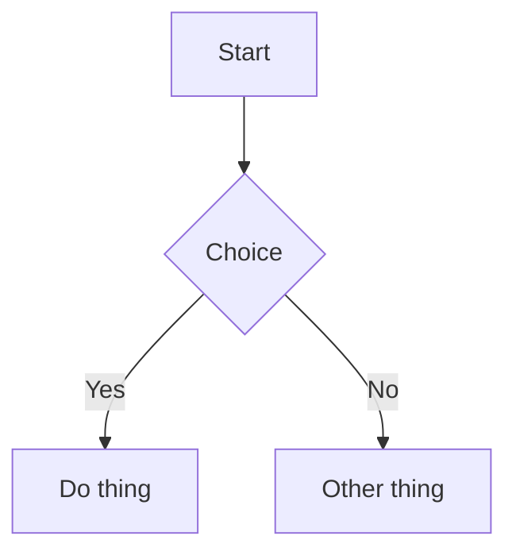
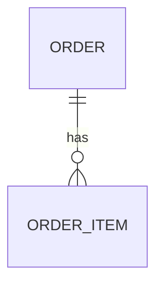

# Feature: <Feature name>

> Status: draft | in-progress | shipped
> Owner: <name / agent>
> Last updated: YYYY-MM-DD

## Problem

One paragraph describing the user problem. No technical talk.

## Persona

Customer / Partner / Admin (+ context: e.g., "first-time customer in a metro city").

## Why now

Strategic / business / customer reason.

## User stories

- As a **<persona>**, I want to **<action>**, so that **<outcome>**.
- ...

## Goals

- [ ] Goal 1
- [ ] Goal 2

## Non-goals

- Out of scope: X
- Deferred: Y

## UX flow

1. User enters …
2. System shows …
3. On submit …
4. Confirmation …

(Include a Mermaid flow diagram for non-trivial flows.)

## API surface

| Method | Path                         | Purpose            | Auth          |
| ------ | ---------------------------- | ------------------ | ------------- |
| POST   | /api/v1/...                  | Create             | customer      |
| GET    | /api/v1/...                  | List               | customer      |

Schemas: <link to `app/schemas/...`>.

## Data model

- New tables / columns:
- Migration: `<ts>_<slug>`
- Indexes added:

## Frontend surface

- Routes: `/...`
- Feature folder: `frontend/features/<feature>/`
- Components: `OrderForm`, `OrderCard`, ...
- State: TanStack Query hooks under `features/<feature>/api/`

## Background work

- Celery tasks needed:
- Schedules (Beat):

## Acceptance criteria

- [ ] Given … When … Then …
- [ ] ...
- [ ] Tests added (unit / integration / E2E)
- [ ] Docs updated
- [ ] Logs updated
- [ ] Lighthouse mobile ≥ 90 on touched routes
- [ ] Backend p95 unchanged or improved

## Metrics & analytics

- Activation event: `<feature>.activated`
- Engagement event(s):
- KPI to watch:

## Risks & mitigations

| Risk                          | Likelihood | Impact | Mitigation        |
| ----------------------------- | ---------- | ------ | ----------------- |
| ...                           | M          | H      | ...               |

## Open questions

- ...
