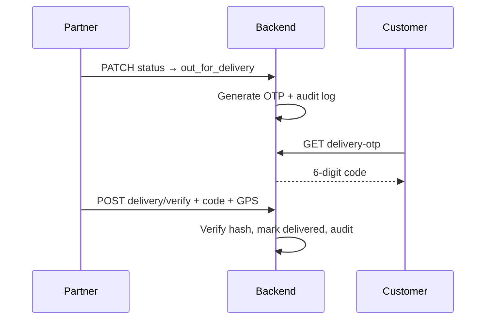

# Delivery OTP Verification System

Production-ready OTP handoff when orders are **out for delivery**. Delivery cannot complete without a valid customer OTP.

## Overview

| Requirement | Implementation |
| ----------- | -------------- |
| 6-digit OTP | `secrets` CSPRNG, zero-padded |
| Generated only when Out For Delivery | Auto-generated in `OrderService` on `out_for_delivery` transition |
| Customer receives OTP | In-app card + encrypted storage for re-fetch; SMS stub via audit metadata |
| Delivery requires OTP | `POST /partner/orders/{id}/delivery/verify` — direct `delivered` status blocked |
| Timestamp, agent, GPS | Stored on `order_delivery_otps` at verification |
| Failed attempts tracked | Per-order counter + per-agent counter on `users` |
| Account lock after failures | Agent locked 30 min after 10 failed attempts |
| Audit logs | `delivery_otp_*` actions in `audit_logs` |
| Verification status | Included in order detail + dedicated endpoints |

## Database

**Migration:** `backend/alembic/versions/20260603_0008_delivery_otp.py`

### `order_delivery_otps`

| Column | Purpose |
| ------ | ------- |
| `code_hash` | bcrypt hash for verification |
| `code_ciphertext` | Fernet-encrypted OTP for customer in-app display (cleared on verify) |
| `status` | `active` \| `verified` \| `expired` \| `locked` |
| `generated_at`, `expires_at` | 24-hour validity |
| `failed_attempts` | Failed verify attempts for this order (locks OTP at 5) |
| `verified_at`, `delivery_agent_user_id` | Successful handoff |
| `verification_latitude`, `verification_longitude` | GPS at completion |

### `users` (agent lockout)

| Column | Purpose |
| ------ | ------- |
| `delivery_otp_fail_count` | Rolling failed attempts across orders |
| `delivery_otp_locked_until` | Temporary lock expiry |

## API

### Customer

| Method | Path | Purpose |
| ------ | ---- | ------- |
| GET | `/orders/{id}/delivery-otp` | Fetch active 6-digit code |
| GET | `/orders/{id}/delivery-verification` | Status (no code) |

Order detail includes `delivery_verification` status.

### Partner / delivery agent

| Method | Path | Purpose |
| ------ | ---- | ------- |
| GET | `/partner/orders/{id}/delivery-verification` | Status + failed attempt count |
| POST | `/partner/orders/{id}/delivery/verify` | Verify OTP + mark `delivered` + GPS |

Request body:

```json
{
  "code": "482910",
  "latitude": 12.9716,
  "longitude": 77.5946
}
```

### Admin

| Method | Path | Purpose |
| ------ | ---- | ------- |
| GET | `/admin/orders/{id}/delivery-verification` | Read-only status |

## Security

- OTP never stored in plaintext — bcrypt hash + Fernet ciphertext (key derived from `JWT_SECRET`)
- Ciphertext wiped on successful verification
- Per-order lock after 5 failed attempts on that OTP
- Agent account lock after 10 cumulative failures (30 minutes)
- All generate / fail / verify / lock events written to `audit_logs`

## Audit actions

- `delivery_otp_generated`
- `delivery_otp_verified`
- `delivery_otp_failed`
- `delivery_otp_agent_locked`

## Frontend

| Surface | Component |
| ------- | --------- |
| Customer order details | `DeliveryOtpCustomerCard` — shows 6-digit code when `out_for_delivery` |
| Partner orders | `DeliveryOtpVerifyForm` — replaces "Mark delivered" button |

**Module:** `frontend/features/delivery-otp/`

## Flow



## Configuration

| Constant | Value |
| -------- | ----- |
| OTP length | 6 digits |
| Expiry | 24 hours |
| Max failures per order | 5 (OTP locked) |
| Max failures per agent | 10 (account locked 30 min) |

## Local setup

```bash
cd backend
DLM_env\Scripts\activate
pip install -r requirements.txt
alembic upgrade head
```

## Tests

```bash
pytest tests/api/test_delivery_otp.py -v
```

## Dependencies

- `cryptography` — Fernet encryption for customer OTP re-fetch (`requirements/base.txt`)
