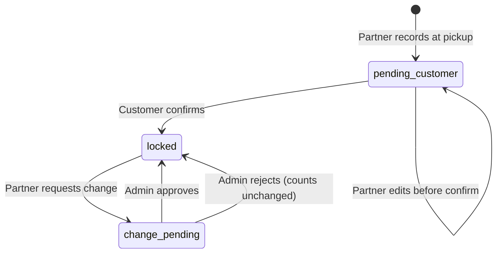

# Item Inventory Verification System

Production-ready pickup inventory for DLM: partners record item counts by category, customers confirm and lock the record, and changes after lock require admin approval.

## Overview

At pickup, the laundry partner records quantities for eight item categories:

| Category | Key |
| -------- | --- |
| Shirts | `shirts` |
| Trousers | `trousers` |
| Sarees | `sarees` |
| Jackets | `jackets` |
| Bedsheets | `bedsheets` |
| Blankets | `blankets` |
| Curtains | `curtains` |
| Other Items | `other` |

The customer reviews and confirms the record on the order details page. After confirmation, inventory is **locked**. Any later changes go through an **admin-approved change request**. Every action is stored in an append-only **history** log with timestamps.

## Lifecycle



## Database

**Migration:** `backend/alembic/versions/20260603_0007_inventory_verification.py`

### `order_inventory_verifications`

One row per order (current verification state).

| Column | Purpose |
| ------ | ------- |
| `order_id` | Unique FK to order |
| `customer_id`, `laundry_id` | Denormalized for queries |
| `status` | `pending_customer` \| `locked` \| `change_pending` |
| `recorded_by_user_id`, `recorded_at` | Partner capture |
| `confirmed_by_user_id`, `confirmed_at`, `locked_at` | Customer lock |

### `order_inventory_items`

Line items: `(verification_id, item_type)` → `quantity`.

### `order_inventory_history`

Append-only audit: action, `items_snapshot` JSONB, `actor_user_id`, `note`, `created_at`.

Actions: `partner_recorded`, `customer_confirmed`, `locked`, `change_requested`, `admin_approved`, `admin_rejected`.

### `order_inventory_change_requests`

Partner proposals to change locked inventory; admin approves or rejects.

## API

Base: `/api/v1`

### Partner

| Method | Path | Purpose |
| ------ | ---- | ------- |
| GET | `/partner/orders/{id}/inventory-verification` | Current record |
| PUT | `/partner/orders/{id}/inventory-verification` | Record / update (before lock) |
| POST | `/partner/orders/{id}/inventory-verification/change-request` | Request change when locked |

### Customer

| Method | Path | Purpose |
| ------ | ---- | ------- |
| GET | `/orders/{id}/inventory-verification` | View record |
| POST | `/orders/{id}/inventory-verification/confirm` | Confirm & lock |
| GET | `/orders/{id}/inventory-verification/history` | Audit trail |

Order detail (`GET /orders/{id}`) includes `inventory_verification`.

### Admin

| Method | Path | Purpose |
| ------ | ---- | ------- |
| GET | `/admin/orders/{id}/inventory-verification` | View record |
| GET | `/admin/inventory-change-requests` | Pending change queue |
| POST | `/admin/inventory-change-requests/{id}/approve` | Apply proposed counts |
| POST | `/admin/inventory-change-requests/{id}/reject` | Reject proposal |

### Dispute center

| Method | Path | Purpose |
| ------ | ---- | ------- |
| GET | `/complaints` | Customer dispute list |
| GET | `/complaints/{id}` | Detail + locked inventory snapshot |

## Business rules

1. Partner must record **≥ 1 item** total before marking order `picked_up` (with pickup photos).
2. Partner may edit freely while status is `pending_customer`.
3. Customer confirmation sets status `locked` and writes history + timeline notes.
4. Locked inventory cannot be edited directly — partner submits change request.
5. Only one pending change request per order.
6. Admin approval replaces line quantities and re-locks; rejection restores `locked` without changing counts.

## Timeline events

- `"Pickup inventory recorded"` — partner save
- `"Inventory confirmed by customer"` — customer confirm

## Frontend

| Surface | Location |
| ------- | -------- |
| Partner record form | Partner order card (`pickup_assigned`) |
| Customer confirm | Order details `/orders/[id]` |
| Dispute center | `/disputes` (linked from Account) |
| Admin approvals | `/admin/inventory-changes` |

**Module:** `frontend/features/inventory-verification/`  
**Service:** `frontend/services/inventory-verification.ts`

## Local setup

```bash
cd backend
DLM_env\Scripts\activate
alembic upgrade head
uvicorn app.main:app --reload
```

**Partner flow:** Accept order → record inventory + upload photos → Mark picked up.  
**Customer flow:** Open order → review counts → Confirm inventory.

## Tests

```bash
pytest tests/api/test_inventory_verification.py -v
```

## Related

- Pickup photos: `PICKUP_EVIDENCE.md`
- Legacy simple count API (`order_inventory` table) remains for backward compatibility; new UI uses verification endpoints.
