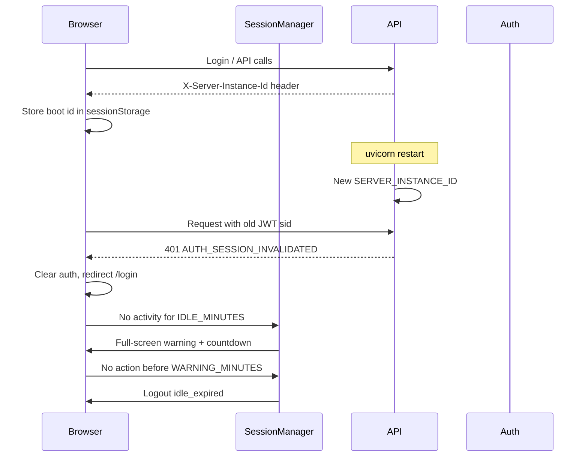

# Session Management & Idle Experience

Production-grade session invalidation on API restart, client idle detection, multi-tab sync, and a premium idle warning overlay with seasonal animations.

---

## Architecture overview



---

## Requirement 1 — Backend restart logout

### Mechanism

| Piece | Location |
| ----- | -------- |
| Boot ID | `backend/app/core/server_session.py` — `init_server_instance()` on startup |
| JWT claim | `sid` on access + refresh tokens (`security.py`) |
| Validation | `decode_token(..., validate_session=True)` on every protected decode |
| Error | `SessionInvalidatedError` → `AUTH_SESSION_INVALIDATED` (401) |
| Header | `X-Server-Instance-Id` on all HTTP responses (`ServerSessionMiddleware`) |
| Public probe | `GET /api/v1/auth/session-info` |

### Configuration (backend `.env`)

```env
FORCE_LOGOUT_ON_RESTART=true
```

Set `false` only for local dev if you want tokens to survive API reloads without re-login.

### Client behaviour

1. On login/refresh, store `server_instance_id` from response header in `sessionStorage` (`dlm.serverInstanceId`).
2. On each API response (when authenticated), compare header to stored id → mismatch triggers logout with message: **"System updated. Please login again."**
3. Poll `GET /auth/session-info` every 60s while signed in.
4. `AUTH_SESSION_INVALIDATED` from API triggers the same logout path.

---

## Requirement 2 — Idle detection

### Tracked signals

| Signal | Implementation |
| ------ | -------------- |
| Mouse | `mousemove`, `mousedown`, `click` |
| Keyboard | `keydown` |
| Scroll | `scroll`, `wheel` |
| Touch | `touchstart`, `touchmove` |
| Navigation | `usePathname()` change in `SessionManager` |
| API | Axios request interceptor → `setApiActivityCallback` |
| Tab focus | `visibilitychange` when visible |

Throttled to **1 event / second** to avoid timer churn.

### Configuration (frontend `.env`)

```env
NEXT_PUBLIC_SESSION_IDLE_MINUTES=10
NEXT_PUBLIC_SESSION_WARNING_MINUTES=2
```

| Variable | Default | Meaning |
| -------- | ------- | ------- |
| `SESSION_IDLE_MINUTES` | 10 | Inactivity before warning |
| `SESSION_WARNING_MINUTES` | 2 | Countdown before forced logout |

---

## Requirement 3 — Idle warning screen

**Component:** `frontend/components/session/idle-warning-overlay.tsx`

- Full-screen scrim + glass card
- Copy: *"You have been inactive"*
- Live countdown `MM:SS` (`aria-live="polite"`)
- **Continue session** — resets timers, syncs tabs
- **Logout** — immediate `performSessionLogout({ reason: 'manual' })`
- Seasonal canvas animation behind card (optional)

---

## Requirement 4 — Automatic logout

**Function:** `frontend/lib/session-logout.ts` → `performSessionLogout()`

Clears:

- Zustand auth store (`accessToken`, `user`)
- `sessionStorage` boot id + activity key
- `localStorage` persisted `dlm.auth`
- React Query cache (when `queryClient` passed)
- Server session via `POST /auth/logout` (unless `skipServer: true`)

Redirect:

```
/login?reason=idle_expired&message=Session+expired+due+to+inactivity.
```

Login page reads `message` and shows a Sonner toast.

---

## Requirement 5 — Seasonal idle animations

**Component:** `frontend/components/session/idle-animation-canvas.tsx`

| Theme | Animation |
| ----- | --------- |
| `snow` | Falling particles (winter) |
| `rain` | Vertical streaks |
| `summer` | Rising golden particles |
| `autumn` | Falling leaf rects |
| `diwali` / `christmas` / `newyear` | Themed particle colours |

### Configuration

```env
NEXT_PUBLIC_ENABLE_IDLE_ANIMATIONS=true
NEXT_PUBLIC_SEASON_MODE=auto
NEXT_PUBLIC_IDLE_ANIMATION=auto
```

| `SEASON_MODE` / `IDLE_ANIMATION` | Behaviour |
| -------------------------------- | --------- |
| `auto` | Month-based (NH): Dec–Feb snow, Mar–May summer, Jun–Sep rain, Oct–Nov autumn |
| Explicit theme | Forces that animation |

Animations use `requestAnimationFrame` with cleanup on unmount (no leak). Colours adapt to `.dark` on `<html>`.

---

## Multi-tab support

| Channel | Purpose |
| ------- | ------- |
| `BroadcastChannel('dlm-session-sync')` | `activity`, `continue`, `logout` |
| `localStorage` `dlm.session.lastActivity` | Fallback for browsers without BroadcastChannel |

Activity in **any** tab resets idle timers in **all** tabs via `subscribeSessionSync`.

---

## File map

### Backend

| File | Role |
| ---- | ---- |
| `app/core/server_session.py` | Boot ID + validation |
| `app/core/security.py` | `sid` in JWT |
| `app/core/exceptions.py` | `SessionInvalidatedError` |
| `app/core/config.py` | `FORCE_LOGOUT_ON_RESTART` |
| `app/middleware/server_session.py` | Response header |
| `app/api/v1/endpoints/auth.py` | `/auth/session-info` |
| `app/main.py` | Init boot id in lifespan |

### Frontend

| File | Role |
| ---- | ---- |
| `lib/session-config.ts` | Env parsing |
| `lib/session-instance.ts` | Boot id storage / compare |
| `lib/session-logout.ts` | Full logout + redirect |
| `lib/idle/activity-tracker.ts` | DOM listeners |
| `lib/idle/tab-sync.ts` | BroadcastChannel |
| `lib/idle/season.ts` | Theme resolution |
| `lib/api.ts` | Header check + `AUTH_SESSION_INVALIDATED` |
| `components/session/session-manager.tsx` | Orchestrator |
| `components/session/idle-warning-overlay.tsx` | UI |
| `components/session/idle-animation-canvas.tsx` | Canvas |
| `providers/index.tsx` | Mounts `SessionManager` |

---

## Security notes

| Threat | Mitigation |
| ------ | ---------- |
| Token reuse after deploy | JWT `sid` ≠ current boot id |
| Stale refresh cookie | Refresh decodes with session validation |
| Zombie client state | Forced logout + storage clear |
| WS after restart | `decode_token(validate_session=True)` on WS connect |
| Double logout race | `handlingSessionInvalidation` flag in `api.ts` |

---

## Validation checklist

| Check | How |
| ----- | --- |
| Backend restart logout | Restart uvicorn → next API call → login toast |
| Idle warning | Set `SESSION_IDLE_MINUTES=1`, wait → overlay + countdown |
| Auto logout | Let countdown reach `00:00` → `/login?reason=idle_expired` |
| Env vars | Change minutes in `.env.local`, restart Next |
| Multi-tab | Open two tabs, idle one, activity in other → warning dismisses |
| Light/dark | Toggle theme on idle overlay |
| Animations | Set `IDLE_ANIMATION=snow` etc. |
| No memory leaks | DevTools Performance — leave overlay 2 min, confirm RAF cancelled on continue |

---

## Quick test commands

```bash
# Backend — restart forces new boot id
cd backend && uvicorn app.main:app --reload --port 8000

# Frontend — fast idle (local)
# .env.local:
# NEXT_PUBLIC_SESSION_IDLE_MINUTES=1
# NEXT_PUBLIC_SESSION_WARNING_MINUTES=1
cd frontend && npm run dev
```

---

## Related

- `UI_AUDIT_REPORT.md` — visual system
- `DESIGN_SYSTEM.md` — tokens used by idle overlay
