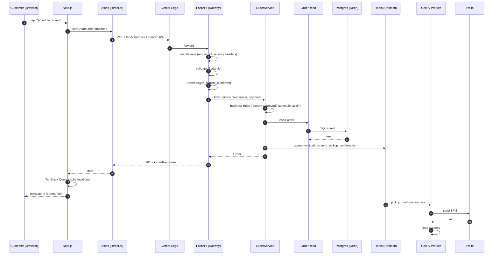
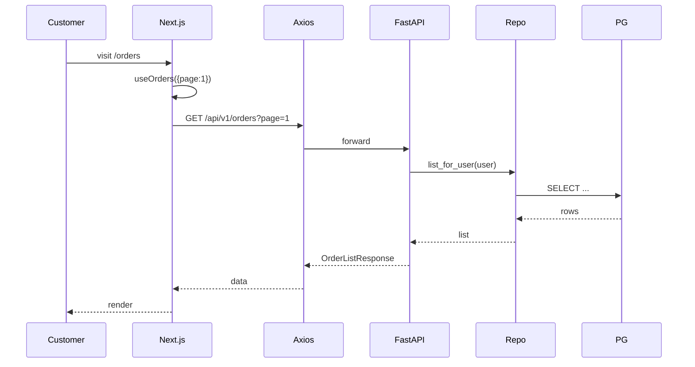
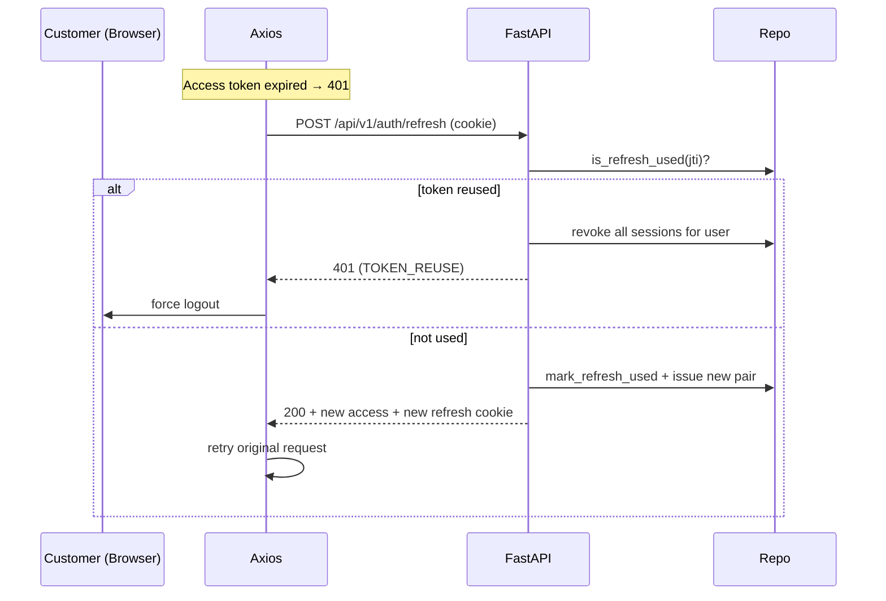

# Data Flow

End-to-end how a write request moves through the system.

## Example: Customer places an order

## Read path

Reads use TanStack Query:

## Auth refresh flow

## Error paths

- Domain errors → JSON envelope with `error.code`
- Validation errors → 422 with field-level `details`
- Auth errors → 401 + force logout if access token cannot be refreshed
- Unhandled → sanitized 500 + Sentry breadcrumb
