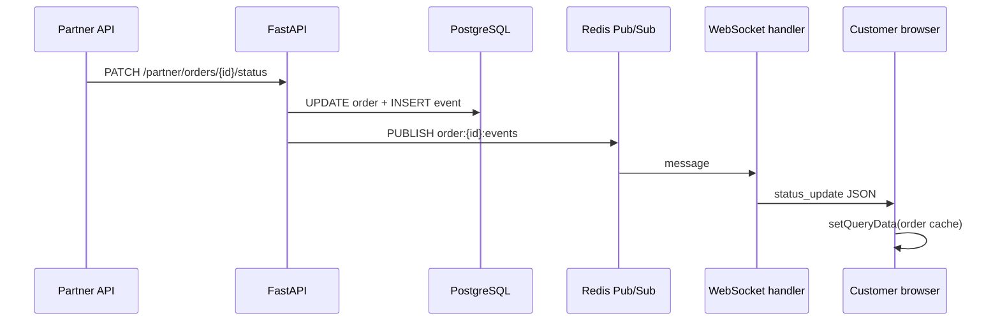

# Order tracking — WebSocket architecture

Live order status for customers uses **FastAPI WebSocket** + **Redis pub/sub** on the backend, and a resilient **browser WebSocket client** integrated with **TanStack Query** on the frontend.

## Flow



If WebSocket is down, the tracking page **falls back to HTTP polling every 30s** (unchanged legacy interval).

## Status events

| Status | Customer label |
| ------ | ---------------- |
| `confirmed` | Order Confirmed |
| `pickup_assigned` | Pickup Assigned |
| `picked_up` | Picked Up |
| `washing` | Washing |
| `ironing` | Ironing |
| `ready` | Ready |
| `out_for_delivery` | Out For Delivery |
| `delivered` | Delivered |
| `cancelled` | (terminal) |

## Backend

| Piece | Path |
| ----- | ---- |
| Publish helper | `backend/app/services/order_events.py` |
| WebSocket route | `GET ws` → `WS /api/v1/ws/orders/{order_id}?token=` |
| Handler | `backend/app/api/v1/endpoints/ws_orders.py` |
| Hook-in | `OrderService.create_order`, `OrderService.update_status_partner` |

### Redis channel

`order:{order_uuid}:events`

### Wire messages (JSON)

**Server → client**

```json
{ "type": "connected", "order_id": "…", "status": "confirmed" }
```

```json
{
  "type": "status_update",
  "order_id": "…",
  "status": "washing",
  "event": { "id": "…", "status": "washing", "note": null, "created_at": "…" }
}
```

```json
{ "type": "pong" }
```

**Client → server**

```json
{ "type": "ping" }
```

### Auth

- JWT access token via query `token` (browsers cannot set `Authorization` on WebSocket).
- Same validation as REST (`typ: access`).
- User must own the order (`order.user_id == sub`).

### Config

| Env | Default | Purpose |
| --- | ------- | ------- |
| `ORDER_WS_ENABLED` | `true` | Disable WS endpoint + publishing |
| `REDIS_URL` | `redis://localhost:6379/0` | Pub/sub broker |

## Frontend

| Piece | Path |
| ----- | ---- |
| URL + message helpers | `frontend/lib/ws/order-tracking-messages.ts` |
| Client (reconnect, ping/pong) | `frontend/lib/ws/order-tracking-client.ts` |
| React hook | `frontend/features/orders/hooks/use-order-tracking-live.ts` |
| UI | `frontend/features/orders/order-tracking.tsx` |

### Connection modes

| Mode | UI | Polling |
| ---- | -- | ------- |
| `connecting` | “Connecting…” | 30s fallback |
| `live` | “Live” badge | **off** |
| `polling` | “Updates every 30s” | **on** |

### Health check

- Client sends `ping` every **25s**.
- Expects `pong` within **10s**; otherwise closes socket and reconnects (exponential backoff, max **30s**).

### React Query

On `status_update`, `queryClient.setQueryData(queryKeys.order(id), …)` merges the new event and status so the timeline and progress bar update **without** `router.refresh()` or a full refetch.

## Local development

1. Start Redis (`docker compose up redis` or full stack).
2. Backend: `uvicorn app.main:app --reload`
3. Frontend: `npm run dev`
4. Log in as customer, open `/orders/{id}`.
5. As partner, advance status → customer UI should update within ~1s.

## Production notes

- Ensure the reverse proxy **upgrades WebSocket** (Vercel does not host WS for Next.js; WS terminates on **Railway/API** host).
- Set `NEXT_PUBLIC_API_URL` to the API origin; the client derives `ws://` / `wss://` automatically.
- Multiple API replicas are supported: all instances publish/subscribe via Redis.

## Related

- Feature spec: [`../features/order-tracking.md`](../features/order-tracking.md)
- Data flow overview: [`data-flow.md`](data-flow.md)
