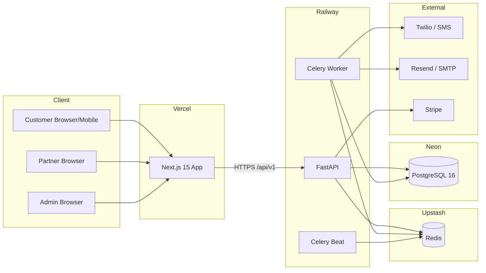
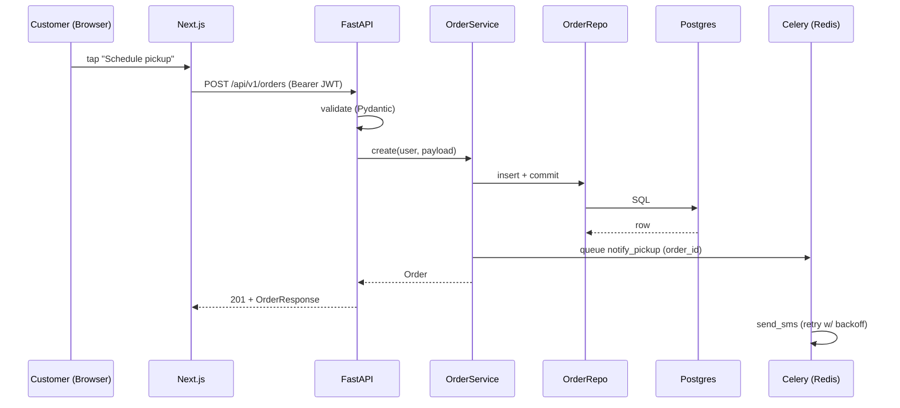

# System Architecture — Overview

## High-level diagram

## Layers

### Frontend (Next.js 15)

- **App Router** with React Server Components by default
- **Feature-based** organization (`frontend/features/<feature>/`)
- **TanStack Query** for server state; **Zustand** for cross-cutting UI state
- **RHF + Zod** for forms
- **Tailwind + shadcn/ui** for UI
- **Framer Motion** for purposeful motion
- **R3F** strictly on landing/hero

### Backend (FastAPI)

- **Async-first** end-to-end
- **Clean architecture**: API → Service → Repository → Model
- **Pydantic v2** for schemas + settings
- **SQLAlchemy 2.x** async ORM
- **JWT** auth + role-based authorization
- **Celery + Redis** for background work
- **Structured logging** via structlog

### Database (PostgreSQL on Neon)

- UUID PKs; `created_at`/`updated_at`/`deleted_at` on every aggregate
- Native enums for finite states
- Indexes match query patterns
- Soft delete preferred; hard delete only with strong reason
- Point-in-time recovery enabled

### Cache / Queue (Redis on Upstash)

- DB 0: app cache
- DB 1: Celery broker
- DB 2: Celery result backend

### Observability

- **Sentry** for both frontend + backend errors / performance
- **Vercel Analytics** for RUM
- **Railway metrics** for backend resource usage

## Cross-cutting concerns

- **Auth** — JWT access (15 min) + refresh (30 days, rotating)
- **Logging** — JSON in prod, pretty in dev; `request_id` correlates everything
- **Errors** — domain exceptions raised in services, mapped to HTTP at API edge
- **Rate limiting** — Redis-backed sliding window
- **Security headers** — set on every response

## Folder structure

See `.cursor/rules/03-folder-structure.md`.

## Data flow example — Place order

## Related

- [`backend.md`](backend.md)
- [`frontend.md`](frontend.md)
- [`data-flow.md`](data-flow.md)
- [`../database/schema.md`](../database/schema.md)
- [`../security/threat-model.md`](../security/threat-model.md)
