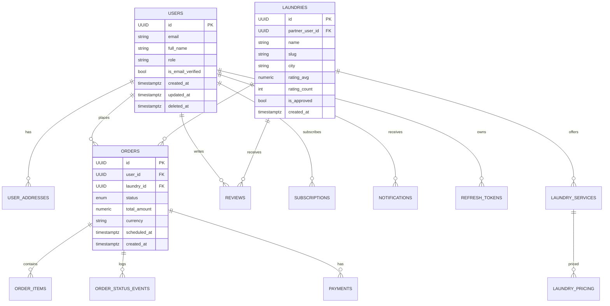
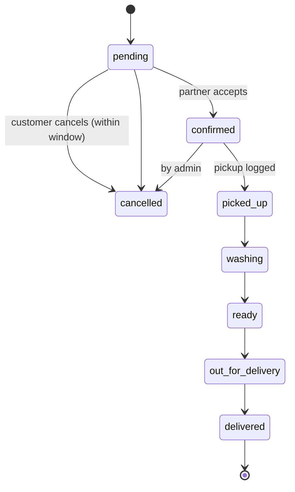

# ERD — Entity-Relationship Diagram

Planned high-level model. Updated as migrations land.

```mermaid
erDiagram
  USERS ||--o{ USER_ADDRESSES : has
  USERS ||--o{ ORDERS : places
  USERS ||--o{ REVIEWS : writes
  USERS ||--o{ SUBSCRIPTIONS : subscribes
  USERS ||--o{ NOTIFICATIONS : receives
  USERS ||--o{ REFRESH_TOKENS : owns

  LAUNDRIES ||--o{ LAUNDRY_SERVICES : offers
  LAUNDRY_SERVICES ||--o{ LAUNDRY_PRICING : priced
  LAUNDRIES ||--o{ ORDERS : fulfills
  LAUNDRIES ||--o{ REVIEWS : receives

  ORDERS ||--o{ ORDER_ITEMS : contains
  ORDERS ||--o{ ORDER_STATUS_EVENTS : logs
  ORDERS ||--o{ PAYMENTS : has

  USERS {
    UUID id PK
    string email
    string full_name
    string role
    bool is_email_verified
    timestamptz created_at
    timestamptz updated_at
    timestamptz deleted_at
  }

  LAUNDRIES {
    UUID id PK
    UUID partner_user_id FK
    string name
    string slug
    string city
    numeric rating_avg
    int rating_count
    bool is_approved
    timestamptz created_at
  }

  ORDERS {
    UUID id PK
    UUID user_id FK
    UUID laundry_id FK
    enum status
    numeric total_amount
    string currency
    timestamptz scheduled_at
    timestamptz created_at
  }
```

## State machine: ORDERS.status

```mermaid
stateDiagram-v2
  [*] --> pending
  pending --> confirmed: partner accepts
  pending --> cancelled: customer cancels (within window)
  confirmed --> picked_up: pickup logged
  picked_up --> washing
  washing --> ready
  ready --> out_for_delivery
  out_for_delivery --> delivered
  delivered --> [*]
  pending --> cancelled
  confirmed --> cancelled: by admin
```
