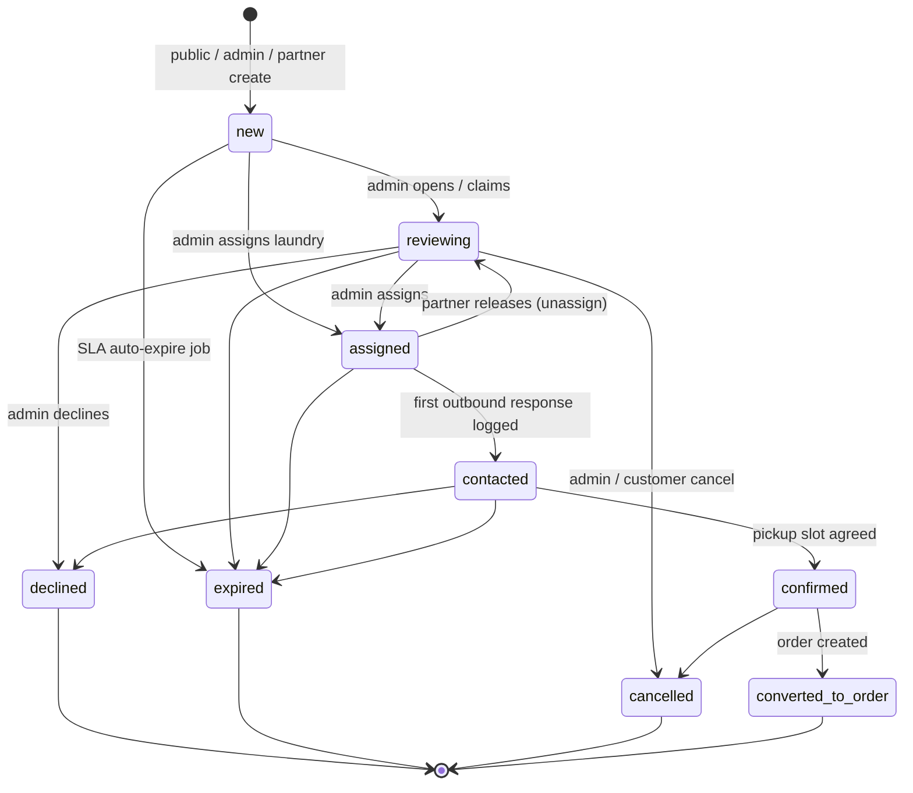
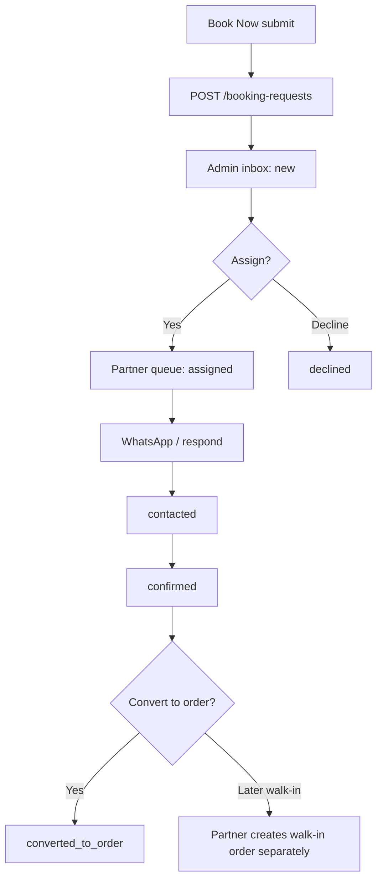
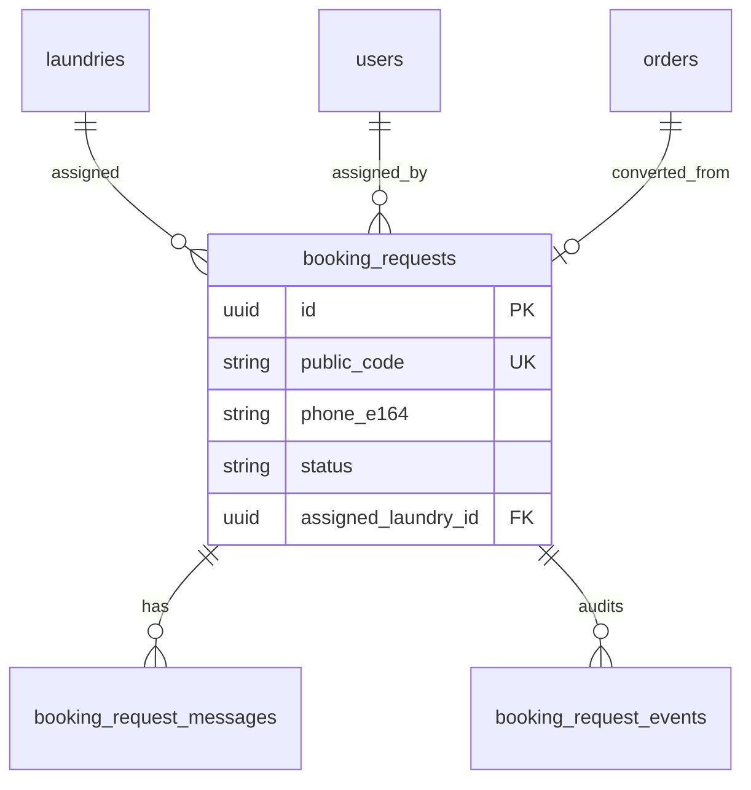

# Feature: Booking Requests (Admin + Partner inbox)

> Status: **in-progress** (Slice 1–6 polish shipped: data + APIs + Book Now + admin/partner inbox + **SLA/dup/suggest/notify polish**; convert/expiry pending)  
> Owner: product-manager + backend-architect + frontend-architect  
> Last updated: 2026-08-03  
> Related: [marketing-homepage.md](marketing-homepage.md) (Book Now dialog), [offline-booking-whatsapp.md](offline-booking-whatsapp.md), [order-placement.md](order-placement.md), [complaints.md](complaints.md) (SLA / drawer UX patterns), [admin-approvals.md](admin-approvals.md)  
> Ops: [booking-requests runbook](../runbooks/booking-requests.md)

## Problem

When a visitor taps **Book Now** without picking a laundry, the request today lands as a generic `order-help` marketing contact lead. Ops cannot triage it like a booking, assign it to a partner, respond with a WhatsApp-ready script, or look up the customer’s past requests by phone. Pickup intent is lost in the contact pile.

## Persona

| Persona | Context |
| ------- | ------- |
| **Guest customer** | India mobile visitor on `/` or `/services`; wants pickup without creating an account or choosing a store |
| **Admin / ops** | WashHouse ops desk; first responder for unassigned marketplace leads; assigns to active partners |
| **Partner** | Approved laundry owner/staff; handles requests assigned to their shop; may log walk-in-style phone bookings into the same inbox |

## Why now

Call-to-book / offline mode is the live launch path. Book Now already converts, but the backend treats it as a contact form. Elevating it to a first-class **Booking Request** workflow unblocks SLA ops, partner handoff, and phone CRM before full online self-serve booking is the default.

## Goals

- [x] Public Book Now creates a `booking_request` in the **admin inbox** (not `marketing_contact_submissions`)
- [x] Admin has full CRUD + assign/transfer + respond + create-on-behalf + soft-delete/restore
- [x] Partner has CRUD on **assigned** requests only + respond + create for their laundry on a phone
- [x] Phone (E.164) is the customer key: timeline of all requests/messages for that number
- [x] Mobile-first India UX: SLA urgency, one-click WhatsApp deep link, duplicate-open warning
- [ ] Hook to convert a confirmed request → real `orders` row when online booking is ready

## Non-goals

- Customer logged-in “my booking requests” portal / phone-OTP self-serve read — **deferred**
- Replacing store-selected online order placement (`POST /orders`) or partner walk-in orders
- Auto-SMS / Meta template blast on every status change (v1 = human WhatsApp deep link; Celery notify stubs optional)
- Geo auto-assign as a hard requirement (suggest-nearest is best-effort when lat/lng or pincode exists)
- Migrating franchise / general contact leads into this table
- Hard-blocking duplicate public submits (warn only — never refuse a pickup intent)

## Domain decisions (defaults)

| Decision | Default | Rationale |
| -------- | ------- | --------- |
| Separate aggregate from marketing contact | **Yes** — `booking_requests` | Contact stays for support/franchise; booking needs status, assign, SLA |
| Phone storage | Single canonical `phone_e164` (`+91XXXXXXXXXX`); drop redundant `phone_normalized` | Existing marketing `normalize_phone` already produces E.164; one indexed column for CRM |
| Public code | `BR-` + 6 alphanumeric (`BR-K7M2QX`) | Short for WhatsApp / call scripts; parallel to order `tracking_code` |
| Open statuses (duplicate / inbox) | `new`, `reviewing`, `assigned`, `contacted`, `confirmed` | Terminal excluded from “open” |
| Partner soft-delete | **Admin only** | Partners may `cancel` / `decline`; cannot hide leads from platform |
| Partner transfer | **Admin only**; partner may **release** (unassign → admin inbox) | Prevents partner↔partner lead poaching |
| Duplicate on public create | Allow create; response `meta.duplicate_warning` + `open_request_ids` | India marketplace: never lose the lead |
| Convert → order | Status `converted_to_order` + `converted_order_id`; API stub until order factory ready | Spec the contract now; implement when online booking flag is on |
| Book Now API switch | `BookPickupForm` → `POST /booking-requests` (break from `POST /marketing/contact`) | Clean cut; optional one-time backfill of historical `order-help` rows |
| Events table | **Include** `booking_request_events` | Audit like disputes/custody; keep messages human-readable |

## Status machine

| Status | Meaning | Who can set |
| ------ | ------- | ----------- |
| `new` | Untriaged; sits in admin inbox | System on create |
| `reviewing` | Ops has claimed / is working unassigned | Admin |
| `assigned` | Linked to an active laundry | Admin (assign/transfer); partner create starts here |
| `contacted` | At least one customer-facing outbound logged | Admin / assigned partner (auto on customer-facing message, or manual) |
| `confirmed` | Customer agreed service + window | Admin / assigned partner |
| `converted_to_order` | Linked `orders.id` exists | Admin / assigned partner via convert action |
| `declined` | Cannot serve (out of area, no capacity, spam) | Admin / assigned partner |
| `expired` | No progress within expiry window (default 72h open) | Celery job |
| `cancelled` | Customer withdrew / ops cancel | Admin / assigned partner |

Illegal transitions → `409 Conflict` with `code: INVALID_STATUS_TRANSITION`.

## Priority & SLA

| Field | Values |
| ----- | ------ |
| `priority` | `normal` (default), `high`, `urgent` |

**Computed SLA badge** (list + detail; mirror dispute SLA cell pattern — live countdown, no DB write required for badge):

| Badge | Condition (from `created_at`, while status ∈ open and not `contacted`+) |
| ----- | ------------------------------------------------------------------------ |
| `fresh` | Age &lt; 15 minutes |
| `aging` | 15–60 minutes |
| `overdue` | &gt; 60 minutes without reaching `contacted` |

Once `contacted` (or terminal), badge becomes `met` / `na`. Admin may bump `priority` manually; overdue open rows sort first in default admin inbox.

**Expiry:** open requests with no status change for **72 hours** → `expired` (Celery beat). Configurable later via platform config.

## Permissions matrix

| Action | Public | Admin | Partner (assigned) | Partner (other laundry) |
| ------ | ------ | ----- | ------------------ | ----------------------- |
| Create | ✅ | ✅ (any phone; optional assign) | ✅ (auto-assigned to own laundry) | — |
| List / filter | ❌ | ✅ all | ✅ own laundry only | ❌ |
| Read detail | ❌ | ✅ | ✅ if assigned | ❌ |
| Update fields (name, service, notes, address, …) | ❌ | ✅ | ✅ if assigned & not terminal | ❌ |
| Change status | ❌ | ✅ (all legal) | ✅ legal subset on assigned | ❌ |
| Assign / transfer laundry | ❌ | ✅ | ❌ | ❌ |
| Release (unassign) | ❌ | ✅ | ✅ own assigned → admin inbox | ❌ |
| Respond (customer-facing message) | ❌ | ✅ | ✅ assigned | ❌ |
| Internal note | ❌ | ✅ | ✅ assigned | ❌ |
| Soft delete | ❌ | ✅ | ❌ | ❌ |
| Restore | ❌ | ✅ | ❌ | ❌ |
| Customer timeline by phone | ❌ | ✅ | ✅ phones that appear on own assigned/created rows | ❌ |
| Bulk assign | ❌ | ✅ | ❌ | ❌ |
| Convert → order | ❌ | ✅ | ✅ assigned | ❌ |
| WhatsApp deep-link helper | n/a (client) | ✅ | ✅ | — |

Staff under a laundry inherit partner laundry scope (same as walk-in / partner orders).

## Creative must-haves (v1)

Ship these; do not bloat beyond:

1. **SLA badges** — `fresh` / `aging` / `overdue` on admin + partner queues  
2. **One-click WhatsApp** — `https://wa.me/{digits}?text={urlencoded}` with prefilled script including `public_code`, name, service, preferred window  
3. **Duplicate detection** — same `phone_e164` + open status → warn on create + banner on detail  
4. **Customer timeline drawer** — all booking requests + messages for a phone (admin full; partner scoped)  
5. **Soft delete + restore** — admin only  
6. **Convert → order** — contract + UI gated; implementation may stub until online booking path is stable  

**v1.1 (document, don’t block v1):**

- Admin **bulk assign** (multi-select → one laundry)  
- **Suggest nearest** active laundry when request has pincode/city and/or client geo; else manual picker only — **shipped** as `GET …/suggest-laundries` (city/pincode → rating → recently active; assign drawer chips)

### Slice 6 polish (shipped)

| Item | Status |
| ---- | ------ |
| SLA aging colors + overdue-first sort | Shipped (Slices 4–5) |
| Duplicate open-request banner on create / phone lookup | Shipped (admin + partner create dialogs) |
| Admin smart-assign suggestions | Shipped |
| Auto-notify stubs (admin on public create; partner on assign) | Shipped |
| Public tracking by `public_code` + phone last-4 | **Not in v1** (customer portal deferred — non-goal) |
| Admin CSV export | **Not in feature doc** — propose later |
| Admin overview KPI cards (new today / converted) | **Not in feature doc** — inbox metrics strip already ships new/reviewing/overdue |

## User stories

- As a **guest**, I want to submit name + phone + service + preferred time from Book Now, so ops can call/WhatsApp me without me picking a store.
- As an **admin**, I want an inbox sorted by SLA urgency, so hot leads are contacted within 15 minutes.
- As an **admin**, I want to assign or transfer a request to any **active + approved** laundry, so the right partner owns fulfillment.
- As a **partner**, I want to see only my assigned requests, respond via WhatsApp script, and update status, so I can confirm pickups quickly.
- As an **admin or partner**, I want to open a phone’s history, so repeat callers aren’t treated as strangers.
- As an **admin**, I want soft-delete/restore and audit events, so mistakes are recoverable and accountable.

## UX flows

### A — Public Book Now (no laundry)

1. Customer opens Book Now dialog (`BookNowDialog` / `?book=1`).
2. Submits name, phone, service, preferred time, optional notes (+ optional city/pincode/address in v1 form if we extend fields; otherwise notes carry landmark).
3. `POST /booking-requests` → `201` with `public_code` (e.g. `BR-K7M2QX`).
4. Dialog stays open on a **confirmation** panel: shows `public_code`, “what happens next”, and WhatsApp / Call fallbacks (prefilled with the code). Toast also includes the code. **Done** closes the dialog.
5. If open duplicate exists: still succeed; confirmation + toast note “We already have an open request — we’ll follow up on both.”

### B — Admin triage → assign → respond

1. Admin opens `/admin/booking-requests` (nav under Operations or Approvals — **default: Operations**, badge = open `new`+`reviewing` count).
2. Inbox table: SLA badge, public_code, name, phone, service, age, status, assigned laundry.
3. Row opens **detail drawer** (reuse disputes drawer pattern): fields, timeline, WhatsApp button, assign laundry select, status controls, internal note vs customer response.
4. Assign → status `assigned`; event + optional in-app notify to partner.
5. “WhatsApp customer” opens `wa.me` with script; logging a customer-facing message can auto-move `assigned` → `contacted` if still earlier.

### C — Partner handle assigned

1. Partner opens `/partner/booking-requests`.
2. Same drawer UX, scoped; no laundry transfer; Release returns to admin.
3. Partner may create a request for a phone (source `partner_created`, auto-assigned).

### D — Customer timeline

1. From any request, click phone → drawer lists all requests for `phone_e164` (newest first) with nested message snippets.
2. Admin: “New request for this phone” pre-fills phone + name.

## Frontend surface (planned)

| Surface | Path / folder |
| ------- | ------------- |
| Public form + confirmation | `frontend/features/marketing/book-now/` → `lib/api/booking-requests.ts` (`submitBookingRequest`) |
| Admin inbox | `frontend/app/(admin)/admin/booking-requests/` + `frontend/features/admin/booking-requests/` (**shipped** Slice 4) |
| Partner inbox | `frontend/app/(partner)/partner/booking-requests/` + `frontend/features/partner/booking-requests/` (**shipped** Slice 5) |
| Shared pieces | SLA badge, WhatsApp link builder, timeline drawer — prefer `components/shared/` or feature-local then extract on 2nd use |
| Patterns to clone | `features/admin/disputes/*` (drawer, SLA cell, badges), `admin-approval-queue` |

Nav:

- Admin: **Operations → Booking requests** (badge key `bookingRequests`)
- Partner: **Orders → Booking requests** (near Walk-in)

## API surface (summary)

Full contract: [`docs/api/endpoints/booking-requests.md`](../api/endpoints/booking-requests.md).

| Method | Path | Auth |
| ------ | ---- | ---- |
| `POST` | `/api/v1/booking-requests` | public |
| `GET` | `/api/v1/admin/booking-requests` | admin |
| `POST` | `/api/v1/admin/booking-requests` | admin |
| `GET` | `/api/v1/admin/booking-requests/{id}` | admin |
| `PATCH` | `/api/v1/admin/booking-requests/{id}` | admin |
| `DELETE` | `/api/v1/admin/booking-requests/{id}` | admin (soft) |
| `POST` | `/api/v1/admin/booking-requests/{id}/restore` | admin |
| `POST` | `/api/v1/admin/booking-requests/{id}/assign` | admin |
| `POST` | `/api/v1/admin/booking-requests/bulk-assign` | admin (v1.1 ok) |
| `POST` | `/api/v1/admin/booking-requests/{id}/messages` | admin |
| `GET` | `/api/v1/admin/booking-requests/by-phone/{phone}` | admin |
| `POST` | `/api/v1/admin/booking-requests/{id}/convert` | admin |
| `GET` | `/api/v1/partner/booking-requests` | partner |
| `POST` | `/api/v1/partner/booking-requests` | partner |
| `GET` | `/api/v1/partner/booking-requests/{id}` | partner |
| `PATCH` | `/api/v1/partner/booking-requests/{id}` | partner |
| `POST` | `/api/v1/partner/booking-requests/{id}/release` | partner |
| `POST` | `/api/v1/partner/booking-requests/{id}/messages` | partner |
| `GET` | `/api/v1/partner/booking-requests/by-phone/{phone}` | partner |
| `POST` | `/api/v1/partner/booking-requests/{id}/convert` | partner |

## Data model

See [`docs/database/schema.md`](../database/schema.md) — tables `booking_requests`, `booking_request_messages`, `booking_request_events`.

## Background work

| Task | Purpose |
| ---- | ------- |
| `expire_stale_booking_requests` | Open → `expired` after 72h inactivity |
| Optional: `notify_partner_booking_request_assigned` | In-app / stub WhatsApp to partner on assign — **shipped** (`BookingRequestNotifier`) |
| Optional: notify admins on public create | In-app + support email + WhatsApp stub — **shipped** |

## Edge cases

| Case | Behavior |
| ---- | -------- |
| Assign to non-active / unapproved laundry | `422` |
| Transfer to same laundry | No-op `200` or `409` — prefer no-op with event skipped |
| Partner patches unassigned / other laundry | `404` (do not leak existence) |
| Message on terminal status | Allow **internal** notes; block customer-facing unless admin override flag |
| Soft-deleted in lists | Hidden by default; `?include_deleted=true` admin only |
| Rate limit public create | 3 per phone / hour; 5 per IP / hour → `429` (same spirit as marketing contact) |
| Invalid Indian mobile | `422` via shared `validate_indian_phone` |
| Convert without `confirmed` | `409` unless admin force flag |
| Historical Book Now contact leads | Not auto-shown in inbox; optional backfill script marked one-shot |

## Acceptance criteria

- [x] Book Now no longer inserts `marketing_contact_submissions` with `order-help`
- [x] Public create returns `public_code`; admin sees row within refresh/poll
- [x] Admin can assign any active laundry; partner sees it; other partners get `404`
- [x] WhatsApp link uses E.164 digits and includes `public_code` in prefilled text
- [x] Duplicate open phone returns warning meta without failing create
- [x] Phone timeline returns chronologically sorted requests + messages
- [x] Soft delete hides from default lists; restore clears `deleted_at`
- [x] Status transitions enforced; events append-only
- [x] Tests: API unit/integration for permissions + transitions; Playwright smoke admin inbox + public submit *(API + Book Now e2e path updated; admin inbox UI Playwright still pending)*
- [x] Docs + `logs/feature-progress.md` updated

## Metrics & analytics

| Event | When |
| ----- | ---- |
| `booking_request.created` | Public/admin/partner create |
| `booking_request.assigned` | Assign / transfer |
| `booking_request.contacted` | First customer-facing response |
| `booking_request.converted` | Convert action |
| `booking_request.sla_overdue_snapshot` | Daily count of overdue open |

KPIs: median time-to-first-contact; % converted; % expired; partner acceptance latency after assign.

## Risks & mitigations

| Risk | Likelihood | Impact | Mitigation |
| ---- | ---------- | ------ | ---------- |
| Ops still looks only at contact leads | M | H | Cut Book Now over to new API; admin badge; short runbook |
| Partner ignores assigned leads | M | H | SLA badges + overdue sort; admin reclaim via transfer |
| PII phone CRM abuse | L | H | Partner timeline scoped; audit events; admin soft-delete |
| Convert-to-order half-built | M | M | Gate behind feature flag; allow manual walk-in until ready |
| Scope creep (chat bot, OTP portal) | H | M | Non-goals enforced; v1.1 list only |

## Open questions

None blocking. Defaults above stand unless product overrides:

1. Exact admin nav section (Operations vs Approvals) — **Operations**.  
2. Whether public form collects city/pincode as first-class fields in v1 — **yes, optional fields** (helps assign); address_text optional.  
3. Auto `new` → `reviewing` on admin detail open — **yes** (single admin claim; no multi-lock in v1).

## Implementation slices (suggested)

| Slice | Scope |
| ----- | ----- |
| **A** | Schema + public create + admin list/detail/assign/messages |
| **B** | Partner list/detail/respond/release/create; WhatsApp + SLA UI |
| **C** | Phone timeline, soft delete/restore, duplicate warning, expiry job |
| **D** | Convert-to-order + bulk assign + suggest-nearest |
| **E / Slice 3** | Switch Book Now FE + confirmation with `public_code` (**shipped**); Playwright; retire order-help path for pickup |
| **Slice 6** | Polish: create-time duplicate banner, suggest-laundries, notify stubs, ops runbook (**shipped** 2026-08-03) |
