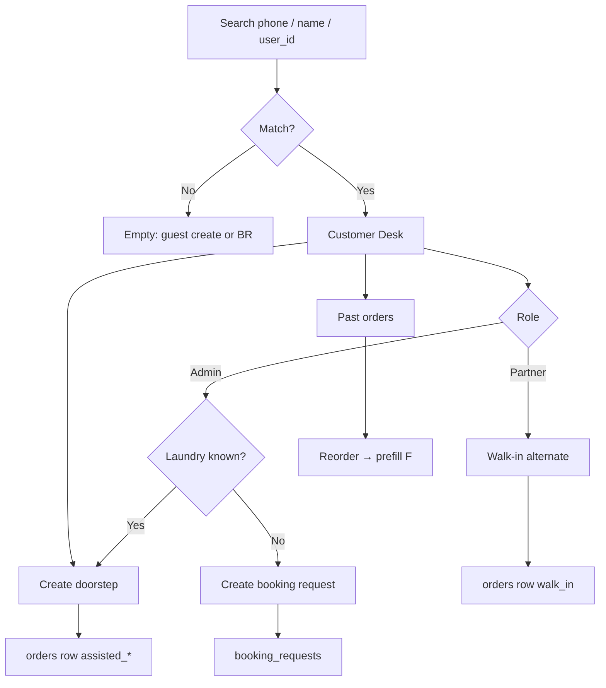
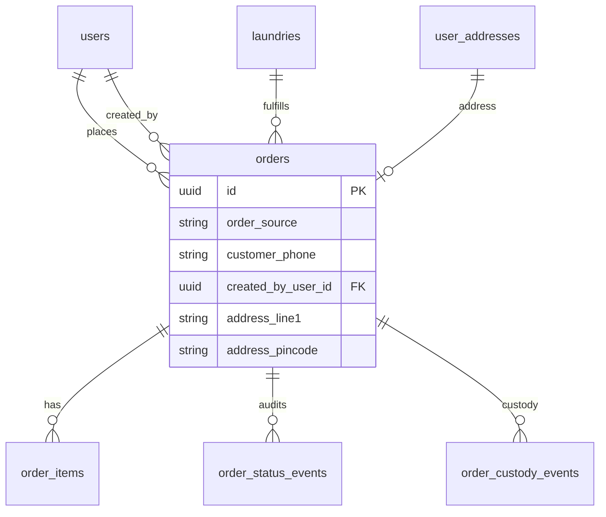

# Feature: Customer Desk — assisted order lookup & create

> Status: **review** (Slices 1–5 complete: lookup/history, assisted create API, Admin UI, Partner UI, QA/security/perf/a11y)  
> Owner: product-manager + backend-architect + frontend-architect  
> Last updated: 2026-08-04  
> Related: [order-placement.md](order-placement.md), [booking-requests.md](booking-requests.md), [orders-hub.md](orders-hub.md) (hard-merge home), [offline-booking-whatsapp.md](offline-booking-whatsapp.md), [partner-dashboard.md](partner-dashboard.md), [admin-dashboard.md](admin-dashboard.md)  
> API: [`docs/api/endpoints/customer-desk.md`](../api/endpoints/customer-desk.md)  
> Schema: [`docs/database/schema.md`](../database/schema.md) § Customer Desk / orders assisted columns

## Problem

When a customer calls or WhatsApps WashHouse ops or a laundry partner, staff cannot quickly find that person by phone, see what they ordered before, or place a real **doorstep** pickup/delivery order on their behalf. Partners can only record **walk-in** (in-shop) orders. Booking-request convert-to-order is still stubbed. Admin Customers claims “order history” in copy but shows none. Repeat callers are treated like strangers, and doorstep intent dies in chat threads.

## Persona

| Persona | Context |
| ------- | ------- |
| **Admin / ops** | Platform desk; handles Book Now / call / WhatsApp leads across all laundries; needs full phone CRM + ability to create doorstep orders or booking requests |
| **Partner / staff** | Own laundry only; phone-booked doorstep customers + walk-in shoppers; must not see other shops’ orders |
| **Customer (indirect)** | India mobile user; may be registered or guest; expects WhatsApp follow-up and correct GST totals — never logs into the desk |

## Why now

Call-to-book / offline mode is the live launch path (`FEATURE_ONLINE_BOOKING` often false). Booking Requests give an inbox for unassigned leads, but ops still cannot (1) see past **orders**, or (2) create a fulfilled doorstep `orders` row without the customer self-serve app. Customer Desk closes that gap and gives booking-request convert a shared order factory later.

## Goals

- [x] Lookup customer by **phone (E.164)**, name, or `user_id`
- [x] Open **Customer Desk** (drawer on mobile, page/drawer on desktop): profile summary + paginated past orders + empty states
- [x] **Reorder** from a past order (prefill laundry + line items) — partner UI matches catalog by `item_summary`; admin pending parity
- [x] **Create doorstep order on behalf** (address required; guest flow if unregistered) — FE + API (`assisted_admin` / `assisted_partner`)
- [x] Partner keeps **walk-in** as an alternate mode from the same desk
- [x] Admin can **assign laundry + create doorstep** (UI), or **create booking request** when laundry is unknown
- [x] Audit: who created (`created_by_user_id` + role), `order_source` ∈ `{assisted_admin, assisted_partner}`, custody / status events
- [x] AuthZ: partner laundry-scoped; admin platform-wide; IDOR tests
- [x] India UX: mobile-first, WhatsApp deep link, GST via shared order pricing path

## Non-goals (v1)

- Customer self-serve “order for a friend”
- Changing customer password, email, or wallet / loyalty balances
- Auto-assign laundry without admin (or partner) choice
- Native SMS blast / Meta template blast on every desk action (human WhatsApp deep link only)
- Replacing partner walk-in UI (`/partner/walk-in-orders`) — desk **links** to it; does not delete it
- Full booking-request convert implementation (desk factory is the future callee; convert remains its own slice) — **convert shipped** via desk factory; see [booking-requests.md](booking-requests.md)
- Creating a permanent customer account without consent beyond phone+name for guest orders

## Domain decisions (defaults)

| Decision | Default | Rationale |
| -------- | ------- | --------- |
| Primary key | `phone_e164` (`+91XXXXXXXXXX`) | Matches booking-request CRM; walk-in already stores `customer_phone` |
| Desk identity resolution | Match `users.phone` **or** any `orders.customer_phone` / walk-in rows for that phone | Guests who only ever walked in still appear |
| Registered vs guest | If `users` row exists for phone → `user_id` set; else guest order (`user_id` null) with phone + name | Same pattern as walk-in |
| Doorstep address (registered) | Prefer existing `user_addresses` id; allow create-on-behalf of a new address under that user | Reuses address FK + validation |
| Doorstep address (guest) | Inline snapshot columns on `orders` (`address_line1`, `address_line2`, `address_city`, `address_pincode`, optional landmark) — `address_id` null | No fake user; rider still has text address |
| `order_source` values | Add `assisted_admin`, `assisted_partner` (keep `online`, `walk_in`) | Audit + lifecycle branching without overloading `online` |
| Lifecycle for assisted doorstep | **Online path** (pickup → washing → … → delivery OTP) — **not** walk-in shortcut | Address + doorstep promise requires pickup/delivery evidence |
| Walk-in from desk | Partner CTA opens existing walk-in create (`order_source=walk_in`); no new walk-in API | Don’t fork walk-in |
| `FEATURE_ONLINE_BOOKING` | **Bypass for assisted create** (admin/partner only) | Ops must book during offline/call-to-book era |
| Payment on assisted create | Default `payment_method=cod`, `payment_status=pending_cod` | Matches phone-booked India ops; Razorpay link later |
| GST / totals | Shared private factory used by `OrderService.create_order` + assisted create (same CGST/SGST split, delivery fee, limits, commission) | One pricing brain; GST-safe |
| Admin laundry unknown | Offer **Create booking request** (reuse `POST /admin/booking-requests`) instead of inventing auto-assign | Booking Requests already own that funnel |
| Reorder | Prefill laundry + service lines from past order; refresh prices from current catalog; drop inactive services with warning | Prevents stale prices / ghost SKUs |
| Partner order history scope | Only orders where `orders.laundry_id` = partner’s laundry | IDOR-safe |
| Admin order history scope | All laundries for that phone / user | Platform desk |
| Open booking requests on desk | Surface count + deep link to BR timeline for same phone | Connect CRM surfaces without merging aggregates |
| WhatsApp | Server-built `whatsapp_url` on desk profile; no auto status WA for assisted in v1 (walk-in keeps existing WA) | Avoid Meta template scope creep |
| Created-by audit | `orders.created_by_user_id` + infer role from JWT; custody event metadata; append `OrderStatusEvent` note | Queryable without new events table in v1 |
| Idempotency | `Idempotency-Key` required on assisted create POST | Money-moving / order-creating |
| Feature flag | `FEATURE_CUSTOMER_DESK` (default true in staging; can gate FE nav) | Safe rollout |

## User stories

- As an **admin**, I want to search by phone and open a desk with past orders, so I can help a caller in under a minute.
- As an **admin**, I want to create a doorstep order for a chosen laundry on the customer’s behalf, so pickup happens without the customer finishing the app flow.
- As an **admin**, I want to create a booking request when I don’t know which laundry fits, so the lead stays in the existing inbox.
- As a **partner**, I want the same desk scoped to my laundry, so I can reorder or book doorstep for my regulars without seeing other shops.
- As a **partner**, I want walk-in still one tap away from the desk, so in-shop customers stay on the short path.
- As a **security reviewer**, I want IDOR tests that a partner never reads another laundry’s order history for the same phone.

## UX flows

### A — Lookup → Desk

1. Admin or Partner opens **Orders → Find customer** (`/admin|/partner/orders?tab=desk`). Legacy `/…/customer-desk` redirects there ([orders-hub.md](orders-hub.md)).
2. Search bar: phone (preferred), name, or paste `user_id`.
3. Results list (compact cards): name, phone, registered badge / guest hint, order count (scoped), last order date.
4. Tap result → **Desk drawer** (full-screen sheet on mobile): profile header + WhatsApp + Call + tabs **Orders** | **Actions**.
5. Empty search → illustrated empty state; no matches → “No customer for this phone — Create guest order / booking request”.

### B — Past orders + reorder

1. Orders tab: paginated list (status badge, tracking code, laundry name, total ₹, pickup/delivery dates, `order_source` chip).
2. Empty: “No past orders yet” + primary CTA Create doorstep order.
3. Row → order detail strip (or link to existing admin/partner order detail).
4. **Reorder** → opens Create form prefilled with laundry (locked for partner) + line items; prices re-fetched; inactive lines shown struck with “unavailable”.

### C — Assisted doorstep create

1. Actions → **Create doorstep order**.
2. Fields: customer name (editable), phone (locked from desk), laundry (admin select / partner locked), address (picker or guest inline), pickup/delivery slots, services + qty, notes, payment COD default.
3. Review strip shows subtotal, delivery fee, CGST, SGST, total (server quote optional `POST …/quote` or client preview from catalog — **server recalculates on submit**).
4. Submit → `201` with `tracking_code`; toast + “WhatsApp customer” with tracking prefill; order appears in partner queue as normal doorstep.

### D — Partner walk-in alternate

1. From desk Actions → **Record walk-in** → navigates to `/partner/walk-in-orders` with phone+name query prefill (or opens existing walk-in dialog).
2. Creates `order_source=walk_in` via existing API — not assisted enum.

### E — Admin laundry unknown

1. From desk (or empty search) → **Create booking request** → existing admin BR create dialog with phone/name prefilled.
2. Does **not** create an `orders` row.

## Permissions matrix

| Action | Admin | Partner (own laundry) | Partner (other) | Customer |
| ------ | ----- | --------------------- | --------------- | -------- |
| Search / lookup | ✅ platform | ✅ scoped results only | — | ❌ |
| Open desk / order history | ✅ all orders for phone/user | ✅ own laundry orders only | ❌ `404` | ❌ |
| Reorder / assisted doorstep create | ✅ any approved laundry | ✅ own laundry only | ❌ | ❌ |
| Create booking request from desk | ✅ | ✅ own (existing partner BR create) | ❌ | ❌ |
| Walk-in from desk | ❌ (N/A) | ✅ | ❌ | ❌ |
| See other laundry’s order for same phone | ✅ | ❌ omit / `404` on detail | — | — |

Staff under a laundry inherit partner scope (same as walk-in / partner orders).

Illegal cross-laundry access → **`404`** (do not leak existence), never `403` with body that confirms the order id.

## API surface (summary)

Full contract: [`docs/api/endpoints/customer-desk.md`](../api/endpoints/customer-desk.md).

### Slice 1 (shipped)

| Method | Path | Auth |
| ------ | ---- | ---- |
| `GET` | `/api/v1/admin/customers/lookup?phone=` \| `?user_id=` | admin |
| `GET` | `/api/v1/admin/customers/search?q=` | admin (name / phone / UUID, max 20) |
| `GET` | `/api/v1/admin/customers/{user_id}/orders` | admin |
| `GET` | `/api/v1/admin/customers/orders?phone=` | admin (guests) |
| `GET` | `/api/v1/partner/customers/lookup?phone=` \| `?user_id=` | partner |
| `GET` | `/api/v1/partner/customers/search?q=` | partner (own-laundry scope, max 20) |
| `GET` | `/api/v1/partner/customers/{user_id}/orders` | partner |
| `GET` | `/api/v1/partner/customers/orders?phone=` | partner (guests) |

### Slice 2+ (assisted create — implemented)

| Method | Path | Auth |
| ------ | ---- | ---- |
| `POST` | `/api/v1/admin/customer-desk/orders` | admin |
| `POST` | `/api/v1/admin/customer-desk/orders/quote` | admin |
| `POST` | `/api/v1/partner/customer-desk/orders` | partner |
| `POST` | `/api/v1/partner/customer-desk/orders/quote` | partner |

Phone lookup uses E.164 (`+91XXXXXXXXXX`). Guest history is phone-keyed because `orders.user_id` may be null.

## Data model

See schema § Customer Desk. Summary:

- Extend Postgres enum `order_source`: `assisted_admin`, `assisted_partner`
- `orders.created_by_user_id` UUID NULL FK → `users.id`
- Guest address snapshot columns on `orders` (nullable; required by service when `address_id` is null and source is assisted_*)
- Index: `(customer_phone, created_at DESC)` + `(laundry_id, customer_phone, created_at DESC)` for partner desk; `(user_id, created_at)` already from Phase 2 perf migration
- `orders.idempotency_key` UNIQUE NULL — assisted create `Idempotency-Key`
- No new aggregate table in v1 (reuse `orders` + `order_status_events` + `order_custody_events`)

## Frontend surface

| Surface | Path / folder |
| ------- | ------------- |
| Admin desk page | `frontend/app/(admin)/admin/customer-desk/page.tsx` |
| Admin feature | `frontend/features/admin/customer-desk/` |
| Partner desk page | `frontend/app/(partner)/partner/customer-desk/page.tsx` |
| Partner feature | `frontend/features/partner/customer-desk/` |
| Shared presentational | Extract on 2nd use: order history list, WhatsApp button, empty states → `components/shared/` or `features/customer-desk-shared/` |
| Patterns to clone | Booking-request phone timeline drawer, disputes drawer, admin customers toolbar, walk-in form line items |

Nav:

- Admin / Partner: **Orders → Find customer** (`?tab=desk`); Directory tab holds former customers/insights; walk-in remains a separate partner nav item ([orders-hub.md](orders-hub.md))

Admin Customers copy today claims order history — **Slice 3** wires row → desk so the claim becomes true.

Mobile-first: search + results as primary viewport; desk as `Sheet` / full-height drawer; sticky CTA bar for Create / WhatsApp.

## Background work

| Task | Purpose |
| ---- | ------- |
| None required for v1 | Create is synchronous; WhatsApp is deep-link only |
| Optional later | Notify partner in-app when admin creates assisted order for their laundry |

## Edge cases

| Case | Behavior |
| ---- | -------- |
| Invalid Indian mobile | `422` via shared `validate_indian_phone` |
| Partner searches phone with only other-laundry orders | Return empty desk profile **or** profile with `order_count=0` and no BR leakage beyond phones they’ve already seen — **default: show name/phone if any own-laundry touch OR registered user; orders list empty** |
| Partner opens order id from another laundry | `404` |
| Reorder with all services inactive | Block submit; show “Catalog changed — pick services” |
| Guest without pincode | `422` — pincode required for doorstep |
| Assisted create while laundry not approved/active | `422` |
| Duplicate rapid submits | Idempotency-Key returns same order |
| Online booking flag false | Assisted still allowed; customer `POST /orders` still blocked |
| Admin creates without laundry_id | Reject assisted create `422`; UI steers to booking request |
| Phone matches multiple users (shouldn’t) | Prefer verified phone; else newest user; log warning |

## Acceptance criteria

- [x] Admin can search by phone and see paginated cross-laundry order history for that phone
- [x] Partner sees only own-laundry orders for the same phone (IDOR pytest + Playwright deny)
- [x] Assisted create produces `order_source=assisted_admin|assisted_partner`, GST fields populated, `created_by_user_id` set, custody + status event recorded
- [x] Guest doorstep order works without `user_id` when address snapshot provided
- [x] Registered doorstep order can use `address_id`
- [x] Reorder prefills items; inactive services excluded with warning meta (partner UI via catalog name match)
- [x] Partner walk-in path unchanged and linked from desk
- [x] Admin “laundry unknown” path creates booking request, not an order
- [x] WhatsApp deep link uses E.164 digits and includes name + tracking (after create) or desk greeting (before)
- [x] `FEATURE_ONLINE_BOOKING=false` does not block assisted create
- [x] Mobile drawer usable at 360px; WCAG 2.1 AA on desk controls (tablist keyboard, labels, focus-visible, 44px CTAs)
- [x] Docs + `logs/feature-progress.md` updated (this spec); implementation slices land in order below

## Implementation slices

| Slice | Scope | Exit |
| ----- | ----- | ---- |
| **1 — Lookup + history** | Schema enum/columns migration; search + desk profile + paginated orders APIs (admin + partner); AuthZ + IDOR tests | ✅ |
| **2 — Assisted create API** | Shared order pricing/create factory; quote + create endpoints; guest address snapshot; audit events; idempotency | ✅ |
| **3 — Admin UI** | `/admin/customer-desk` + wire Customers row → desk; create/reorder/BR CTAs | ✅ |
| **4 — Partner UI** | `/partner/customer-desk` + walk-in deep link; scoped empty states | ✅ |
| **5 — Tests / a11y / docs** | Pytest IDOR matrix; Playwright smoke admin+partner; a11y pass; security checklist; perf indexes | ✅ |

## Security checklist (v1)

| Control | Status | Notes |
| ------- | ------ | ----- |
| **PII — phone** | ✅ | Canonical E.164 only; shown in desk UI to authenticated admin/partner; never logged in plain error bodies beyond validation |
| **Audit fields** | ✅ | `created_by_user_id`, `order_source`, custody metadata `{order_source, phone_e164, guest}`, status event note |
| **No mass export** | ✅ | **Out of scope v1** — no CSV/bulk download of desk search results or phone CRM; paginated history only (`page_size` ≤ 100) |
| **IDOR** | ✅ | Partner queries filter `laundry_id` first; cross-laundry history omitted; partner create forces own laundry |
| **Customer JWT** | ✅ | All desk endpoints `403` |
| **Idempotency** | ✅ | `Idempotency-Key` required on assisted POST; unique `orders.idempotency_key` |

## Performance notes (v1)

| Item | Status |
| ---- | ------ |
| `ix_orders_user_id_created_at` | ✅ (migration `20260602_0003`) |
| `ix_orders_customer_phone_created_at` | ✅ (`20260804_0039`) |
| `ix_orders_laundry_id_customer_phone` | ✅ (`20260804_0039`) — partner desk filter laundry first |
| Partner list/stats SQL | ✅ applies `laundry_id` before phone/user identity clauses |

## Metrics & analytics

| Event | When |
| ----- | ---- |
| `customer_desk.searched` | Search submitted |
| `customer_desk.opened` | Desk profile loaded |
| `customer_desk.order_created` | Assisted create success (`source`, `guest`) |
| `customer_desk.reorder_started` | Reorder CTA |
| `customer_desk.walk_in_handoff` | Partner walked to walk-in |
| `customer_desk.booking_request_handoff` | Admin/partner opened BR create |

KPIs: median time search→create; % assisted orders of total; % guest vs registered; partner IDOR incident count (should be 0).

## Risks & mitigations

| Risk | Likelihood | Impact | Mitigation |
| ---- | ---------- | ------ | ---------- |
| Partner IDOR via phone CRM | M | H | Scope every query by `laundry_id`; `404` conceal; dedicated tests |
| Pricing drift vs customer app | M | H | Single factory; quote endpoint; catalog validation |
| Guest PII sprawl on orders | M | M | Snapshot only what’s needed for pickup; audit who created |
| Confusion walk-in vs assisted | M | M | Explicit CTAs + `order_source` badges in queues |
| Scope creep into convert-to-order | H | M | Document handoff; convert remains booking-requests slice |
| Ops creates orders during offline flag surprise | L | L | Document bypass; badge “Assisted” in UI |

## Open questions

None blocking. Defaults above stand unless product overrides:

1. Whether guest snapshot columns live on `orders` vs `order_address_snapshots` table — **on `orders` for v1** (fewer joins).  
2. Whether assisted orders trigger walk-in-style WhatsApp status templates — **no in v1**; deep link only.  
3. Whether admin Customers table embeds a side drawer vs dedicated route — **dedicated route + row deep link** (shareable URL `?phone=`).

## Synergy with Booking Requests

- Desk **does not** replace BR inbox.
- When laundry is unknown → BR create.
- `POST …/booking-requests/{id}/convert` calls the **same assisted order factory** (admin/partner actor, address from BR fields or body, `order_source` assisted_*), then sets `converted_order_id` (**shipped** 2026-08-04).
