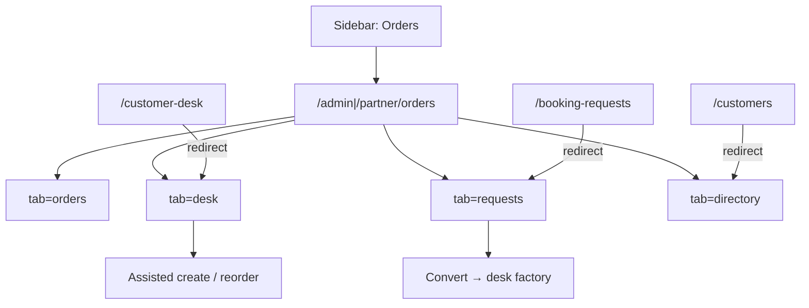

# Feature: Orders Hub — hard-merge ops home

> Status: **review** (Admin + Partner hub shells complete; Playwright partner matrix shipped)  
> Owner: product-manager + frontend-architect  
> Last updated: 2026-08-04  
> Related: [customer-desk.md](customer-desk.md), [booking-requests.md](booking-requests.md), [partner-dashboard.md](partner-dashboard.md), [admin-dashboard.md](admin-dashboard.md), [order-placement.md](order-placement.md)  
> API: reuses [customer-desk.md](../api/endpoints/customer-desk.md) + existing order / booking-request / customers endpoints  
> Product map: [offline-booking-ui-map.md](../product/offline-booking-ui-map.md)

## Problem

Admin and laundry partners (often non-technical) bounce between **Orders**, **Customer Desk**, **Booking requests**, and **Customers / Customer insights** to answer a call, see history, place work, and review directory data. They think in one job: “find this customer and handle their order.” Soft-merge enriched Orders but left four sidebar entries that still feel like separate tools.

## Persona

| Persona | Context |
| ------- | ------- |
| **Partner / staff** | Shop floor; phone + walk-in; laundry-scoped only |
| **Admin / ops** | Platform desk; any laundry; may save leads as booking requests |

## Why now

Customer Desk (Slices 1–5) and booking-request convert already ship the APIs. Soft-merge put find-customer on Orders. Hard-merge collapses the remaining ops CRM surfaces into **one sidebar home** so staff stop hunting nav labels.

## Goals

- [x] Spec hard-merge IA (single **Orders** nav item; tabs for Today/Orders, Find customer, Requests, Directory)
- [x] Admin sidebar Operations: keep **Laundries** + **Orders** only (drop Customers / Customer Desk / Booking requests as top-level items)
- [x] Partner sidebar Operations: keep walk-in / pickups / deliveries / operations center; collapse Customer Desk / Booking requests / Customer insights into **Orders**
- [x] Hub tabs on `/admin/orders` and `/partner/orders` (see IA)
- [x] Redirects: `/customer-desk`, `/booking-requests`, `/customers` → `/orders?tab=…` (both roles)
- [x] Move `bookingRequests` badge onto the single **Orders** nav item (partner also sums `orders` + `bookingRequests`)
- [x] Admin hub shell in `features/admin/orders-hub` — requests badge on header/tab + soft-merge today strip on `tab=orders`
- [x] Playwright Admin hub smoke (tabs + redirects + desk deep-link @ 375px)
- [x] Partner hub shell in `features/partner/orders-hub` — same tab IA + requests badge; soft-merge today panel
- [x] Playwright Partner hub matrix — nav + all tabs + search → place-order + legacy redirects

## Non-goals

- New backend CRUD or AuthZ changes
- Removing dedicated page modules immediately (routes redirect; components mount inside hub tabs)
- Merging **Laundries** (admin) into Orders
- Merging partner **Walk-in orders**, **Pickup requests**, **Deliveries**, or **Operations center** into Orders (they are floor workflows, not CRM duplicates)
- Changing assisted-create / BR convert APIs
- Customer self-serve portals

## Domain decisions

| Decision | Default | Rationale |
| -------- | ------- | --------- |
| Merge style | **Hard** | One ops home; stop training four labels for one job |
| Sidebar label | **Orders** | Familiar daily home; href `/admin/orders` / `/partner/orders` |
| Tab IA | `orders` \| `desk` \| `requests` \| `directory` | Clear query deep-links; matches staff mental model |
| Legacy routes | Redirect (308/replace) to hub tab | Bookmarks + old docs keep working |
| Panel / desk UI | Reuse Customer Desk feature modules inside `tab=desk` | One assisted-create brain |
| Requests UI | Reuse BR inbox inside `tab=requests` | Avoid forking BR |
| Directory | Admin = customers table; Partner = customer insights | Analytics still available without separate nav |
| Admin Laundries | Stay in sidebar | Store management ≠ order ops |
| Partner walk-in / pickups / deliveries / ops center | Stay in sidebar | Floor queues; not Desk/BR/directory duplicates |
| Soft-merge shell | Keep as Today/Orders foundation | Phone search may live on `orders` and/or focus `desk` |
| URL params | `?tab=` + existing `?phone=` / `?user_id=` | Shareable desk deep-links on hub |

## Information architecture

### Sidebar (target)

**Admin — Operations**

| Keep | Collapse into **Orders** |
| ---- | ------------------------ |
| Laundries | Customers |
| Orders (`/admin/orders`) | Customer Desk |
| | Booking requests |

**Partner — Operations**

| Keep | Collapse into **Orders** |
| ---- | ------------------------ |
| Operations center | Booking requests |
| Orders (`/partner/orders`) | Customer Desk |
| Walk-in orders | Customer insights |
| Pickup requests | |
| Deliveries | |

### Orders Hub tabs

| Tab | `?tab=` | Content |
| --- | ------- | ------- |
| Today / Orders | `orders` (default) | Today strip + active orders table (existing soft-merge queue home) |
| Find customer | `desk` | Full Customer Desk (lookup, history, assisted create / walk-in handoff) |
| Requests | `requests` | Booking requests inbox (admin platform / partner assigned) |
| Directory | `directory` | Admin: customers table; Partner: customer insights |

## Redirects

| Legacy path | Target |
| ----------- | ------ |
| `/admin/customer-desk` | `/admin/orders?tab=desk` |
| `/partner/customer-desk` | `/partner/orders?tab=desk` |
| `/admin/booking-requests` | `/admin/orders?tab=requests` |
| `/partner/booking-requests` | `/partner/orders?tab=requests` |
| `/admin/customers` | `/admin/orders?tab=directory` |
| `/partner/customers` | `/partner/orders?tab=directory` |

Preserve query extras where useful (e.g. `/admin/customer-desk?phone=+91…` → `/admin/orders?tab=desk&phone=+91…`).

## UX flow

1. Staff opens **Orders** from the sidebar (only CRM/ops queue entry).
2. Default **Today / Orders** shows the live queue + optional compact search.
3. **Find customer** opens the desk: search → history → New / Repeat / Walk-in (partner) / Save as request (admin).
4. **Requests** is the full BR inbox (badge on Orders nav).
5. **Directory** is the customers table (admin) or insights (partner).
6. Old bookmarks to Desk / BR / Customers land on the matching tab.

## API surface

No new endpoints. Reuse:

| Method | Path | Purpose |
| ------ | ---- | ------- |
| GET | `/admin\|partner/customers/lookup` \| `search` | Find customer |
| GET | `/admin\|partner/customers/.../orders` | History |
| POST | `/admin\|partner/customer-desk/orders` | Assisted create |
| GET | `/admin\|partner/booking-requests` | Requests inbox / preview |
| Existing | Admin customers / partner insights APIs | Directory tab |

## Frontend surface

| Route | Role |
| ----- | ---- |
| `/admin/orders` | Hub shell + tabs (admin) |
| `/partner/orders` | Hub shell + tabs (partner) |
| Legacy `/…/customer-desk`, `/…/booking-requests`, `/…/customers` | Redirect only |

Feature folders: `frontend/features/admin/orders-hub/` (full admin shell + today panel), `frontend/features/partner/orders-hub/` (full partner shell + today panel), shared `frontend/features/orders-hub/orders-hub-tabs.tsx`. Mount existing desk / BR / directory modules by tab — do not fork. Nav source of truth: `admin-nav.ts` / `partner-nav.ts`.

## Acceptance criteria

### Both roles

- [x] Sidebar shows a single **Orders** item for the collapsed surfaces (no separate Customer Desk, Booking requests, or Customers / Customer insights entries).
- [x] `/…/orders` exposes tabs: Today/Orders, Find customer, Requests, Directory.
- [x] Deep-link `?tab=desk|requests|directory|orders` selects the correct tab; unknown `tab` falls back to `orders`.
- [x] `?phone=` with `tab=desk` opens the customer panel / desk search (shareable deep-link).
- [x] Legacy paths redirect to the correct hub tab and preserve phone/user query when present.
- [x] `bookingRequests` badge appears on **Orders** nav (not a removed nav row).

### Admin

- [x] **Laundries** remains a top-level Operations item.
- [x] `/admin/orders` is the ops home shell (`features/admin/orders-hub`): tabs mount desk / BR inbox / customers without forking those modules.
- [x] Default `tab=orders` keeps soft-merge Today strip (phone search opens desk drawer) + `AdminOrdersTable`.
- [x] Requests badge visible on hub header and Requests tab (`new` + `reviewing`).
- [x] Directory tab shows the platform customers table (former `/admin/customers`).
- [x] Desk remains platform-wide; partner laundry picker / Save as request behavior unchanged.
- [x] Hub tabs usable at 375px (horizontal scroll + 44px targets).
- [x] Jest tab smoke + Playwright `admin-orders-hub` smoke covering tabs, badge, redirects, and `?tab=desk&phone=`.

### Partner

- [x] Walk-in orders, Pickup requests, Deliveries, and Operations center remain separate sidebar items.
- [x] Desk / history / create remain laundry-scoped (existing desk AuthZ).
- [x] Directory tab shows customer insights (former `/partner/customers`).
- [x] `/partner/orders` is the ops home shell (`features/partner/orders-hub`): tabs mount desk / BR inbox / insights without forking those modules.
- [x] Default `tab=orders` keeps soft-merge Today strip (phone search opens desk drawer) + orders queue.
- [x] Requests badge visible on hub header and Requests tab (assigned waiting count).
- [x] Hub tabs usable at 375px (horizontal scroll + 44px targets).
- [x] Jest tab smoke + Playwright `partner-orders-hub` smoke covering tabs, badge, search → place-order, redirects, and `?tab=desk&phone=`.

## Security / privacy

- Same IDOR rules as Customer Desk (partner `404` cross-laundry).
- No mass export from hub that directory did not already allow.
- PII limited to phone lookup already approved for desk.
- Redirects must not widen AuthZ (same role gates as legacy pages).

## Test plan

### Unit / component

- [x] Hub tab switcher renders four tabs; unknown `tab` falls back to `orders` (`admin-orders-hub.test.tsx`).
- [x] Requests badge on hub header + Requests tab when inbox `new`+`reviewing` > 0.
- [x] Badge key wired to Orders nav item for both roles.

### Playwright — Admin

- [x] Operations nav: **Laundries** + **Orders**; no Customer Desk / Booking requests / Customers links.
- [x] Visit `/admin/orders` → each tab loads expected landmark (queue / desk search / BR list / customers table).
- [x] Visit `/admin/customer-desk?phone=+91…` → lands on `/admin/orders?tab=desk&phone=…`.
- [x] Visit `/admin/booking-requests` → `tab=requests`; `/admin/customers` → `tab=directory`.
- Spec: `frontend/tests/e2e/admin-orders-hub.spec.ts` (also in `playwright.admin.config.ts`).

### Playwright — Partner

- [x] Operations nav still includes walk-in, pickups, deliveries, operations center + **Orders**.
- [x] No top-level Customer Desk / Booking requests / Customer insights.
- [x] Visit `/partner/orders` → all four tabs; desk search → place-order (walk-in deep-link still available).
- [x] Legacy `/partner/customer-desk`, `/partner/booking-requests`, `/partner/customers` redirect to matching tabs.
- Spec: `frontend/tests/e2e/partner-orders-hub.spec.ts` (also in `playwright.partner.config.ts`).

### Manual

- Deep-link share: `?tab=desk&phone=+91…` on both roles.
- BR badge increments on Orders after a new waiting request (staging).
