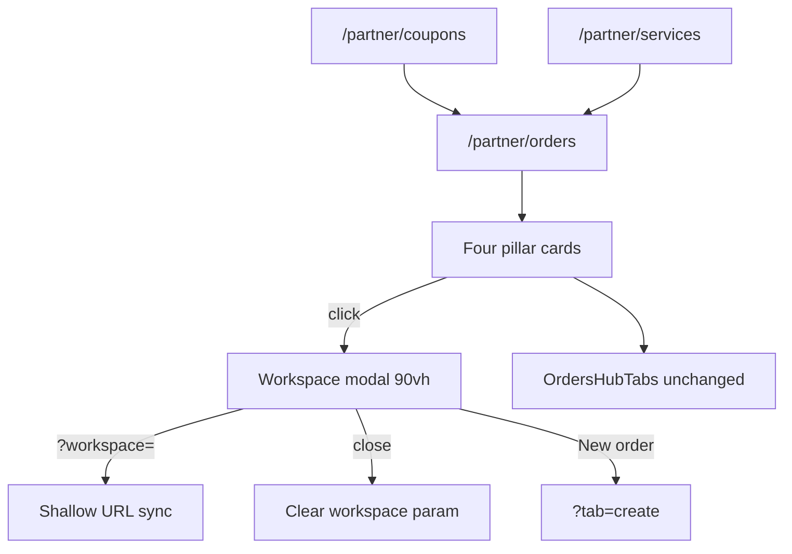

# Feature: Partner Customers & Orders — Four pillars workspace

> Status: **review** (Prompts 0–8 — 2026-08-10)  
> Owner: product-manager + ui-ux-designer → frontend-architect + backend-architect  
> Last updated: 2026-08-10  
> Prompt pack: [`.cursor/prompts/partner-customers-orders-four-pillars-workspace.md`](../../.cursor/prompts/partner-customers-orders-four-pillars-workspace.md)  
> Parent: [partner-customers-orders-hub.md](partner-customers-orders-hub.md) (tabs, chips, queue **unchanged** — pillars **add** fast paths above tabs)  
> Polish baseline: [partner-customers-orders-hub-ui-polish.md](partner-customers-orders-hub-ui-polish.md) (`h-9` controls, `PartnerOpsSurface` card language)  
> Related: [partner-coupons.md](partner-coupons.md), [customer-desk.md](customer-desk.md), [ui-fix-and-backend-pagination](../qa/partner-admin-pagination-matrix.md) (default **page_size = 10**)  
> QA matrix: [partner-four-pillars-workspace-matrix.md](../qa/partner-four-pillars-workspace-matrix.md)

## Problem

Counter staff and owners already have a strong **Customers & Orders** hub (tabs for queue, desk, requests, directory), but daily CRM and shop setup still scatter across **Operations › Services**, **Operations › Coupons**, directory tab, and sidebar bookmarks. At the counter the mental model is four questions: **Who is this?** · **What's in the shop?** · **Any discount?** · **Do we offer dry clean?** — not “which tab or sidebar item?” Owners want the same four entry points for promos and catalog without leaving the workplace they live in all day.

## Persona

| Persona | Context | Needs |
| ------- | ------- | ----- |
| **Counter staff** | Phone/tablet at counter; English-first | Glance KPIs + one tap into searchable, paginated lists; create order/customer without hunting nav |
| **Laundry owner** | Same hub for ops + setup | Coupons + services CRUD beside customers + orders; garment prices still one hop away |

## Why now

- Hub P1–P8 and UI polish landed a dense queue workplace; the next friction is **sidebar duplication** (Services/Coupons under Operations **and** Your shop) and **tab depth** for simple list/create jobs.
- Pagination standard (default 10) and customer insights APIs are production-ready — pillars can expose them in modals without unbounded fetches.
- Coupons CRUD and service catalog views already exist; this pack **extracts** them into a shared modal shell rather than new backend surface.

## User stories

- As **counter staff**, I want four obvious tiles at the top of Customers & Orders, so I open customers or orders in one tap without changing tabs first.
- As **counter staff**, I want a large modal with search and pagination, so I never load the full customer or order list on a phone.
- As **owner**, I want to manage coupons and services from the same screen as the queue, so I do not use Operations sidebar for daily setup.
- As **staff**, I want `/partner/coupons` and `/partner/services` bookmarks to open the hub with the right modal, so old links keep working.
- As **any partner user**, I want desk, requests, create tab, and queue chips **unchanged**, so power-user flows are not removed.

## Goals

- [x] Four **pillar cards** below hub header, above `OrdersHubTabs` on `/partner/orders`
- [x] Each pillar: **2 glance KPIs** + whole-card click → **~90% viewport modal** (full-screen ≤640px)
- [x] Modals: sticky header (title, debounced search, primary create), scrollable body, footer pagination (**customers + orders only**; default `page_size=10`)
- [x] **URL state:** `?workspace=customers|orders|coupons|services`; closing modal clears param (shallow `replace`)
- [x] Remove **Operations › Services** and **Operations › Coupons** from sidebar; keep **Your shop › Service catalog**
- [x] Redirect `/partner/coupons` and `/partner/services` → hub with matching `workspace=`
- [x] Reuse existing CRUD for coupons/services; server-paginated customers/orders only
- [x] Phased delivery Prompts 1–8 per prompt pack

## Non-goals

- Removing hub tabs (`orders`, `create`, `desk`, `requests`, `directory`), queue chips, or Find customer tab
- Admin hub or Admin CRM changes
- Bluetooth thermal print SDK
- Full i18n / Hindi-primary UI
- New coupon/service list pagination on backend (lists stay small; client table OK)
- Breaking print routes (`/partner/floor/print`, tag/bill/invoice deep links)

---

## Layout wireframes

Pillars sit **after** `PartnerPageHeader`, **before** `OrdersHubTabs`. Tabs and tab panels below are unchanged.

### Mobile (375px) — 2×2 pillar grid

```text
┌─────────────────────────────────────┐
│ Customers & Orders    [Print][New]  │
├─────────────────────────────────────┤
│ ┌─────────────┐ ┌─────────────┐     │
│ │ 👤 Customers│ │ 📦 Orders   │     │
│ │ 128 total   │ │ 412 total   │     │
│ │ +6 this wk  │ │ 28 this wk  │     │
│ │ Open →      │ │ Open →      │     │
│ └─────────────┘ └─────────────┘     │
│ ┌─────────────┐ ┌─────────────┐     │
│ │ 🎫 Coupons  │ │ ✨ Services │     │
│ │ 3 active    │ │ 6 services  │     │
│ │ 5 total     │ │ from ₹49    │     │
│ │ Open →      │ │ Open →      │     │
│ └─────────────┘ └─────────────┘     │
├─────────────────────────────────────┤
│ Orders · Create · Find · Requests · │
│ Customers (tabs — unchanged)        │
│ … queue / desk / etc. …             │
└─────────────────────────────────────┘
```

### Desktop (1280px) — 4 columns

```text
┌──────────────────────────────────────────────────────────────────────────┐
│ Header + actions                                                          │
├──────────────────────────────────────────────────────────────────────────┤
│ [ Customers ] [ Orders ] [ Coupons ] [ Services ]   ← grid-cols-4 gap-3  │
├──────────────────────────────────────────────────────────────────────────┤
│ Tabs + active tab content (unchanged)                                     │
└──────────────────────────────────────────────────────────────────────────┘
```

### Pillar card (shared)

- Visual: `PartnerOpsSurface` / dashboard pillar language (picture or icon slot, solid text panel, AA contrast per UI polish spec).
- **Primary metric** (line 1): total or dominant count — `text-sm font-semibold`.
- **Secondary metric** (line 2): contextual — `text-[11px] text-muted-foreground`.
- **Affordance:** entire card is `<button>` or clickable surface; trailing “Open” + chevron in text panel; `data-testid={`hub-pillar-${id}`}`.
- Loading: skeleton metrics; error: muted “—” + retry on modal open.

### Workspace modal shell

| Breakpoint | Size / behavior |
| ---------- | ---------------- |
| `sm+` | `max-w-[90vw] w-full max-h-[90vh]`, rounded dialog, flex column `p-0` |
| `≤640px` | `h-[100dvh] max-h-[100dvh] max-w-full rounded-none` (full-screen sheet feel) |

Structure:

```text
┌─ Dialog (role="dialog", labelled title) ─────────────────────────────┐
│ STICKY: Title · optional description · [Search…………] [Add / Create]   │
├──────────────────────────────────────────────────────────────────────┤
│ SCROLL: table or list (horizontal scroll on narrow viewports)         │
├──────────────────────────────────────────────────────────────────────┤
│ FOOTER: PartnerHubWorkspacePagination (customers + orders modals)     │
└──────────────────────────────────────────────────────────────────────┘
```

**Accessibility:** shadcn `Dialog` focus trap; `Escape` closes; focus returns to triggering pillar; `aria-labelledby` on title.

**Search:** debounce **300ms**; customer modal — enforce **≥2 characters** for name/phone text search before firing insights list (align desk `_SEARCH_MIN_LEN`); empty search = unfiltered page 1.

---

## KPI sources (exact fields)

| Pillar | Line 1 (primary) | Line 2 (secondary) | Source |
| ------ | ---------------- | ------------------ | ------ |
| **Customers** | Total customers | New this week | `GET /api/v1/partner/customer-insights/dashboard` → `total_customers`, `new_this_week` |
| **Orders** | All-time order count | Orders this week (IST) | `GET /api/v1/partner/customer-insights/dashboard` → `orders_count_all_time`, `orders_count_this_week` |
| **Coupons** | Active coupons | Total coupons | `listPartnerCoupons()` → count where `is_active === true` / `length` |
| **Services** | Service count | Optional: “from ₹X” | `listPartnerServices()` → `items.length`; secondary = `min(price_inr)` if any |

### Customers API (existing)

| Method | Path | Response fields used |
| ------ | ---- | -------------------- |
| GET | `/partner/customer-insights/dashboard` | `CustomerInsightsDashboard`: `total_customers`, `new_this_week` |
| GET | `/partner/customer-insights/customers` | Paginated `CustomerInsightRow`: `name`, `phone`, `order_count`, `last_order_at`, `segment` (soft tags via `customerSoftTag`) — params: `search`, `page`, `page_size` (default **10**) |

Backend: `partner_customer_insights.py` + `CustomerInsightsService.partner_list_customers`. Search filters in-memory on aggregated rows by name/phone substring (no minimum length server-side; FE applies ≥2 char gate).

### Orders KPI backend (Prompt 1)

**Implemented (Option A):** `GET /partner/customer-insights/dashboard` includes `orders_count_all_time` and `orders_count_this_week` (IST week via `partner_analytics_period`, aligned with `GET /partner/analytics/overview?period=week` order counts). Hub pillars use one dashboard round-trip for customer + order KPIs.

### Orders modal list (existing)

| Method | Path | Notes |
| ------ | ---- | ----- |
| GET | `/partner/orders` | `PaginatedList`: `total_records`, `items`; params `search`, `page`, `page_size=10`, `bucket=all` (modal default); row actions reuse status advance + `PrintOrderActions layout="compact"` |

Modal KPI strip (inside orders workspace): **Needs action** = `bucket=action` total; **This week** = same source as pillar line 2.

### Coupons & services (existing — no pagination)

| Client | API | KPI / modal body |
| ------ | --- | ---------------- |
| `listPartnerCoupons` | `GET /api/v1/partner/coupons` | `PartnerCoupon[]`: `id`, `code`, `discount_percent`, `is_active` |
| CRUD | POST/PATCH/DELETE `/api/v1/partner/coupons` | Unchanged from [partner-coupons-view.tsx](../../frontend/features/partner/views/partner-coupons-view.tsx) |
| `listPartnerServices` | `GET /partner/services` | `ServiceCatalogItem[]`; CRUD unchanged from [partner-service-catalog-view.tsx](../../frontend/features/partner/views/partner-service-catalog-view.tsx) |

---

## Product decision: Create customer

**Chosen: Recommended — `POST /api/v1/partner/customers`** (implement in Prompt 1 if not present).

| Aspect | Decision |
| ------ | -------- |
| Body | `PartnerCustomerCreateRequest { name, phone }` |
| Phone | `validate_strict_indian_mobile` (same as desk / walk-in) |
| Behavior | If phone new → create `User` (customer role), set display name; if exists → update display name if provided; **idempotent on phone** |
| Scope | Partner laundry visibility only; row appears in insights list after at least one order **or** explicit registration — **Prompt 1** must define whether zero-order registered users appear in insights aggregates (recommend: include registered users linked to partner touch) |
| Response | `PartnerCustomerSummary` or desk lookup profile shape |
| Authz | Partner A cannot create/view partner B laundry customers |

**Rationale:** Counter staff need “Add customer” to mean a durable record for directory and prefilled create — desk lookup alone does not register guests (`CustomerDeskService.lookup` returns `registered: false` until User exists; partner search hides zero-order guests).

**Fallback (if Prompt 1 defers POST):** “Add customer” opens desk lookup by phone + toast *“Customer ready — place first order”*; **no** insights row until first order; document limitation in UI helper text.

---

## Create order from pillars

| Entry | Behavior |
| ----- | -------- |
| Orders modal **New order** | `router.push(buildOrdersHubPath('/partner/orders', 'create'))` or `buildPartnerCreateOrderHref` |
| Customer row **New order** | `newOrderPrefillHref` / `buildNewOrderHref(phone, name)` → hub `?tab=create&phone=&name=` (reuse [owner-customer-crm.ts](../../frontend/features/partner/lib/owner-customer-crm.ts)) |
| Customer row **Open desk** | `?tab=desk&phone=` |
| Customer row **Call / WhatsApp** | `telHref`, `whatsappHref` |

Close workspace modal before or after navigation — prefer navigate with modal closed + clear `workspace` param.

---

## Customer row actions (modal)

| Action | Target |
| ------ | ------ |
| Call | `tel:` via `telHref` |
| WhatsApp | `wa.me` via `whatsappHref` |
| New order | Prefilled create tab |
| Open desk | Desk tab + phone query |

Columns: Name, Phone, Orders (`order_count`), Last visit (`last_order_at`), Tags (`customerSoftTag(segment)`), Actions.

---

## Coupons modal extras

- Copy code to clipboard
- Active toggle, delete with confirm
- Hint: *“Apply when creating orders in the Create tab.”*
- Create dialog — same fields as current coupons view

---

## Services modal extras

- Inline edit rows (parity with catalog view)
- Empty state CTA: **Add Wash & Fold**
- Footer link: **Garment prices** → `/partner/pricing`
- Walk-in composer continues to use `listPartnerServices` (no regression)

---

## Navigation & redirects

### Sidebar after change

```text
Operations
  Customers & Orders     → /partner/orders
  (REMOVED) Services
  (REMOVED) Coupons

Your shop
  Service catalog        → /partner/services  (redirects to hub ?workspace=services)
  Garment prices         → /partner/pricing
  …
```

Implementation: [partner-nav.ts](../../frontend/features/partner/lib/partner-nav.ts) — remove Operations items at lines for Services + Coupons; **keep** Your shop › Service catalog.

### Search aliases

Update `PARTNER_ORDERS_HUB_SEARCH_ALIASES`:

- Services → `/partner/orders?workspace=services`
- Coupons → `/partner/orders?workspace=coupons`

### Redirect map

| Legacy path | Target |
| ----------- | ------ |
| `/partner/coupons` | `/partner/orders?workspace=coupons` |
| `/partner/services` | `/partner/orders?workspace=services` |

Implemented as `permanentRedirect` in [coupons/page.tsx](../../frontend/app/(partner)/partner/coupons/page.tsx) and [services/page.tsx](../../frontend/app/(partner)/partner/services/page.tsx). Legacy client redirect views remain for unit tests only.

`PARTNER_ORDERS_HUB_ALIASES` includes `/partner/coupons` and `/partner/services` so `getPartnerPageTitle` resolves to **Customers & Orders** during redirect.

**Do not** remove `/partner/floor/print` or print child routes from hub aliases.

---

## UX flow



1. Partner opens Customers & Orders.
2. Scans four KPI tiles; taps one → modal opens; URL gains `?workspace=`.
3. Search (debounced) + paginated table for customers/orders; full list for coupons/services.
4. Create actions: Add customer (POST or fallback), New order (hub tab), coupon/service dialogs (existing).
5. Escape or close → focus returns to pillar; `workspace` removed.
6. Queue chips, desk, requests, directory tabs remain available below.

---

## API surface (delta)

| Method | Path | Purpose | Prompt |
| ------ | ---- | ------- | ------ |
| GET | `/partner/customer-insights/dashboard` | KPIs + `orders_count_all_time`, `orders_count_this_week` | **1** |
| GET | `/partner/customer-insights/customers` | Modal list (`search`, `page`, `page_size` default 10) | exists |
| GET | `/partner/orders` | Modal list + order KPIs | exists |
| GET | `/partner/analytics/overview?period=week` | Orders this week (fallback KPI) | exists |
| POST | `/api/v1/partner/customers` | Create/link customer (`PartnerCustomerCreateRequest`); `laundry_customer_registrations` for zero-order directory rows | **1** |
| GET/POST/PATCH/DELETE | `/api/v1/partner/coupons` | Coupons modal | exists |
| GET/POST/PATCH/DELETE | `/partner/services` | Services modal | exists |

Schemas (new in Prompt 1): `PartnerCustomerCreateRequest`, response aligned with desk profile or `CustomerInsightRow`.

## Data model

- **`laundry_customer_registrations`** — `(laundry_id, user_id)` unique link so counter-added customers appear in insights before first order.
- `POST /partner/customers` creates/updates `users` (customer role) and upserts registration; idempotent on phone.

## Frontend surface

| Piece | Location |
| ----- | -------- |
| Hub integration | [partner-orders-hub.tsx](../../frontend/features/partner/orders-hub/partner-orders-hub.tsx) — pillars between header and tabs |
| New folder | `frontend/features/partner/orders-hub/workspace/` — grid, card, modal shell, pagination, four workspace bodies |
| Reuse | `PartnerOpsSurface`, `PartnerOrdersTable`, `Dialog`, `@/lib/pagination/types`, coupon/service views (extract) |
| Nav | [partner-nav.ts](../../frontend/features/partner/lib/partner-nav.ts) |
| CRM helpers | [owner-customer-crm.ts](../../frontend/features/partner/lib/owner-customer-crm.ts) |

State: TanStack Query; modal page/search in component state or URL for `workspace` only (list page can stay local).

## Background work

None.

---

## Phased delivery (Prompts 1–8)

| Prompt | Scope |
| ------ | ----- |
| **1** | Backend: confirm insights pagination/search tests; `POST /partner/customers` if spec holds; hub order KPI endpoint or document FE fallback |
| **2** | Shared UI: `PartnerHubPillarGrid`, `PartnerHubPillarCard`, `PartnerHubWorkspaceModal`, pagination shell; URL `workspace` sync; placeholders |
| **3** | Customers pillar + modal (list, search, create, row actions); hub integration |
| **4** | Orders pillar + modal (list, search, KPI strip, create nav, print/status actions) |
| **5** | Coupons pillar + extract CRUD workspace; thin page redirect |
| **6** | Services pillar + extract catalog workspace; pricing link; redirect |
| **7** | Nav removal, redirects, search aliases, E2E hooks, title tests |
| **8** | QA matrix, polish (equal pillar height, mobile table scroll, `h-9` buttons), pytest + unit tests note |

---

## QA matrix (manual — extend in Prompt 8)

Environment: staging partner account; light + dark; viewports **375**, **768**, **1280**.

| ID | Case | 375 | 768 | 1280 | L | D |
| -- | ---- | --- | --- | ---- | - | - |
| P1 | Four pillars visible above tabs | ☐ | ☐ | ☐ | ☐ | ☐ |
| P2 | Pillar equal height; 2×2 vs 4-col | ☐ | ☐ | ☐ | ☐ | ☐ |
| P3 | Open/close each modal; focus return | ☐ | ☐ | ☐ | ☐ | ☐ |
| P4 | `Escape` closes modal | ☐ | ☐ | ☐ | ☐ | ☐ |
| P5 | `?workspace=` opens correct modal; close clears param | ☐ | ☐ | ☐ | ☐ | ☐ |
| C1 | Customers: 10 rows, next page network call | ☐ | ☐ | ☐ | ☐ | ☐ |
| C2 | Customer search debounce; ≥2 chars | ☐ | ☐ | ☐ | ☐ | ☐ |
| C3 | Add customer create + list refresh | ☐ | ☐ | ☐ | ☐ | ☐ |
| C4 | Row: call, WA, new order, desk | ☐ | ☐ | ☐ | ☐ | ☐ |
| O1 | Orders: pagination + search (phone last-4) | ☐ | ☐ | ☐ | ☐ | ☐ |
| O2 | New order → create tab | ☐ | ☐ | ☐ | ☐ | ☐ |
| O3 | Needs action / week KPI strip | ☐ | ☐ | ☐ | ☐ | ☐ |
| K1 | Coupon CRUD in modal | ☐ | ☐ | ☐ | ☐ | ☐ |
| S1 | Service add/edit/delete in modal | ☐ | ☐ | ☐ | ☐ | ☐ |
| S2 | Garment prices link | ☐ | ☐ | ☐ | ☐ | ☐ |
| N1 | Operations sidebar: no Services/Coupons | ☐ | ☐ | ☐ | ☐ | ☐ |
| N2 | `/partner/coupons` → hub + modal | ☐ | ☐ | ☐ | ☐ | ☐ |
| N3 | `/partner/services` → hub + modal | ☐ | ☐ | ☐ | ☐ | ☐ |
| R1 | Queue chips + desk + requests tabs still work | ☐ | ☐ | ☐ | ☐ | ☐ |
| R2 | Print routes unchanged | ☐ | ☐ | ☐ | ☐ | ☐ |
| A1 | No horizontal **page** scroll (modal table scroll OK) | ☐ | ☐ | ☐ | ☐ | ☐ |

Prompt 8 adds `docs/qa/partner-four-pillars-workspace-matrix.md` as the canonical checked copy.

---

## Acceptance criteria (Prompt 0)

- [x] Feature spec written from template with wireframes, KPI table, create-customer decision, nav/redirect map, phased map, QA matrix
- [x] Traceability row in [traceability.md](../product/traceability.md)
- [x] No application code in Prompt 0

## Acceptance criteria (feature complete — Prompts 1–8)

- [x] Given partner on `/partner/orders`, when page loads, then four pillars appear above tabs without removing tabs.
- [x] Given customers modal, when paginating, then only `page_size=10` server requests occur.
- [x] Given legacy `/partner/coupons`, when opened, then hub loads with coupons modal.
- [x] Given Operations nav, when expanded, then Services and Coupons items are absent.
- [x] Given create customer with valid Indian mobile, when POST succeeds, then customer appears in insights search (after Prompt 1).
- [x] Tests: hub pillar unit tests, nav tests, backend pytest for new routes, E2E smoke per Prompt 7–8.

**QA matrix:** [`partner-four-pillars-workspace-matrix.md`](../qa/partner-four-pillars-workspace-matrix.md)

## Metrics & analytics

| Event | Purpose |
| ----- | ------- |
| `partner_hub.pillar_open` | `{ workspace: customers|orders|coupons|services }` |
| `partner_hub.workspace_create` | Create from modal vs tab |

## Risks & mitigations

| Risk | L | I | Mitigation |
| ---- | - | - | ---------- |
| Double fetch KPIs (4 pillars × N APIs) | M | M | Prompt 1 lightweight combined metrics or cache TanStack `staleTime` |
| Modal + tab both open create flows | L | M | Clear copy; create from modal navigates to tab |
| Insights list loads full aggregate client-side | M | H | Already paginated at API; never increase page_size in modal |
| Coupon/service extract drift from full pages | M | M | Single workspace component; coupons view = redirect wrapper |

## Open questions

- Include zero-order registered users in insights `total_customers` immediately after POST — **done** via `laundry_customer_registrations`.
- Orders KPI: Option A vs B — **Option A** on insights dashboard.

## Security / privacy

- Same laundry-scoped auth as desk and insights (`404` cross-laundry).
- Customer create must not attach users to wrong laundry.
- Redirects must not bypass partner session checks.
