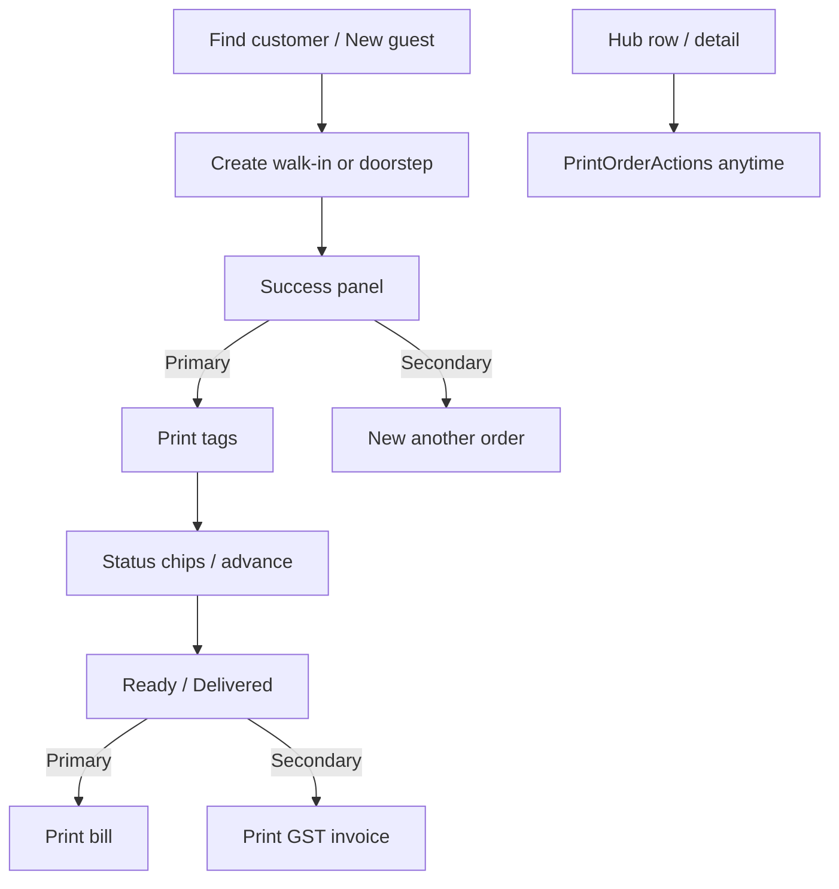
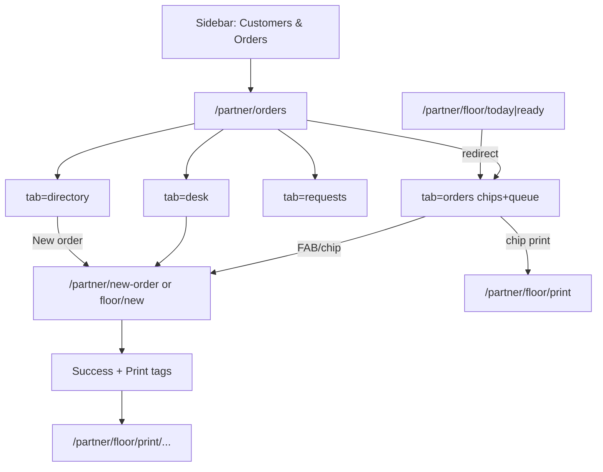

# Feature: Partner Customers & Orders Hub

> Status: **review** (P1–P8 complete — 2026-08-08)  
> Owner: product-manager + ui-ux-designer → frontend-architect  
> Last updated: 2026-08-08  
> Prompt pack: [`.cursor/prompts/partner-customers-orders-hub.md`](../../.cursor/prompts/partner-customers-orders-hub.md)  
> QA matrix: [`docs/qa/partner-customers-orders-hub-matrix.md`](../qa/partner-customers-orders-hub-matrix.md)  
> Related: [orders-hub.md](orders-hub.md) (CRM tabs — **superseded for Partner IA** by this spec; Admin hub unchanged), [partner-shop-floor.md](partner-shop-floor.md) (**display mode retired**; print + Cloth Wall become shared modules), [partner-owner-command-center.md](partner-owner-command-center.md) (single shell to evolve), [customer-desk.md](customer-desk.md), [offline-booking-ui-map.md](../product/offline-booking-ui-map.md)  
> Product: India laundry **counter + owner** daily workplace — find customer → order → print tags → ready → print bill — English-first, picture-led, **one shell**

## Problem

Laundry partners bounce between **Orders**, **New Order**, **Walk-in orders**, and **People › Customers** to do one job: serve the person in front of them or on the phone. **Shop Floor display mode** splits the product into a second OS (4-tile Hinglish home) that many shops never use — while print tags/invoice feel “floor-only,” not part of normal order completion. Hinglish/Hindi-first floor copy fails partners who run shops in English-primary states. Staff need **one Customers & Orders workplace** with chips, filters, images, and print in the order lifecycle — not two shells and four nav labels.

## Persona

| Persona | Context | Primary jobs |
| ------- | ------- | ------------ |
| **Counter staff** | Phone/tablet at counter; walk-ins + calls; may read English slowly | Find by phone → see unpaid/ready → create walk-in or doorstep → **Print tags** → advance status → **Print bill** |
| **Laundry owner** | Same shop + laptop; cares about queue clarity + money elsewhere | Same daily loop in one hub; Logistics / Money / Staff stay separate pillars |

**Jobs-to-be-done (daily loop):**

```text
Customer walks in / calls
  → Find by phone (or create guest)
  → See past orders + unpaid / ready
  → New order (walk-in or doorstep)
  → Print garment TAGS immediately
  → Work progresses (status chips)
  → Ready / collected / paid
  → Print BILL or GST INVOICE
  → Optional reprint anytime
```

## Why now

- Orders Hub hard-merge already collapsed Desk / Requests / Directory under `/partner/orders` — but **New Order**, **Walk-in**, and **People › Customers** still compete as top-level entries.
- Shop Floor Mode shipped print + Cloth Wall + boards; Owner Command Center shipped the Advanced shell. Maintaining **two OSes** (`dlm.partner_ui_mode`) doubles training cost and blocks a single English-first workplace.
- Print APIs and `PrintOrderActions` exist; productizing them into create-success and ready/handover CTAs unlocks counter speed without a mode toggle.

## User stories

- As a **counter staffer**, I want one sidebar home for customers and orders, so I stop hunting New Order vs Walk-in vs Orders.
- As a **counter staffer**, I want shortcut chips (Needs action, Ready today, Unpaid…), so I clear the queue without reading dense filters first.
- As a **counter staffer**, I want **Print tags** right after create and **Print bill** when ready/collected, so printing is part of the order — not a separate mode.
- As a **partner from any Indian state**, I want **English** UI by default, so Hinglish is not a barrier.
- As an **owner**, I want Logistics, Money, and Staff to stay separate, so this hub stays about customers + orders only.
- As a **returning device user**, I want Shop Floor mode removed without losing print or Cloth Wall, so bookmarks still work via redirects.

## Goals

- [x] One sidebar workplace: **Customers & Orders** → `/partner/orders`
- [x] Extend hub with image-led chips, smart filters, search, and intake shortcuts (no second shell) *(P2 chips/filters; P3 FAB/intake)*
- [x] Retire `shop_floor` \| `advanced` display-mode toggle; single = former Advanced / Owner Command Center shell *(default + hydrate migrate in P1; toggle UI removed in P6)*
- [x] Migrate useful floor capabilities (Cloth Wall, print center, ready/today signals) into hub actions / deep routes
- [x] English-primary copy for hub + remaining reachable floor screens; voice TTS English (en-IN), default OFF
- [x] Print lifecycle CTAs on create success, ready/handover, hub rows, and order detail (reuse `PrintOrderActions`)
- [x] Redirects preserve bookmarks for New Order, Walk-in, Customers, floor boards
- [x] Phased P1–P8 delivery per prompt pack; docs + Playwright *(P8 QA matrix + polish 2026-08-08)*

## Non-goals

- **Admin** Orders Hub redesign (parity note only; Admin keeps current [orders-hub.md](orders-hub.md) IA)
- New payment provider / Bluetooth thermal SDK
- Full multilingual i18n framework (future language picker = Phase 2 / non-goal this pack)
- Fake metrics or invented queue counts
- Breaking existing print APIs (`/api/v1/partner/orders/{id}/tags|invoice…`)
- Merging Logistics, Money, Staff, Storefront, or Settings into this hub
- Deleting print HTML routes or Cloth Wall create capability (retire **mode**, keep **modules**)

## Decision defaults

| Topic | Decision | Rationale |
| ----- | -------- | --------- |
| Sidebar label | **Customers & Orders** | Says both jobs; still one tap |
| Primary href | `/partner/orders` | Keep Orders Hub URL; badges + deep-links unchanged |
| Tab IA | **Keep** `orders` \| `desk` \| `requests` \| `directory` | Already shipped; extend `orders` with chips/filters rather than invent a fifth OS |
| Tab labels (EN) | Orders · Find customer · Requests · Customers | Directory already labeled Customers on partner |
| Intake entry | **FAB + chips** on hub (`New order`, `Walk-in`, `Doorstep`) → existing create routes | Remove duplicate sidebar items |
| Create routes | Keep `/partner/new-order`, `/partner/floor/new` (Cloth Wall), walk-in list redirect | Don’t fork create brains |
| People › Customers | **Remove** from sidebar; `/partner/customers` → hub `?tab=directory` | Directory already is the CRM |
| Logistics / Money / Staff | **Stay separate** | Owner Command Center pillars |
| Display mode | **Retire Shop Floor mode** | One shell = Advanced / OCC |
| localStorage | Default `advanced`; on hydrate `shop_floor` → `advanced` (one-time); then remove toggle UI | No dual home at `/partner` |
| Floor today / ready | **Redirect into hub chips** | Same job as Needs action / Ready today |
| Floor print / new | **Keep** as shared modules | Print + Cloth Wall remain valuable |
| Floor more | Redirect → `/partner/settings` | Mode chrome dies with mode |
| Language | English primary everywhere in scope | No Hindi/Hinglish as primary |
| Voice | `en-IN` if kept; **default OFF** | Stop Hindi preference |
| Print form factors | Thermal 58mm + browser print | No Bluetooth in this pack |

---

## Information architecture (HARD)

### Target Partner sidebar (Operations / Orders pillar)

```
Today                         → /partner

Operations
  Customers & Orders          → /partner/orders
                                badgeKeys: orders + bookingRequests
  (REMOVED) New Order
  (REMOVED) Walk-in orders

Logistics                     → /partner/logistics   (unchanged)
People
  (REMOVED) Customers         → was /partner/customers
  Staff                       → /partner/staff
Money / Your shop / System    → unchanged
```

**Active-state rule:** `/partner/orders?tab=*`, legacy desk/BR/customers aliases, `/partner/new-order`, `/partner/walk-in-orders`, and kept `/partner/floor/new|print…` highlight **Customers & Orders** (print/detail may also stay “in hub context”). Directory tab no longer yields to a separate People › Customers item.

### Tab + chip model

| Layer | Role |
| ----- | ---- |
| **Tabs** (unchanged query keys) | `?tab=orders` queue workplace · `desk` find/create CRM · `requests` BR inbox · `directory` relationship CRM |
| **Shortcut chips** (`tab=orders` only) | Fast queue lenses — see § Chips |
| **Filters sheet** | Status, source, payment, date range |
| **Search** | Phone / name / tracking / token last-4 |
| **FAB** (mobile) | Primary **New order** → sheet: Walk-in (Cloth Wall) · Doorstep (desk assisted) · Find customer |

**Justify extend-not-redesign:** Hub tabs already match “queue / find person / leads / directory.” Partners learn chips faster than a new tab taxonomy. Intake becomes chips + FAB, not more tabs.

### Where surfaces live

| Surface | Placement |
| ------- | --------- |
| Orders queue | `tab=orders` + chips/filters |
| Find customer / assisted | `tab=desk` |
| Booking requests | `tab=requests` |
| Customer CRM cards | `tab=directory` |
| New Order (Cloth Wall / workspace) | Chip + FAB → `/partner/new-order` (and `/partner/floor/new` alias) |
| Walk-in list | Chip → `/partner/orders?tab=orders&source=walk_in` (list) or deep-link create; legacy `/partner/walk-in-orders` redirects |
| Print center | Chip **Print** → `/partner/floor/print` (keep route) |
| Print tags/bill/invoice | Order success panel, detail, hub row actions → `/partner/floor/print/[orderId]/…` |
| Ready board | Hub chip **Ready today** (not a second OS) |
| Today’s bags | Hub chips **Today** / **Needs action** |

### Redirect map

| Legacy / floor path | Target | Prompt |
| ------------------- | ------ | ------ |
| `/partner/customer-desk` | `/partner/orders?tab=desk` (+ phone) | Already shipped; keep |
| `/partner/booking-requests` | `/partner/orders?tab=requests` | Already shipped; keep |
| `/partner/customers` | `/partner/orders?tab=directory` | Already shipped; keep (nav item removed) |
| `/partner/new-order` | **Keep page**; remove from nav; hub FAB/chip entry | P3 |
| `/partner/walk-in-orders` | `/partner/orders?tab=orders&source=walk_in` (or `chip=walk_in`) | P3 |
| `/partner/floor/new` | **Keep** Cloth Wall (or soft-alias `/partner/new-order`) | P3/P7 |
| `/partner/floor/print` · `/partner/floor/print/[orderId]/tags\|bill\|invoice` | **Keep** (shared print module) | — |
| `/partner/floor/today` | `/partner/orders?tab=orders&chip=today` | P7 |
| `/partner/floor/ready` | `/partner/orders?tab=orders&chip=ready_today` | P7 |
| `/partner/floor/more` | `/partner/settings` | P7 |

Preserve useful query extras (`phone`, `user_id`, `mode=walk_in|assisted`, `orderId`).

### Owner Command Center impact

- Evolve OCC nav: Operations collapses to **Customers & Orders** only (drop New Order / Walk-in; drop People › Customers).
- Today home pillar cards / brief deep-links that pointed at New Order or Shop Floor tiles → hub chips / `/partner/new-order`.
- Do **not** fork OCC; update labels + hrefs only.

---

## RETIRE Shop Floor as Display mode

### Product decision

Shop Floor is **no longer a display mode**. Useful capabilities become **shared modules** inside the single Advanced / Owner Command Center shell:

| Capability | Fate |
| ---------- | ---- |
| 4-tile Shop Floor home at `/partner` | **Gone** — `/partner` always OCC Today |
| Mode toggle (Settings / More / home footer) | **Remove** (P6) |
| Cloth Wall (`/partner/floor/new`, `/partner/new-order`) | **Keep** — hub intake |
| Print center + tag/bill/invoice routes | **Keep** — lifecycle + hub chip |
| Today / Ready boards | **Fold into hub chips** (P7 redirects); optional later “board view” is out of scope |
| More (`/partner/floor/more`) | Redirect Settings; delete dead chrome |
| Color tokens `R-42`, catalog thumbs, calm success | **Keep** — English copy |
| Hinglish primary labels / Hindi TTS preference | **Retire** |

### localStorage migration

| Key | Action |
| --- | ------ |
| `dlm.partner_ui_mode` | **P1:** `DEFAULT_PARTNER_UI_MODE = 'advanced'`; on hydrate if value is `shop_floor`, write `advanced`. **P7/P8:** stop reading mode for shell chrome; optional delete key on migrate |
| `dlm.partner_floor_voice_prompts` | Keep opt-in; default OFF; language **en-IN** only when speaking |
| `dlm.partner_floor_coach_orders` | Keep or reset; coach copy → English |
| `dlm.partner_tag_per_piece` | Unchanged |
| `dlm.partner_practice_mode` | Unchanged if still used for training banner |

Types: keep `PartnerUiMode` temporarily for migration tests; after P7, `shop_floor` is dead code path (store may no-op `setMode('shop_floor')` → force advanced).

### Spec supersession note

Update [partner-shop-floor.md](partner-shop-floor.md) status banner: **Display mode retired** by this feature; print + Cloth Wall documented as shared modules. Do not delete historical P0–P3 delivery notes.

---

## Language

- **English is the only primary UI language** for Customers & Orders Hub and any remaining reachable floor screens (Cloth Wall, print, redirects).
- Migrate Hinglish strings (*Naya Order*, *Aaj ka Kaam*, *Diya*, *Order save हो गई*, etc.) to clear English when those screens remain reachable (P6).
- Voice TTS: if Web Speech remains, use **`en-IN`**, never prefer Hindi; **default OFF**.
- Full i18n framework / language picker: **non-goal** this pack (document as Phase 2 optional).

---

## Print lifecycle

Reuse `PrintOrderActions` (`frontend/features/partner-shop-floor/components/print-order-actions.tsx`) and existing FE/API print routes.

| Moment | Primary CTA | Secondary | Notes |
| ------ | ----------- | --------- | ----- |
| **Create success** (walk-in / Cloth Wall / assisted) | **Print tags** | Continue to order · New another order | Calm success panel + image + token chip |
| **Ready** (`ready`) | **Print bill** | Print GST invoice · Reprint tags | Hub row + detail |
| **Delivered / collected** (walk-in `delivered`; doorstep `delivered` or counter handover) | **Print bill** | GST invoice | Same actions |
| **Any time** | Reprint via Print actions on hub row + `/partner/orders/[id]` | Print center search | Idempotent reprints — no money recalculation |

**Statuses for bill emphasis:** `ready`, `out_for_delivery`, `delivered`. Tags emphasized for new/`confirmed`/in-progress after create.

**Print center:** Hub chip → `/partner/floor/print` (phone last-4 / tracking / token search).

**Form factors:** Thermal ~58mm tags/bill + A4 GST via browser `window.print()`. No Bluetooth SDK.



---

## Chips, filters, search

### Shortcut chips (`tab=orders`)

| Chip id | Label (EN) | Behavior |
| ------- | ---------- | -------- |
| `needs_action` | Needs action | Accept/reject / awaiting partner action bucket |
| `ready_today` | Ready today | Status `ready` (+ optional due today) |
| `walk_in` | Walk-in | `order_source=walk_in` |
| `doorstep` | Doorstep | online + assisted sources |
| `unpaid` | Unpaid | COD pending / unpaid payment states already exposed |
| `today` | Today | Created or due today (align with existing today panel) |
| `repeat` | Repeat customers | Optional: 2+ prior orders for phone (if insights cheap; else defer P8) |
| `all` | All | Clear chip lens |
| `print` | Print | Navigate print center (not a list filter) |

Picture labels: small status/garment thumbs beside chip text (catalog or `partner-ops` icons) — literacy without Hindi.

### Filters (sheet / drawer)

- Status (confirmed, washing, ironing, ready, out_for_delivery, delivered, cancelled — match existing partner filter set)
- Source (walk_in, assisted_partner, online, …)
- Payment (pending COD / paid / … as API allows)
- Date range (today, last 7 days, custom)

Compose with chips: chip sets a preset; filters refine. URL sync preferred: `?chip=` + existing page/bucket params.

### Search

Single field on hub Orders tab:

- Phone (full or last-4)
- Customer name
- Tracking code
- Token last-4 / `R-42` pattern

Desk tab keeps full CRM search. Opening from directory/desk with `?phone=` or `user_id` **customer-scopes** the orders list (“Orders for this customer”) + sticky **New order for this customer**.

---

## Image system

- Every primary action, empty state, and chip group gets a small illustration or `CatalogGarmentThumb` where it aids recognition.
- Prefer reuse: `frontend/public/catalog/**`, existing Owner Command Center `partner-ops` slots.
- New metaphors only if missing → `frontend/public/partner-ops/` (e.g. `print-tags.webp`, `ready-bag.webp`, `find-phone.webp`) — keep files small.
- Visual language: `tokens.css` brand/accent; match OCC calm laundry aesthetic.
- **Anti-patterns:** purple neon gradients, cream+terracotta cliché, broadsheet density, confetti success, 3D in shell.

| Slot | Reuse / add |
| ---- | ----------- |
| Empty queue | catalog hygienic / fresh laundry |
| Empty desk search | find-phone / store interior |
| Create success | garment stack + token swatch |
| Chip Needs action | accent warning icon + thumb |
| Chip Ready | green bag / ready metaphor |
| Print | tag/bill simple illustration |

---

## Creative extras

| Idea | Decision | Rationale |
| ---- | -------- | --------- |
| Recent customers strip (last ~8 phones today) | **Accept** | **P4:** localStorage `dlm.partner_recent_customers` (Kolkata day); no dedicated API yet |
| Repeat last order (1-tap clone lines) | **Accept soft** | **P4:** Desk “Same as last” when `item_summary` present; disabled + reason if not |
| WhatsApp share invoice | **Accept soft** | Reuse `wa.me` + tracking + amount (desk/CRM already pattern); stub if invoice URL awkward |
| Big token display | **Accept** | Detail + success + print center |
| Unpaid / ready overdue emphasis | **Accept** | Chip + row accent (color + icon + label) |
| Phone keypad on desk | **Accept** | Reuse Cloth Wall keypad patterns on desk phone entry |
| Picture labels on chips | **Accept** | Literacy without Hindi |

---

## UX flow

1. Partner opens **Customers & Orders** (only ops CRM/intake entry).
2. Default **Orders** tab: recent strip + shortcut chips + search + queue (paginated, default 10).
3. Tap **Find customer** or search → desk: history, unpaid/ready, **New order for this customer**.
4. Create via FAB/chip → Cloth Wall / assisted → **success panel** → **Print tags**.
5. Chip **Ready today** → Print bill / mark collected.
6. Directory → one tap into customer-scoped orders + new order.
7. Old bookmarks land via redirect map; Settings has **no Shop Floor mode**.



---

## API surface

No new money-moving endpoints required for P1–P8. Reuse:

| Method | Path | Purpose |
| ------ | ---- | ------- |
| GET | `/api/v1/partner/orders` | Queue (+ existing buckets/filters/pagination). **P2 extras:** `order_source=doorstep` (≠ walk_in), `payment_status=unpaid` (pending + pending_cod), `created_today=true` (Asia/Kolkata date) |
| GET | `/api/v1/partner/customers/lookup` \| `search` | Desk |
| GET | `/api/v1/partner/customers/.../orders` | History |
| POST | `/api/v1/partner/customer-desk/orders` | Assisted doorstep |
| POST | `/api/v1/partner/walk-in-orders` | Walk-in + token assign |
| GET | `/api/v1/partner/orders/{id}/tags` · `…/tags/print` | Tags |
| GET | `/api/v1/partner/orders/{id}/invoice` · `…/invoice/print` | Bill / GST |
| GET | Booking requests / insights | Requests + directory |

Optional later (not blocking): richer server `chip=` presets if client filter is insufficient.

## Data model

No schema change required for hub IA / mode retirement. Color token columns already on `orders` (Shop Floor migration). Do not break print allocation of `invoice_number`.

## Frontend surface

| Piece | Location |
| ----- | -------- |
| Hub shell | `frontend/features/partner/orders-hub/` (extend `PartnerOrdersHub`) |
| Shared tabs | `frontend/features/orders-hub/orders-hub-tabs.tsx` |
| Nav | `frontend/features/partner/lib/partner-nav.ts` |
| Mode store | `frontend/features/partner-shop-floor/store/partner-ui-mode.store.ts` + `types.ts` |
| Mode toggle | Remove UI in P6 (`partner-ui-mode-toggle.tsx`) |
| Print actions | `print-order-actions.tsx` (reuse) |
| Cloth Wall / create | existing `partner-shop-floor` + `new-order` |
| Shell | `frontend/components/layout/partner-shell.tsx` — always Advanced chrome after P1 |

State: TanStack Query for lists; localStorage for recent phones + migrated mode key.

## Background work

None required for this pack.

---

## Phased slices (Prompts 1–8)

| Slice | Prompt | Scope |
| ----- | ------ | ----- |
| **P1** | 1 | Spec lock consumed: nav label **Customers & Orders**; remove New Order / Walk-in / People › Customers from sidebar; mode default `advanced` + hydrate migrate `shop_floor`→`advanced`; PartnerShell never lands shop_floor chrome; unit tests |
| **P2** | 2 | Hub shell: chips, filters, search, image-led empty/loading; no intake merge yet |
| **P3** | 3 | Merge intake into hub (FAB/chips) + redirects for new-order entry / walk-in list; success panel foundation |
| **P4** | 4 | Customer-centric CRM: directory/desk → customer-scoped orders + **New order for this customer**; recent strip — **done 2026-08-08** |
| **P5** | 5 | Print lifecycle CTAs (create success, ready/delivered, hub rows, detail); Print center chip — **done 2026-08-08** |
| **P6** | 6 | English copy pass + voice/lang defaults; **remove Shop Floor toggle UI** — **done 2026-08-08** |
| **P7** | 7 | Floor route migration (`today`/`ready`/`more` redirects); delete dead mode chrome; keep print + Cloth Wall — **done 2026-08-08** |
| **P8** | 8 | Polish, a11y, Playwright, docs, logs; mark related specs superseded — **done 2026-08-08** |

---

## Acceptance criteria

- [x] Sidebar shows a single **Customers & Orders** item for queue + CRM + intake entry (no top-level New Order, Walk-in orders, or People › Customers). *(P1)*
- [x] Partner finds a customer and starts a new order in **≤ 3 taps** from the hub (chip/FAB/desk). *(P3 — FAB/header sheet)*
- [x] After create, primary CTA is **Print tags** without leaving order context (success panel → print route). *(P3 foundation; P5 polish)*
- [x] On ready/delivered (and hub/detail), **Print bill** / GST invoice / reprint available via `PrintOrderActions`. *(P5)*
- [x] Settings / More / home have **no Shop Floor display-mode toggle**; fresh + migrated devices use Advanced shell only. *(hydrate migrate P1; toggle UI removal P6)*
- [x] UI English-first on hub + remaining floor screens in scope; voice default OFF, `en-IN` if on.
- [x] Redirects: customers/desk/BR (existing) + **walk-in list** (P3) + floor today/ready/more per map (P7); print routes still work.
- [x] Logistics, Money, Staff, Shop, System remain separate. *(P1 confirmed)*
- [x] Admin Orders Hub unchanged this pack.
- [x] Tests: nav + mode migration unit tests (P1); hub chips (P2); intake FAB + walk-in redirect (P3); customer href builders + queue scope (P4); print lifecycle unit + success CTA (P5); Playwright partner hub journey chips → create → print CTAs (P8).
- [x] Docs: this spec, features README, feature-progress, current-status; cross-links on orders-hub + shop-floor; QA matrix `docs/qa/partner-customers-orders-hub-matrix.md`.
- [x] Lighthouse mobile budget respected on `/partner/orders` (no heavy new charts).
- [x] Pagination remains server-driven default **10** on queue.

## Metrics & analytics

| Event / KPI | Purpose |
| ----------- | ------- |
| `partner_hub.chip_click` | Which lenses get used |
| `partner_hub.create_start` | Intake from FAB vs desk vs directory |
| `partner_print.tags` / `partner_print.bill` | Print adoption after create / ready |
| Success metric | % creates with tags printed same session; time-to-first-order from hub open |

(Instrument when FE analytics hooks already exist; else document for P8.)

## Risks & mitigations

| Risk | Likelihood | Impact | Mitigation |
| ---- | ---------- | ------ | ---------- |
| Partners who loved 4-tile Shop Floor feel lost | M | H | Keep Cloth Wall + print; hub chips mirror Today/Ready; English picture labels; redirects |
| Nav active-state bugs after collapsing items | M | M | Extend `isPartnerNavActive` + aliases + unit tests in P1 |
| Filter/chip URL explosion | M | L | Document allowed query keys; unknown chip → All |
| Hinglish leftovers confuse QA | M | L | P6 copy checklist + Playwright string smoke |
| Double-create from FAB + old bookmarks | L | M | Idempotent APIs unchanged; clear success panel |

## Open questions

- Exact URL param for walk-in list lens: `source=walk_in` vs `chip=walk_in` — **resolved in P2:** shortcuts use `chip=`; filter bar uses `source=` / `status=` / `payment=` / `q=`. Selecting a chip also writes the matching filter params for deep links.
- Whether `/partner/floor/new` permanently aliases to `/partner/new-order` or stays dual — **prefer dual keep in P3; soft-alias optional P7**.
- Repeat-customers chip: **deferred to P8** (not shown in P2 chip row).

## Security / privacy

- Same laundry-scoped AuthZ as Orders Hub / Desk (partner `404` cross-laundry).
- Redirects must not widen AuthZ.
- Recent-customers strip: local device only + own-laundry phones; no cross-shop cache.
- Print routes remain partner-authenticated.

## Test plan

### Unit

- Nav: single hub item; aliases highlight Customers & Orders; titles/search aliases updated.
- Mode: default advanced; persist migrate shop_floor → advanced.
- Hub: chip parsing; unknown chip → all; tab fallback unchanged.

### Playwright (P8)

- Nav smoke @ 375px: no New Order / Walk-in / People Customers links; hub present.
- Chips + search → open order → print actions visible.
- Create success → Print tags link.
- Legacy `/partner/floor/today` → hub chip; `/partner/floor/more` → settings.
- Mode: no toggle in Settings; `/partner` shows OCC Today not 4-tile floor.

### Manual

- Migrate device with `localStorage.dlm.partner_ui_mode=shop_floor` → reload → Advanced shell.
- English copy on Cloth Wall success + print.
- Thermal print smoke (browser) tags + bill.

---

## Supersession

| Spec | Relationship |
| ---- | ------------ |
| [orders-hub.md](orders-hub.md) | **Partner** sidebar/intake IA superseded by this doc; tab keys retained; Admin hub still governed by orders-hub.md |
| [partner-shop-floor.md](partner-shop-floor.md) | **Display mode retired**; print + Cloth Wall + tokens remain as shared modules referenced here |
| [partner-owner-command-center.md](partner-owner-command-center.md) | Single shell continues; Operations nav slimmed per this IA — evolve, don’t fork |
