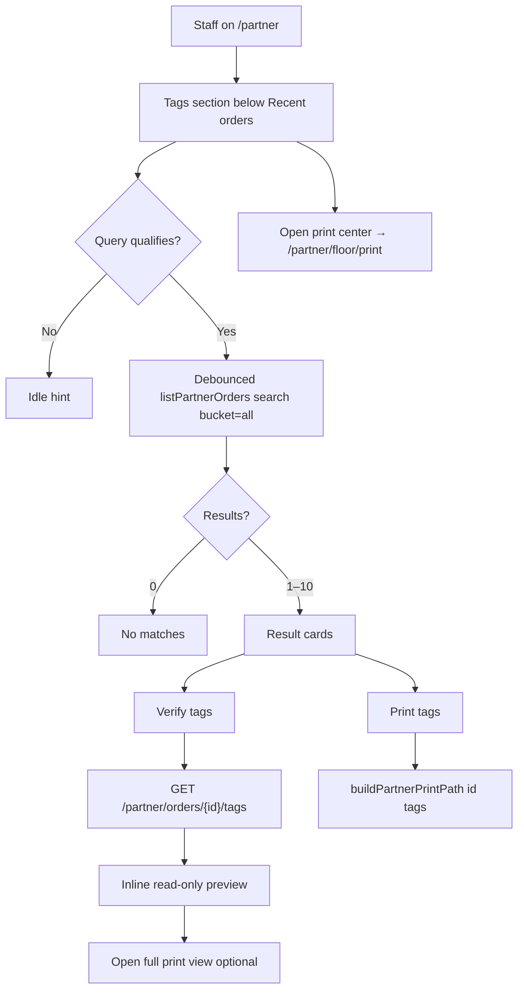

# Feature: Partner Dashboard — Tags section (find · verify · reprint)

> Status: **review** (Prompts 0–6 shipped; manual QA pending)  
> Owner: product-manager + ui-ux-designer → frontend-architect + backend-architect  
> Last updated: 2026-08-10  
> Prompt pack: [`.cursor/prompts/partner-dashboard-tags-section.md`](../../.cursor/prompts/partner-dashboard-tags-section.md)  
> Related: [partner-laundry-dashboard-redesign.md](partner-laundry-dashboard-redesign.md), [partner-shop-floor.md](partner-shop-floor.md) (tokens + print), [partner-dashboard.md](partner-dashboard.md), [partner-washhouse-ops-visual.md](partner-washhouse-ops-visual.md)

## Problem

Bag and garment tags get lost, swapped, or damaged on a busy wash floor. Counter staff need a **fixed, obvious place on `/partner`** — right after **Recent orders** — to look up an order by **order number, phone, or color token (e.g. R-42)**, confirm what should be on the labels, and **reprint** without opening the full Orders Hub or remembering the print-center URL (`/partner/floor/print`). Owners use the same flow when they are at the counter. Today, print center search only filters **~50 active orders client-side**, so **delivered or older** orders are hard to find from the dashboard context.

## Persona

| Persona | Context | Need |
| ------- | ------- | ---- |
| **Counter staff** | Tablet at counter; tag misplaced | Type phone or WH number → see token + preview → print tags |
| **Laundry owner** | Same desk as staff | Same lookup/reprint without navigating away from command desk |

**Design thesis:** Server-backed search (not only recent/active rows) · same print URLs as hub/shop floor · `PartnerOpsSurface` language · mobile-first · debounced search · default page size **10**.

## Why now

- **Partner laundry dashboard redesign** (2026-08-10) ships Recent orders + create success print on `/partner`; the next counter pain is **re-finding orders for reprint**.
- **Print center** exists but is a separate route and limited to client filter on active orders — dashboard Tags closes the gap on the home screen.
- Pagination standard (**10**) and **`listPartnerOrders` `search`** already exist — extend, don’t fork.

## User stories

- As **counter staff**, I want to **search by phone or token on `/partner`**, so that I can reprint when a customer lost a tag.
- As **counter staff**, I want to **preview tag lines before printing**, so that I know bag master vs item tags match the order.
- As **counter staff**, I want **Print tags** to open the **same route as row actions**, so behavior stays consistent with Recent orders and the hub.
- As an **owner**, I want a link to **Open print center**, so power users can still use the full print workspace.

## Goals

- [x] **Tags** section on `/partner` **immediately after** `PartnerDashboardRecentOrders` and **before** create success panel
- [x] Debounced server search via `GET /partner/orders?search=&bucket=all&page_size=10`
- [x] Result rows: token chip, customer, tracking #, phone, status, **Verify tags** + **Print tags**
- [x] **Verify tags:** inline expandable read-only preview (Option A)
- [x] Reprint via **`buildPartnerPrintPath(orderId, 'tags')`** — no duplicate tag HTML
- [x] Refactor print center to share search helper/hook (Prompt 2)
- [x] Tests + QA matrix (Prompt 6)

## Non-goals

- Bluetooth thermal SDK or native printer drivers
- Editing tag content, reassigning token numbers, or Admin UI for tags
- Promoting Tags search to Orders Hub header (optional follow-up)
- Replacing or removing **`/partner/floor/print`** (dashboard **deep-links** only)
- Duplicating **`OrderTagsService`** print HTML — use existing print route + JSON API
- Invented mock orders or client-only search over a fixed 50-row window for dashboard Tags

## Decision defaults

| Topic | Decision | Rationale |
| ----- | -------- | ----------- |
| Verify interaction | **Option A — inline expandable panel** | Stay on command desk; fetch `GET …/tags`; read-only preview aligned with `print-order-tags-view`; no `window.print` from verify |
| Option B (not chosen) | Navigate to `/partner/floor/print/[id]/tags` | Valid fallback; spec chooses A for fewer context switches |
| Search API | Existing **`listPartnerOrders`** with `search`, `bucket=all`, `page=1`, `page_size=10` | Covers delivered/older orders; no duplicate endpoint |
| Print URL | **`buildPartnerPrintPath(id, 'tags')`** | Same as `PrintOrderActions` / row menu “Reprint labels” |
| Debounce | **300–400 ms** | Match dashboard density; avoid query spam |
| Query gate | **≥ 3 characters** OR **tracking/token pattern** (e.g. `WH-`, `R-`) | Balance noise vs counter habit (short tokens) |
| Visual shell | **`PartnerOpsSurface`** | Match [partner-dashboard-recent-orders.tsx](../../frontend/features/partner/components/partner-dashboard-recent-orders.tsx) |
| Per-piece tags | Same **`readTagPerPieceSetting()`** localStorage key as shop floor | Verify panel respects staff preference |

---

## UX flow — layout (mobile stack after Recent orders)

1. Staff scrolls past **Recent orders** to **Tags**.
2. Section title **Tags**; subtitle: *find order · verify labels · reprint*.
3. Single search field: placeholder **Order no. · phone · R-42** (`min-h` ≥ 44px, search icon, hint via `aria-describedby`).
4. When query qualifies → debounced server search → up to **10** results (cards on `sm`, comfortable touch targets).
5. Per result: **ColorTokenChip**, customer name, `#tracking_code`, phone, **PartnerStatusBadge**; actions **Verify tags** | **Print tags** (row menu subset only if needed for parity).
6. **Verify tags** expands **one accordion panel at a time** (`aria-expanded` on trigger) → `getPartnerOrderTags` → bag master + item lines + piece count; link **Open full print view**.
7. **Print tags** → `buildPartnerPrintPath` (same tab or `_blank` pattern as existing print actions).
8. Footer: **Open print center** → `/partner/floor/print`.

### Empty / loading / error

| State | Copy / behavior |
| ----- | ---------------- |
| **Idle** (empty query) | Hint: search by order no., phone, or token; mention reprint after lost tags |
| **Loading** | Skeleton or inline spinner consistent with Recent orders |
| **No matches** | “No matching orders” + keep query editable |
| **Error** | `QueryErrorState` + retry |



### Desktop (≥ 1280px)

Same section order in the main column; result list aligns with ops surfaces (max width consistent with Recent orders). Search + actions remain usable without horizontal scroll.

---

## Search rules (documented)

Maps to **`PartnerService.list_orders_for_partner_paginated`** when `params.search` is set:

| User input | Backend match (SQL `ilike %term%`) | Notes |
| ---------- | ----------------------------------- | ----- |
| Order no. | `orders.tracking_code` | e.g. `WH-…` |
| Phone | `orders.customer_phone` | Accept `+91`, spaces, 10-digit; backend substring on stored phone |
| Token | `orders.token_code` | e.g. `R-42`, color token string |
| Customer name | `orders.customer_name`, `users.full_name` | Partial match |

**Frontend gate (`shouldRunPartnerTagsSearch`):**

- Normalized trim; run when `length >= 3`, **or** pattern looks like tracking (`WH-`, etc.) or token (`R-`, letter-digit token).
- **`normalizePartnerTagsSearchQuery`:** trim; optional strip for display only — pass raw trimmed string to API (backend already ilike).

**Phone last-4:** Verified in Prompt 1 — `customer_phone ilike %term%` matches last four digits on typical `+91` / hyphenated storage (see `test_partner_orders_list_search_tracking_phone_token_name`). No digit-suffix normalization added.

**Backend verification (Prompt 1):** `PartnerService.list_orders_for_partner_paginated` search OR-clauses confirmed on `tracking_code`, `customer_name`, `customer_phone`, `User.full_name`, `token_code`. Tags JSON + print return **404** for another laundry’s `order_id` (`OrderService.get_for_partner` scoping; `test_partner_a_cannot_fetch_partner_b_order_tags`).

**List params (authoritative):**

```text
listPartnerOrders({
  search,
  bucket: 'all',
  page: 1,
  page_size: 10,
  sort_by: 'created_at',
  sort_order: 'desc',
})
```

---

## API surface

| Method | Path | Purpose | Auth |
| ------ | ---- | ------- | ---- |
| GET | `/api/v1/partner/orders` | Order lookup (`search`, `bucket=all`, `page_size=10`) | partner |
| GET | `/api/v1/partner/orders/{order_id}/tags` | Tag JSON for verify preview (`per_piece` query) | partner (laundry scoped) |
| GET | `/api/v1/partner/orders/{order_id}/tags/print` | HTML print (unchanged; not called from verify panel) | partner |

Schemas: `app/schemas/order_tags.py`; service: `app/services/order_tags_service.py` (`get_tags_for_partner` → 404 if no token / wrong laundry).

**Do not** add a duplicate search endpoint unless a reproducible gap requires it.

---

## Data model

No schema changes. Uses existing `orders.token_code`, `color_token`, items, and tag assignment via `ColorTokenService`.

---

## Frontend surface

| Item | Location |
| ---- | -------- |
| Dashboard mount | [partner-laundry-dashboard-view.tsx](../../frontend/features/partner/views/partner-laundry-dashboard-view.tsx) — after `PartnerDashboardRecentOrders` |
| Section component | `frontend/features/partner/components/partner-dashboard-tags-section.tsx` (Prompt 3) |
| Verify panel | `partner-dashboard-tags-verify-panel.tsx` or colocated (Prompt 4) |
| Search helpers + hook | `partner-tags-order-search.ts`, `use-partner-tags-order-search.ts` (Prompt 2) |
| Print route (reuse) | `/partner/floor/print/[orderId]/tags` — [print-order-tags-view.tsx](../../frontend/features/partner-shop-floor/views/print-order-tags-view.tsx) |
| Shared UI | `ColorTokenChip`, `PartnerOpsSurface`, `PartnerStatusBadge`, `PrintOrderActions` / `buildPartnerPrintPath` |
| Print center refactor | [shop-floor-print-view.tsx](../../frontend/features/partner-shop-floor/views/shop-floor-print-view.tsx) — server search when query qualifies |

**Hard rules:**

- Reprint must use **`buildPartnerPrintPath(orderId, 'tags')`**.
- Do **not** fork tag HTML generation.
- Search must find **delivered / older** orders (`bucket=all`).

---

## Background work

None.

---

## Phased delivery (Prompts 1–6)

| Prompt | Scope | Deliverable |
| ------ | ----- | ----------- |
| **1** | Backend | Confirm `search` fields; tags auth 403/404 tests; optional phone suffix fix | **Done** — search + tags IDOR tests; no BE behavior change |
| **2** | Shared FE | `partner-tags-order-search` + `usePartnerTagsOrderSearch`; refactor print center | **Done** |
| **3** | UI | `PartnerDashboardTagsSection` shell, search, results, print link, verify stub | **Done** |
| **4** | Verify | `PartnerDashboardTagsVerifyPanel`, accordion, `getPartnerOrderTags` | **Done** |
| **5** | Wire | Insert section in dashboard; update redesign IA; logs | **Done** |
| **6** | QA | RTL + optional Playwright; complete checklist below | **Done** — RTL smoke + verify mock; Playwright placement smoke |

---

## Acceptance criteria

- [x] Given partner on `/partner`, When page loads, Then **Tags** appears **below** Recent orders and **above** create success strip.
- [x] Given a valid search term, When debounce elapses, Then API returns up to **10** orders including non-active bucket. *(covered by `usePartnerTagsOrderSearch` + BE tests; RTL mocks hook)*
- [x] Given a result row, When **Print tags** is activated, Then navigation matches **`buildPartnerPrintPath(id, 'tags')`** (same as Recent orders reprint).
- [x] Given **Verify tags**, When expanded, Then panel shows bag master + item lines and piece count from **`GET …/tags`** without calling `window.print`.
- [x] Given wrong laundry `order_id`, When tags API called, Then **403/404** (existing partner scoping). *(BE: `test_partner_a_cannot_fetch_partner_b_order_tags`)*
- [x] Given empty/error states, When user retries or edits query, Then UI recovers without full page reload. *(component wiring; manual QA for retry)*
- [x] Tests added (unit: normalize/shouldRun, section smoke, verify panel mocks).
- [x] Docs + traceability updated; implementation log entry on ship.
- [ ] Manual QA matrix (375px + 1280px, light/dark) passed.

---

## QA matrix

| Area | 375px mobile | 1280px desktop | Light | Dark |
| ---- | ------------ | -------------- | ----- | ---- |
| Section placement (below Recent orders) | ✓ | ✓ | ✓ | ✓ |
| Search input ≥ 44px, keyboard focus | ✓ | ✓ | ✓ | ✓ |
| Idle / loading / error / no results | ✓ | ✓ | ✓ | ✓ |
| Result cards: chip, status, actions | ✓ | ✓ | ✓ | ✓ |
| Verify accordion + preview | ✓ | ✓ | ✓ | ✓ |
| Print tags URL | ✓ | ✓ | ✓ | ✓ |
| Open print center link | ✓ | ✓ | ✓ | ✓ |
| Old/delivered order via server search | ✓ | ✓ | ✓ | ✓ |
| `/partner/floor/print` still works after refactor | — | ✓ | ✓ | ✓ |
| Recent orders row “Reprint labels” unchanged URL | — | ✓ | ✓ | ✓ |

### Manual QA checklist (after Prompt 6)

> **Automated (2026-08-10):** `npm test -- --testPathPattern="partner-dashboard-tags-section|partner-tags-order-search"` (8 tests). Playwright: `partner-laundry-dashboard.spec.ts` — tags section DOM order + search visible (requires auth; skip with `E2E_SKIP_AUTH=1`).

- [x] `/partner`: Tags section appears **below** Recent orders, above create success strip *(Playwright DOM order smoke)*
- [ ] Search by **full tracking code** → correct order, Print tags opens `/partner/floor/print/{id}/tags` *(RTL print href; manual E2E)*
- [ ] Search by **phone** (full or last digits per spec) → finds order *(BE `test_partner_orders_list_search_*`; manual)*
- [ ] Search by **token** `R-42` (or shop token) → finds order *(RTL + BE; manual)*
- [x] **Verify tags** shows bag + item lines matching print preview *(RTL mocks `getPartnerOrderTags`)*
- [ ] Delivered / old order findable (server search, not only “active 50”) *(print center refactor + `bucket=all`; manual)*
- [ ] Empty / error / loading states sane; retry works *(manual; idle/short-query testids in component)*
- [ ] Mobile 375px: usable search + buttons; desktop 1280px: aligned with ops surfaces
- [ ] Light + dark mode
- [ ] `/partner/floor/print` still works; refactored search consistent
- [ ] Row actions “Reprint labels” on Recent orders still matches Tags print URL

---

## Metrics & analytics

- Engagement: optional `partner.dashboard.tags_search` / `partner.dashboard.tags_print` (defer unless product asks)
- KPI: reduction in “can’t find order to reprint” support noise (qualitative)

---

## Risks & mitigations

| Risk | Likelihood | Impact | Mitigation |
| ---- | ---------- | ------ | ---------- |
| Search too noisy (< 3 chars) | M | M | Gate + debounce; token/WH- exceptions |
| Last-4 phone fails on formatted DB phones | M | H | Prompt 1 verify; suffix match only if reproducible |
| Duplicate list/query logic | M | M | Shared hook; refactor print center in Prompt 2 |
| Verify panel drifts from print view | L | M | Reuse tag line rendering tokens from `print-order-tags-view` |

---

## Open questions

- Hindi/Hinglish microcopy for counter staff — optional follow-up per [partner-shop-floor.md](partner-shop-floor.md) voice guidelines.
- Hub header search promotion — out of scope unless spec updated.

---

## Existing assets — extend, don’t duplicate

| Area | Location |
| ---- | -------- |
| Dashboard shell | `frontend/features/partner/views/partner-laundry-dashboard-view.tsx` |
| Recent orders pattern | `frontend/features/partner/components/partner-dashboard-recent-orders.tsx` |
| Print center (client filter today) | `frontend/features/partner-shop-floor/views/shop-floor-print-view.tsx` |
| Tag JSON API | `GET /api/v1/partner/orders/{order_id}/tags` → `getPartnerOrderTags` |
| Tag print UI | `print-order-tags-view.tsx`, route `/partner/floor/print/[orderId]/tags` |
| Print helpers | `PrintOrderActions`, `buildPartnerPrintPath`, `print-lifecycle.ts` |
| Orders list search (BE) | `partner_service.list_orders_for_partner_paginated` — `search` on tracking, phone, token, name |
| FE list | `listPartnerOrders({ search, bucket: 'all', page_size: 10 })` |
| Color token chips | `ColorTokenChip`, `ColorTokenBar` |
