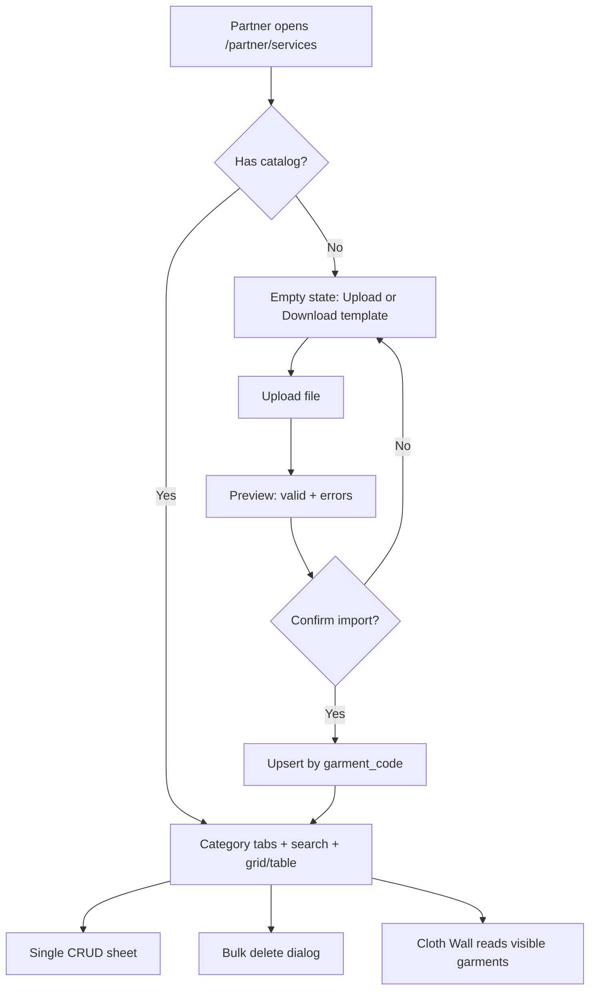
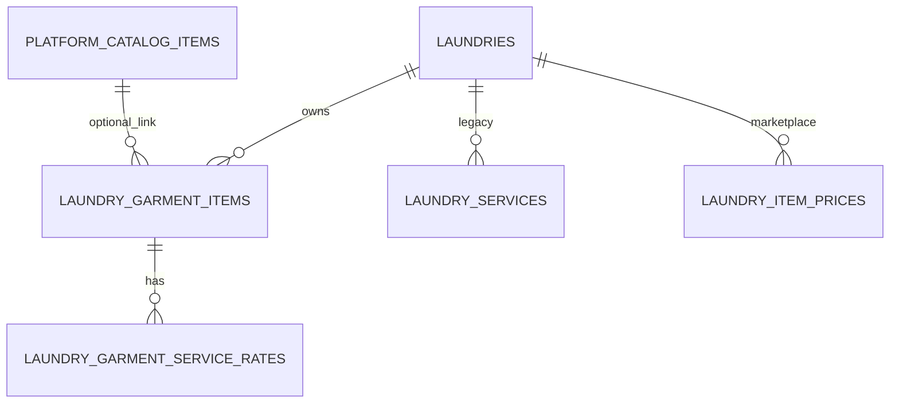

# Feature: Partner garment service catalog (bulk upload + CRUD + images)

> Status: review  
> Owner: product-manager + backend-architect + frontend-architect  
> Last updated: 2026-08-14  
> Related: [partner-price-list.md](partner-price-list.md), [partner-shop-floor.md](partner-shop-floor.md), [partner-customers-orders-four-pillars-workspace.md](partner-customers-orders-four-pillars-workspace.md)  
> Prompt pack: [.cursor/prompts/partner-garment-service-catalog-bulk.md](../../.cursor/prompts/partner-garment-service-catalog-bulk.md)

## Problem

Laundry partners maintain their full rate card in Excel or POS exports — garment names, short codes, and different prices per service type (dry clean, steam press, shoe cleaning, etc.). Today the partner **Service catalog** (`/partner/services`) only supports flat rows with a single price per service name. Partners cannot bulk-import their existing spreadsheet, cannot express multi-service pricing per garment, and staff at the counter have no photo to identify unfamiliar items. Setup becomes tedious manual entry; walk-in intake stays disconnected from how partners actually price work.

## Persona

| Persona | Context |
| ------- | ------- |
| **Partner (owner)** | Runs a neighbourhood laundry; has a 300+ row Excel rate card from their billing software; wants one upload to go live, then tweak individual items. |
| **Counter staff** | Low-literacy or high-throughput counter; needs category → photo → service type → auto price. |
| **Customer** (later) | Browsing store detail; wants to see what garments this laundry accepts and approximate rates. |
| **Admin** (light) | Does not manage partner rate cards in v1; platform master catalog stays separate. |

## Why now

- Partners onboarding with **Default.xls**-style exports is the norm in Indian laundry POS; manual CRUD does not scale.
- **Cloth Wall** and walk-in orders already need garment identity + dry clean / press splits — the flat `laundry_services` model fights that UX.
- **Four pillars workspace** links to Services from `/partner/orders`; the catalog must be trustworthy before owners rely on the tile KPI.
- `/partner/pricing` (marketplace compare list) is shipped; ops rate card is the missing half of “my shop’s prices.”

## User stories

- As a **partner**, I want to **upload my Excel rate card in one step**, so that **hundreds of garment prices appear without typing each row**.
- As a **partner**, I want to **download a template matching my POS export**, so that **I know the exact columns to fill**.
- As a **partner**, I want to **add or edit one garment with photo and multiple service prices**, so that **I can fix mistakes without re-uploading the whole file**.
- As a **partner**, I want to **bulk delete by category or selection**, so that **I can reset seasonal or wrong imports quickly**.
- As a **partner**, I want to **hide garments I don’t offer** (`T_ISSHOWITEM = 0`), so that **staff only see relevant tiles at the counter**.
- As **counter staff**, I want to **see a garment photo and pick dry clean vs press**, so that **I charge the right rate without memorizing codes**.
- As a **partner**, I want a **link to marketplace garment prices** (`/partner/pricing`), so that **I understand the difference between counter rate card and public compare list**.

## Goals

- [x] New **`laundry_garment_items`** + **`laundry_garment_service_rates`** schema matching **Default.xls** (313 rows × 11 service columns).
- [ ] Partner API: paginated list, single CRUD, image upload, bulk import (preview → confirm), bulk delete, template download.
- [ ] Rebuilt **`/partner/services`** UI: toolbar (bulk upload / template / bulk delete / add), category tabs, search, card grid + table, add/edit sheet with image.
- [ ] Import **`.xls` / `.xlsx` / `.csv`** with row-level validation and upsert by **`GarmentCode`** per laundry.
- [ ] **Cloth Wall bridge** (read path): prefer garment catalog when non-empty; fallback to price list then `laundry_services`.
- [ ] Hub Services pillar KPI + modal link to full catalog page (no duplicate CRUD).
- [ ] Docs, API reference, tests, QA matrix.

## Non-goals

- Out of scope: GST calculation changes, surge pricing, AI price recommendations.
- Out of scope: Admin CRUD on partner garment rows (partner-owned only in v1).
- Out of scope: Replacing **`platform_catalog_items`** / **`/partner/pricing`** — separate marketplace vocabulary.
- Out of scope: Multi-currency.
- Out of scope: Customer-facing storefront price tables from this catalog (defer to Slice F).
- Deferred: **`order_items.garment_item_id`** FK and booking checkout wired to this catalog (Slice E+).
- Deferred: Two-way sync between garment catalog and `laundry_item_prices`.

## Decision defaults (locked)

| Topic | Default | Rationale |
| ----- | ------- | --------- |
| Schema | **New tables**; do not overload `laundry_services` | One row = one price today; Excel is garment × N service types |
| vs `platform_catalog_items` | **Keep both**; optional `platform_catalog_item_id` on garment for photo fallback | Marketplace list vs ops rate card |
| Upsert key | `(laundry_id, garment_code)` case-insensitive trim | Matches POS **`GarmentCode`** column |
| Zero price in Excel | **No rate row** (or `price_inr = NULL`); treat `0` and empty as not offered | Avoid clutter; UI shows “—” |
| `T_ISSHOWITEM` | `1` → `is_visible = true`, else `false` | 39 visible / 274 hidden in Default.xls sample |
| Import flow | **Preview → confirm**; never silent full replace without explicit mode | Prevent accidental wipe |
| Import modes | `upsert` (default), `replace_categories_in_file`, `replace_all` (danger) | Partner control |
| Zero-rate garment | Allowed if `is_visible = false` or partner adds rates later | Hidden rows in sample file |
| Images | `image_url` on garment; upload via shared partner media path | Reuse storefront upload pattern |
| Image fallback | WashHouse catalog photo resolver by name/category | Staff still see recognizable tile |
| List pagination | Default **`page_size = 20`** | Performance on 300+ rows |
| Delete | Soft delete garments + cascade soft delete rates | Reversible |
| Delete all | Require typing **`DELETE`** | Safety |
| Legacy `/partner/services` API | Deprecate after bridge; keep 1 release reading old `laundry_services` if garment catalog empty | No break for existing laundries |
| Money | DB `NUMERIC(12,2)` INR; API `*_inr` string + `*_paise` int | [pricing-model.md](../business/pricing-model.md) |

## Excel source — `Default.xls`

**Sheet:** `Data` · **313 data rows** · **15 columns**

| # | Column header | Maps to |
| - | ------------- | ------- |
| 1 | `T_ISSHOWITEM` | `is_visible` |
| 2 | `Category` | `category` |
| 3 | `Garment` | `name` |
| 4 | `GarmentCode` | `garment_code` |
| 5 | `COMMERCIAL SERVICE` | `service_type = commercial_service` |
| 6 | `Dry Cleaning` | `dry_cleaning` |
| 7 | `EXPRESS SERVICE` | `express_service` |
| 8 | `On Hanger` | `on_hanger` |
| 9 | `LINT REMOVER` | `lint_remover` |
| 10 | `PREMIUM LAUNDRY` | `premium_laundry` |
| 11 | `SHOE CLEANING` | `shoe_cleaning` |
| 12 | `Steam Press` | `steam_press` |
| 13 | `Starch` | `starch` |
| 14 | `Wash and Fold` | `wash_and_fold` |
| 15 | `Wash N Iron` | `wash_n_iron` |

**Categories in sample:** Men (60), Women (78), Kids (62), Household (74), Institutional (20), Others (19).

**Non-zero price counts in sample:** commercial_service 13, dry_cleaning 258, shoe_cleaning 29, steam_press 151.

Template download and import parser must preserve **exact header labels** (case Relaxed match) for partner POS compatibility.

## UX flow

### Partner — first-time setup

1. Partner opens **Your shop → Service catalog** (`/partner/services`).
2. Empty state: **Upload rate card** (primary) + **Download template** (secondary).
3. Partner uploads `Default.xls` → system parses → **Preview** shows valid / error rows + new vs update counts.
4. Partner confirms **Upsert by garment code** → toast with summary → catalog list loads.
5. Partner switches category tab (e.g. **Men**), searches “Shirt”, edits one price inline or via sheet.

### Partner — daily maintenance

1. **Add garment** → sheet: photo, category, name, code, service price grid, visible toggle → Save.
2. **Bulk delete** → select category “Institutional” → confirm → rows removed.
3. Toggle **visibility** on row without deleting (hide from counter, keep for re-enable).

### Counter — Cloth Wall (bridge, Prompt 8)

1. Staff opens walk-in / Cloth Wall.
2. If garment catalog has rows: tiles built from **visible** garments with dry clean / press / shoe prices.
3. Else: existing price-list → `laundry_services` fallback unchanged.



### Wireframes

#### Mobile (375px)

```
┌─────────────────────────────┐
│ Service catalog             │
│ Your garment list and rates │
│ ┌─────┐ ┌─────┐ ┌─────┐     │
│ │ 313 │ │  39 │ │  6  │     │  KPI: total / visible / categories
│ │total│ │shown│ │ cat │     │
│ └─────┘ └─────┘ └─────┘     │
│ [Upload] [Template] [Delete]│  toolbar wraps 2×2
│ [+ Add garment]             │
│ All Men Women Kids …        │  horizontal scroll tabs
│ 🔍 Search garment or code   │
│ ┌──────────┐ ┌──────────┐   │
│ │ [photo]  │ │ [photo]  │   │  2-col card grid
│ │ T Shirt  │ │ Jeans    │   │
│ │ TF · ₹59 │ │ Je · ₹79 │   │  price pills
│ │ 👁 ✏️    │ │ 👁 ✏️    │   │
│ └──────────┘ └──────────┘   │
│ … paginated …               │
└─────────────────────────────┘
```

#### Desktop (1280px)

```
┌──────────────────────────────────────────────────────────────────────────┐
│ Service catalog                    [Upload] [Template] [Bulk delete] [Add] │
│ Subtitle + KPI chips                                                     │
│ All | Men | Women | Kids | Household | Institutional | Others   🔍 Search│
├──────────────────────────────────────────────────────────────────────────┤
│ ☐ │ Img │ Garment    │ Code │ Dry clean │ Press │ Shoe │ Visible │ ··· │
│ ☐ │ 🖼  │ T Shirt      │ TF   │ ₹59       │ ₹15   │ —    │   ✓     │ Edit│
│ ☐ │ 🖼  │ Jeans        │ Je   │ ₹79       │ ₹12   │ —    │   ✓     │ Edit│
│ … paginated footer page_size=20 …                                        │
├──────────────────────────────────────────────────────────────────────────┤
│ Marketplace garment prices → /partner/pricing                            │
└──────────────────────────────────────────────────────────────────────────┘
```

#### Bulk upload dialog (both)

```
Step 1 Upload → Step 2 Preview → Step 3 Done
┌ Preview ────────────────────────────────┐
│ ✓ 280 valid  ⚠ 5 errors  ↻ 28 updates   │
│ Import mode: [Upsert ▼]                 │
│ Row │ Status │ Garment │ Code │ Notes    │
│  12 │  ⚠    │ …       │ dup  │ Duplicate code in file │
│ [ ] Skip invalid rows                   │
│              [Cancel]  [Import 280 rows]│
└─────────────────────────────────────────┘
```

#### Add / Edit sheet

- Image dropzone (optional) + fallback preview
- Category, Name, Garment code
- **Service prices** — primary row: Dry cleaning, Steam press, Shoe cleaning; **More services** accordion for remaining 8 types
- Visible toggle
- Save / Cancel

#### Bulk delete dialog

- Mode: **Selected rows** | **Category** | **Entire catalog**
- Entire catalog: type `DELETE` to enable button
- Shows count before confirm

## API surface

Auth: **`partner`** (own laundry only). Public read deferred (Slice F).

| Method | Path | Purpose |
| ------ | ---- | ------- |
| GET | `/api/v1/partner/garment-catalog` | Paginated list `?category=&search=&page=&page_size=` |
| GET | `/api/v1/partner/garment-catalog/summary` | KPI counts: total, visible, categories |
| GET | `/api/v1/partner/garment-catalog/template` | Download `.xlsx` template (Default.xls headers) |
| POST | `/api/v1/partner/garment-catalog/import/preview` | `multipart/form-data` file → preview |
| POST | `/api/v1/partner/garment-catalog/import` | Confirm import |
| POST | `/api/v1/partner/garment-catalog` | Create garment + rates |
| GET | `/api/v1/partner/garment-catalog/{id}` | Detail |
| PATCH | `/api/v1/partner/garment-catalog/{id}` | Update garment + patch rates |
| DELETE | `/api/v1/partner/garment-catalog/{id}` | Soft delete one |
| POST | `/api/v1/partner/garment-catalog/bulk-delete` | Bulk delete |
| POST | `/api/v1/partner/garment-catalog/{id}/image` | Upload garment image |

**Legacy (deprecated):** `GET|POST|PATCH|DELETE /api/v1/partner/services` — document sunset; garment catalog becomes source of truth for `/partner/services` UI.

Schemas: `backend/app/schemas/garment_catalog.py` (to add).  
API doc: `docs/api/endpoints/partner-garment-catalog.md` (Prompt 3).

### List response (paginated)

```json
{
  "items": [
    {
      "id": "uuid",
      "category": "men",
      "name": "T Shirt",
      "garment_code": "TF",
      "image_url": null,
      "resolved_image_url": "/catalog/men/shirt.webp",
      "is_visible": true,
      "sort_order": 0,
      "platform_catalog_item_id": null,
      "rates": {
        "dry_cleaning": { "price_inr": "59.00", "price_paise": 5900 },
        "steam_press": { "price_inr": "15.00", "price_paise": 1500 }
      }
    }
  ],
  "page": 1,
  "page_size": 20,
  "total_records": 313,
  "total_pages": 16
}
```

### Import preview response

```json
{
  "preview_id": "uuid",
  "summary": {
    "total_rows": 313,
    "valid_count": 308,
    "error_count": 5,
    "create_count": 280,
    "update_count": 28
  },
  "valid_rows": [
    {
      "row_number": 2,
      "garment_code": "TF",
      "name": "T Shirt",
      "category": "men",
      "is_visible": true,
      "rates": { "dry_cleaning": 59, "steam_press": 15 }
    }
  ],
  "error_rows": [
    {
      "row_number": 45,
      "garment_code": "",
      "errors": ["GarmentCode is required"]
    }
  ]
}
```

### Import confirm body

```json
{
  "preview_id": "uuid",
  "mode": "upsert",
  "skip_invalid": true
}
```

`mode`: `upsert` | `replace_categories_in_file` | `replace_all`

### Bulk delete body

```json
{
  "ids": ["uuid1", "uuid2"],
  "category": "institutional",
  "all": false,
  "confirm": "DELETE"
}
```

Exactly one of `ids`, `category`, or `all: true` required. `confirm: "DELETE"` required when `all: true`.

## Data model

### Enum: `garment_category`

`men` | `women` | `kids` | `household` | `institutional` | `others`

Import normalizes Excel `Category` case-insensitively (e.g. `Men` → `men`).

### Enum: `garment_service_type`

| Slug | Excel header |
| ---- | ------------ |
| `commercial_service` | COMMERCIAL SERVICE |
| `dry_cleaning` | Dry Cleaning |
| `express_service` | EXPRESS SERVICE |
| `on_hanger` | On Hanger |
| `lint_remover` | LINT REMOVER |
| `premium_laundry` | PREMIUM LAUNDRY |
| `shoe_cleaning` | SHOE CLEANING |
| `steam_press` | Steam Press |
| `starch` | Starch |
| `wash_and_fold` | Wash and Fold |
| `wash_n_iron` | Wash N Iron |

### Table: `laundry_garment_items`

| Column | Type | Notes |
| ------ | ---- | ----- |
| `id` | UUID PK | |
| `laundry_id` | UUID FK → `laundries` ON DELETE CASCADE | |
| `category` | enum `garment_category` | |
| `name` | VARCHAR(120) | Display name from `Garment` |
| `garment_code` | VARCHAR(20) | POS code; unique per laundry |
| `image_url` | VARCHAR(2000) NULL | Partner upload URL |
| `platform_catalog_item_id` | UUID FK NULL → `platform_catalog_items` | Optional link for marketplace alignment |
| `is_visible` | BOOL | default true; from `T_ISSHOWITEM` |
| `sort_order` | INT | default 0 |
| `created_at` / `updated_at` / `deleted_at` | timestamptz | Soft delete |

**Indexes / constraints:**

- `uq_laundry_garment_items_laundry_code_active` UNIQUE `(laundry_id, lower(garment_code))` WHERE `deleted_at IS NULL`
- `ix_laundry_garment_items_laundry_category` `(laundry_id, category)` partial active
- `ix_laundry_garment_items_laundry_visible` `(laundry_id, is_visible)` partial active

### Table: `laundry_garment_service_rates`

| Column | Type | Notes |
| ------ | ---- | ----- |
| `id` | UUID PK | |
| `garment_item_id` | UUID FK → `laundry_garment_items` ON DELETE CASCADE | |
| `service_type` | enum `garment_service_type` | |
| `price_inr` | NUMERIC(12,2) NULL | NULL = not offered |
| `created_at` / `updated_at` / `deleted_at` | timestamptz | Soft delete |

**Indexes / constraints:**

- `uq_laundry_garment_rates_item_type_active` UNIQUE `(garment_item_id, service_type)` WHERE `deleted_at IS NULL`
- CHECK `price_inr IS NULL OR price_inr >= 0`

**Zero-price import rule:** Parser does **not** insert rate rows when Excel cell is empty or `0`. PATCH may set a rate explicitly to `0` → stored as NULL (not offered).



Migration: `20260814_0044_laundry_garment_catalog` (Alembic; reversible).

## Import rules (detailed)

| Rule | Behavior |
| ---- | -------- |
| Header row | Required; fuzzy match column names (trim, case-insensitive) |
| `GarmentCode` | Required; max 20 chars; upsert key per laundry |
| `Garment` / `Category` | Required on create; optional on update (upsert updates provided fields) |
| `T_ISSHOWITEM` | `1`, `1.0`, `true`, `yes` → visible; else hidden |
| Price cells | Parse decimal; empty/`0` → skip rate row |
| Duplicate code in file | Last row wins in preview; warn on earlier duplicates |
| Unknown category | Row error; suggest valid enum |
| Invalid price | Row error (negative, non-numeric) |
| `replace_categories_in_file` | Soft-delete existing garments in categories present in file, then upsert file rows |
| `replace_all` | Soft-delete all garments for laundry, then insert file rows |
| Partial import | When `skip_invalid: true`, commit valid rows only |

## Relationship to existing systems

| System | Relationship |
| ------ | ------------ |
| **`laundry_services`** | Legacy flat catalog. Garment catalog **supersedes UI** at `/partner/services`. Walk-in keeps working via Cloth Wall bridge + legacy fallback. No automatic dual-write to `laundry_services` in v1. |
| **`platform_catalog_items` / `laundry_item_prices`** | Separate **marketplace compare** list at `/partner/pricing`. Optional FK for photo/name alignment. No import sync in v1. |
| **Cloth Wall** | **Prompt 8:** `buildGarmentClothWallTiles()` preferred when `count(garment_items) > 0`. Map `dry_cleaning` → `dryCleanInr`, `steam_press` → `pressInr`, `shoe_cleaning` → single `priceInr`. Categories `institutional` / `others` → Cloth Wall chip `other`. |
| **Four pillars hub** | Services tile KPI from garment catalog summary; modal links to `/partner/services` (no second CRUD surface). |
| **Walk-in orders** | Continue `service_id` / `catalog_item_id` paths. Future: `garment_item_id` + `service_type` on order lines (Slice E+). |

## Frontend surface

| Surface | Route / folder | Notes |
| ------- | -------------- | ----- |
| Main catalog page | `/partner/services` | Rebuild `partner-service-catalog-view.tsx` |
| Feature module | `frontend/features/partner/garment-catalog/` | components, hooks, utils |
| API client | `frontend/services/partner-garment-catalog.ts` | TanStack Query |
| Hub pillar | `partner-hub-services-workspace.tsx` | Summary + link only |
| Cloth Wall | `cloth-wall-items.ts` | Add `buildGarmentClothWallTiles` |
| Images | Reuse storefront upload or `/garment-catalog/{id}/image` | Max 5 MB, jpeg/png/webp/gif |
| Template asset | Generated server-side | Same headers as Default.xls |

UI rules: one job per section; mobile card grid; desktop dense table; debounced search 300ms; copy distinguishes **counter rate card** vs **marketplace prices** link in footer.

## Background work

- Celery: none for v1 (import synchronous; warn if file > 500 rows still OK for ~313).
- Optional later: async import job + email notification for 1000+ row files.

## Delivery slices (Prompts 1–9)

| Slice | Deliverable | Exit criteria |
| ----- | ----------- | ------------- |
| **1 — Schema** | Migration + models | Tables + constraints + unit tests |
| **2 — Service** | Repository + import parser + Default.xls fixture | Preview/confirm logic tested |
| **3 — API** | All endpoints + authz tests | Postman doc |
| **4 — FE client** | Types + API functions + query keys | Contract match |
| **5 — Page shell** | Toolbar, tabs, search, KPI, empty state | `/partner/services` renders |
| **6 — CRUD UI** | Grid, table, add/edit sheet, image | Single-item E2E |
| **7 — Bulk upload** | 3-step dialog | Import Default.xls end-to-end |
| **8 — Bulk delete + bridge** | Delete dialog, hub link, Cloth Wall read | Walk-in shows imported shirt |
| **9 — Polish + QA** | a11y, dark mode, E2E spec, logs | Matrix green |

## Acceptance criteria

- [ ] Given an empty laundry, When partner uploads Default.xls and confirms upsert, Then 313 garment rows exist with correct codes and rates.
- [ ] Given `T_ISSHOWITEM = 0`, When imported, Then `is_visible = false` and item excluded from Cloth Wall tiles.
- [ ] Given duplicate `GarmentCode` in DB, When import upserts, Then existing row updates prices/name/category without duplicate insert.
- [ ] Given partner uploads file with 5 invalid rows and `skip_invalid: true`, When confirm, Then 308 rows saved and error report downloadable.
- [ ] Given partner bulk deletes category Institutional, Then only that category soft-deleted; other categories unchanged.
- [ ] Given partner deletes entire catalog, When confirm without typing DELETE, Then action blocked.
- [ ] Given partner adds image on T Shirt, When Cloth Wall loads, Then custom image shown on tile.
- [ ] Given partner A, When calling partner B garment id, Then 403.
- [ ] Given garment catalog empty, When Cloth Wall opens, Then existing price-list / services fallback unchanged.
- [ ] Given `/partner/pricing`, When partner uses it, Then unaffected; footer link from service catalog works.
- [ ] Money stored as NUMERIC(12,2); API exposes paise + INR strings.
- [ ] Tests: import idempotency; authz; pagination; bulk delete; Cloth Wall tile mapping.
- [ ] Docs: this spec, schema.md, API endpoint doc, traceability, feature-progress log.

## Test plan

| Layer | Cases |
| ----- | ----- |
| Unit | Excel/CSV parser; category normalize; T_ISSHOWITEM parse; zero → no rate row; upsert key |
| Unit | Price validation; bulk delete scope; DELETE confirm gate |
| API | CRUD 401/403; list pagination; import preview + confirm; template download |
| Integration | Import Default.xls → list count; re-import updates not duplicates |
| E2E | Upload 3-row CSV; edit price; toggle visibility; bulk delete category |
| Regression | Walk-in with empty garment catalog; `/partner/pricing` editor |

## QA matrix

| Case | 375 mobile | 1280 desktop | Dark |
| ---- | ---------- | ------------ | ---- |
| Empty → upload CTA | ☐ | ☐ | ☐ |
| Download template | ☐ | ☐ | ☐ |
| Import Default.xls full | ☐ | ☐ | ☐ |
| Preview shows errors | ☐ | ☐ | ☐ |
| Add garment + image | ☐ | ☐ | ☐ |
| Edit service prices | ☐ | ☐ | ☐ |
| Toggle visibility | ☐ | ☐ | ☐ |
| Bulk delete category | ☐ | ☐ | ☐ |
| Bulk delete all (DELETE) | ☐ | ☐ | ☐ |
| Hub services tile link | ☐ | ☐ | ☐ |
| Cloth Wall after import | ☐ | ☐ | ☐ |
| Marketplace link footer | ☐ | ☐ | ☐ |
| Keyboard / focus trap modals | ☐ | ☐ | ☐ |

## Metrics & analytics

- Activation: `partner.garment_catalog.imported` (row count, mode)
- Engagement: `partner.garment_catalog.view`, `partner.garment_catalog.item_edited`
- KPI: % approved laundries with ≥50 garment rows within 14 days of approval

## Risks & mitigations

| Risk | Likelihood | Impact | Mitigation |
| ---- | ---------- | ------ | ---------- |
| Three price systems confuse partners (services / pricing / garment catalog) | M | M | Clear labels; footer cross-links; hub modal → full page only |
| Import overwrites wrong data | M | H | Preview + confirm; replace_all requires explicit mode + DELETE for wipe |
| 313 images lazy-load performance | L | M | Pagination; thumbnail lazy load; fallback sprites |
| Cloth Wall regression | M | H | Feature flag read path; fallback chain; E2E smoke |
| Legacy orders reference `laundry_service` ids | M | M | Do not delete legacy services automatically; bridge only on read |

## Open questions

- **Institutional / Others on Cloth Wall:** Default to `other` chip — confirm with product if separate tabs needed.
- **Sync to `laundry_item_prices`:** Deferred — optional “Copy dry clean rates to marketplace list” button in v2.
- **Public customer view of garment catalog:** Deferred Slice F — use same tables, read-only public endpoint.

---

## Appendix A — Files to touch (implementation)

- `backend/alembic/versions/*_laundry_garment_catalog.py`
- `backend/app/models/garment_catalog.py`
- `backend/app/repositories/partner_garment_catalog.py`
- `backend/app/services/partner_garment_catalog_service.py`
- `backend/app/api/v1/endpoints/partner_garment_catalog.py`
- `backend/app/schemas/garment_catalog.py`
- `backend/tests/fixtures/default_garment_catalog.xls`
- `backend/tests/api/test_partner_garment_catalog.py`
- `frontend/features/partner/garment-catalog/`
- `frontend/features/partner/views/partner-service-catalog-view.tsx`
- `frontend/services/partner-garment-catalog.ts`
- `frontend/features/partner-shop-floor/lib/cloth-wall-items.ts`
- `docs/api/endpoints/partner-garment-catalog.md`
- `docs/database/schema.md`
