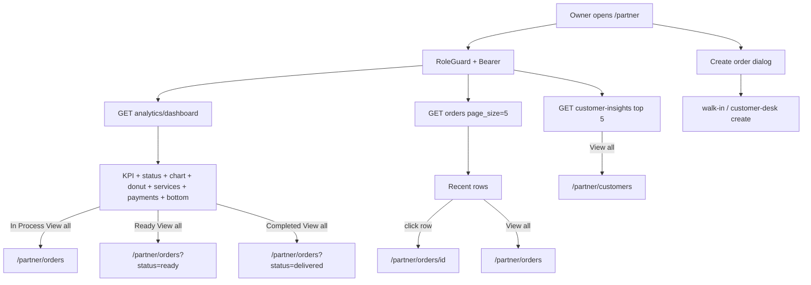

# Feature: Partner Laundry Dashboard — live data on current design

> Status: **review** (Prompt 8 polish + tests 2026-08-14)  
> Owner: product-manager + ui-ux-designer → backend-architect + frontend-architect  
> Last updated: 2026-08-14  
> Prompt pack: [`.cursor/prompts/partner-laundry-dashboard-live-data.md`](../../.cursor/prompts/partner-laundry-dashboard-live-data.md)  
> QA: [partner-laundry-dashboard-live-data-matrix.md](../qa/partner-laundry-dashboard-live-data-matrix.md)  
> Related: [partner-laundry-dashboard-redesign.md](partner-laundry-dashboard-redesign.md) (older command-desk spec — **do not revert this visual**), [partner-dashboard.md](partner-dashboard.md), [partner-owner-command-center.md](partner-owner-command-center.md)

## Problem

`/partner` now shows a franchise-style dashboard (KPI cards, comparison chart, donut, top services, recent orders, top customers, payments, bottom stats). The **layout is the product**. The numbers, names, and most **View all** buttons are still **hardcoded** (placeholder laundry name, placeholder ₹, dead buttons). Owners cannot trust the home screen.

## Persona

| Persona | Context | Jobs on this page |
| ------- | ------- | ----------------- |
| **Laundry owner** | Phone / laptop, morning check | See real today / week / month / year pulse; open the matching queue; trust ₹ |
| **Counter staff** | Tablet | Open recent order, create order, jump to customers |

**Design thesis:** Keep the current visual (rounded cards, 6 KPI row, chart + donut + services, 3-column bottom row). **Real metrics only.** No invented KPIs. IST calendar. Empty states when the shop has no data.

## User stories

- As a **laundry owner**, I want the home numbers to match my real orders and delivered ₹, so I can trust the morning pulse.
- As a **laundry owner**, I want **View all** and order rows to open the real queue or order, so I can act without hunting the sidebar.
- As **counter staff**, I want **Create order** on this same screen, so I do not leave home to take a walk-in.

## Goals

- [x] Keep the current `/partner` visual; do not restore `PartnerOverviewView`
- [x] One partner-scoped dashboard API plus two small lists (recent orders, top customers)
- [x] Every View all / row / Create order control works
- [x] Empty shop shows zeros and empty copy, never placeholder names or ₹
- [x] Wallet row never shows a made-up amount

## Why now

The visual landed from `main`. Existing APIs (`analytics/summary`, `analytics/overview`, orders list, customer insights) cover **parts** of this screen. Gaps (year, previous-period overlay, top services, payment mix, honest status buckets) must be filled **to match this UI**, not to rebuild the old command desk.

## Non-goals

- Replacing this visual with `PartnerOverviewView` / ops-visual command desk
- Reintroducing Shop Floor display mode
- Fake / demo numbers when APIs are empty
- New payment provider or Wallet product
- Bluetooth thermal SDK
- Admin dashboard rebuild
- Changing `/partner/orders` hub (dashboard **deep-links** only)

## Locked visual (do not restyle)

Source of truth: `frontend/features/partner/views/partner-laundry-dashboard-view.tsx` (Prompt 0 compared line-by-line).  
Route: `/partner` → `PartnerHomeView` → this view. Do **not** restore `PartnerOverviewView`.

Keep this structure, copy, and card chrome:

1. **Header** — `h1`: `Welcome, {laundry_name}` + wave emoji. Subtitle (keep): `Here's what's happening at your franchise today.` Right side of header is empty today → **allowed add:** primary **Create order** (same visual language, `md:justify-between` already reserved).
2. **Six KPI cards** (`md:2` / `xl:3` / `2xl:6`) in this order and titles:
   - Today's Orders · This Week Orders · This Month Orders
   - Today's Revenue · This Week Revenue · This Month Revenue  
   Each: big value, currentLabel, previous value + previousLabel, % badge.
3. **Three status cards** (`grid-cols-1 sm:2 xl:3`) exact labels: **In Process Orders** · **Ready for Delivery** · **Completed Orders**. Each has a **View all** control (top-right).
4. **Row** `xl:grid-cols-[1.55fr_1fr_1fr]`:
   - **Revenue Overview** / **Total Revenue** — chips **Today | Week | Month | Year** (default **Week**). Two-line Recharts (current solid indigo, previous dashed gray). Comparison box = previous period total. Dead **Revenue** metric chip: keep as a **static label**, do not keep a one-option toggle.
   - **Orders by Status** donut + three-slice legend (In Process / Ready / Completed).
   - **Top Services** — four bars.
5. **Row** `xl:grid-cols-[1.7fr_1.15fr_1.15fr]`:
   - **Recent Orders** table, **5** rows, columns: Order ID · Customer · Service · Amount · Status. **View all**.
   - **Top Customers** — **5** rows (avatar initial, name, N orders, spent). **View all**.
   - **Payment Summary** — four rows in this order: **Cash · UPI · Wallet · Pending Payments**. **View all**.
6. **Bottom stats** (`md:2` / `xl:3` / `2xl:6`) exact labels: Total Customers · New Customers · Repeat Customers · Average Order Value · Avg. Delivery Time · Customer Rating.

**Allowed UI adds (same language):** loading skeletons, empty copy, Create order in the header, working `Link`s. Do not add a second KPI wall, Tags strip, or ops-visual command desk.

### Chart buckets (match this visual, not the old overview API)

| Period chip | Default selected | X-axis (live) | Matches current mock |
| ----------- | ---------------- | ------------- | -------------------- |
| Today | no | **24 hourly** IST (mock was 6 sparse points — live fills hours) | layout only |
| Week | **yes** | **7 daily** Mon–Sun | yes |
| Month | no | **W1–W5** weekly buckets in the IST month (not 28–31 daily ticks) | yes |
| Year | no | **12 monthly** Jan–Dec (mock showed 8 months — live is full year) | yes |

Donut + Top Services **share the chart period**. Replace decorative “This Month” + chevron with `period_label_ist` text (no fake dropdown). Default period = **Week**. `PartnerDashboardPeriod` includes `year`; provider default is **week**. Overview API still today/week/month only.

---

## Broken / dead controls (must fix)

| Control | Today | Required |
| ------- | ----- | -------- |
| Welcome name | Hardcoded placeholder laundry name | `laundry_name` from dashboard API (fallback: auth `full_name`) |
| Status **View all** (×3) | `<button>` no href | Canonical hrefs below |
| Recent Orders **View all** | dead | `/partner/orders` |
| Recent order rows | not clickable | `/partner/orders/{id}` |
| Top Customers **View all** | dead | `/partner/customers` |
| Top customer rows | not clickable | `/partner/customers` (directory has no `?q=` contract) |
| Payment Summary **View all** | dead | `/partner/revenue` |
| Donut / Top Services “This Month” + chevron | decorative | Shared chart period label; **no dropdown** |
| Chart period chips | local placeholder series | Live `chart_series` + previous overlay |
| Revenue metric chip | only “Revenue”, no-op | Static label — do not keep a one-option toggle |
| Create order | missing | Header button → existing `PartnerCreateOrderDialog` |

### Canonical hrefs (hub IA unchanged)

Orders Hub URL contract today: `?chip=` `?status=` `?source=` `?payment=` `?q=`. There is **no** in-process chip. This pack does **not** add hub chips.

| Control | Href |
| ------- | ---- |
| In Process Orders → View all | `/partner/orders` |
| Ready for Delivery → View all | `/partner/orders?status=ready` |
| Completed Orders → View all | `/partner/orders?status=delivered` |
| Recent Orders → View all | `/partner/orders` |
| Recent row | `/partner/orders/{id}` |
| Top Customers → View all | `/partner/customers` |
| Top customer row | `/partner/customers` |
| Payment Summary → View all | `/partner/revenue` |
| Top Services empty CTA | `/partner/services` |
| Create order | dialog (no route) |

---

## Metrics dictionary (authoritative)

All queries: `orders.laundry_id = partner laundry`, `orders.deleted_at IS NULL`.  
Timezone: **Asia/Kolkata (IST)** for calendar windows. Compare `timestamptz` in UTC.

### Periods

| Key | Current window | Previous window | Chart buckets | Previous overlay |
| --- | -------------- | --------------- | ------------- | ---------------- |
| `today` | IST midnight → next midnight | Yesterday IST | 24 hourly | Same hours yesterday |
| `week` | Monday 00:00 IST → +7d | Previous Mon–Sun | 7 daily | Same weekday last week |
| `month` | 1st 00:00 IST → 1st next month | Previous calendar month | **W1–W5** weekly | Same week index previous month (omit extra week if missing) |
| `year` | 1 Jan 00:00 IST → 1 Jan next | Previous calendar year | 12 monthly | Same month last year |

### Six KPI cards (always show all three windows — not a single selected period)

| Card | Current | Previous | % |
| ---- | ------- | -------- | - |
| Today's Orders | count `created_at` in today IST | yesterday | growth; **null → "—"** if previous = 0 |
| This Week Orders | created in IST week | previous IST week | same |
| This Month Orders | created in IST month | previous IST month | same |
| Today's Revenue | **delivered** gross `total_inr` where `updated_at` in today IST | yesterday | same |
| This Week Revenue | delivered gross, `updated_at` in IST week | previous week | same |
| This Month Revenue | delivered gross, `updated_at` in IST month | previous month | same |

Revenue = GST-inclusive `orders.total_inr`, status = `delivered`. Do **not** use collected-cash as primary.

### Status snapshot cards (open queue — **global**, not period)

| Card (TSX label) | Status set | View all href |
| ---------------- | ---------- | ------------- |
| In Process Orders | `picked_up`, `washing`, `ironing` | `/partner/orders` |
| Ready for Delivery | `ready`, `out_for_delivery` | `/partner/orders?status=ready` |
| Completed Orders | `delivered` (all-time count) | `/partner/orders?status=delivered` |

Do **not** reuse `analytics_summary.orders_in_progress` as-is (it includes `ready` + `out_for_delivery`).

### Donut — Orders by Status

Period-scoped counts for the **chart period** (default Week; same control as chart when wired):

| Slice | Statuses |
| ----- | -------- |
| In Process | `picked_up`, `washing`, `ironing` |
| Ready | `ready`, `out_for_delivery` |
| Completed | `delivered` |

Exclude `cancelled` from the donut total (footnote optional). Empty period → empty state, not placeholder slice counts. Status **cards** stay **global**; the **donut** is **period-scoped** (cards and donut may differ — that is correct).

### Chart

Two series per bucket: `current` (this period) and `previous` (aligned previous period). Metric = **revenue gross** (INR). Tooltip: Current / Previous. Total above chart = sum of current buckets; comparison box = previous period total.

### Top Services

Top **4** `order_items.service_name` by **order line count** (sum of `quantity`) in the **selected chart period**. Percent = share of those top lines vs all lines in period. Empty → empty state + link to `/partner/services`.

### Recent Orders

`GET /partner/orders` page_size **5** (visual) or **10** (pagination standard — prefer **5 rows** to match this table, still server-paginated). Sort `created_at desc`.

Columns: tracking code (Order ID), customer_name, first item `service_name` (or “N items”), `total_inr`, mapped status pill.

Status pill map:

| API status | Pill |
| ---------- | ---- |
| `confirmed`, `pickup_assigned` | Pending |
| `picked_up`, `washing`, `ironing` | In Process |
| `ready` | Ready |
| `out_for_delivery` | Out for Delivery |
| `delivered` | Completed |
| `cancelled` | Cancelled |

### Top Customers

`GET /partner/customer-insights/customers?list_type=top&page_size=5`. Name, order_count, lifetime_spent.

### Payment Summary (honest mapping)

DLM `payment_method` enum is only `cod` | `razorpay`. **Do not invent Wallet ₹.**

| UI row | Rule | If unused |
| ------ | ---- | --------- |
| Cash | `payment_method=cod` AND `payment_status=paid`, sum `total_inr` (all-time or selected period — **period = chart period**) | ₹0.00 |
| UPI | `payment_method=razorpay` AND `payment_status=paid` (Razorpay includes UPI in India) | ₹0.00 |
| Wallet | **No backend field** | Show **—** and muted “Not tracked” — never a fake number |
| Pending Payments | `payment_status IN (pending, pending_cod)`, sum `total_inr` | ₹0.00 |

### Bottom stats

| Tile | Source | Delta |
| ---- | ------ | ----- |
| Total Customers | insights `total_customers` / overview `customers_count_all_time` | only if API sends prior; else omit % |
| New Customers | insights `new_this_week` (label “This week”) | omit fake % |
| Repeat Customers | insights `lists.repeat` | omit fake % |
| Average Order Value | insights `avg_order_value_inr` | omit fake % |
| Avg. Delivery Time | operations `avg_delivery_time_minutes` → “X.X hrs” or “—” | omit fake % |
| Customer Rating | `avg_rating` + `review_count` as subtitle (not a fake growth %) | |

---

## API surface

### New / extend (Prompt 1)

Prefer **one** dashboard payload so `/partner` does not fire 8 unbounded queries:

`GET /api/v1/partner/analytics/dashboard`

Auth: partner (same `get_current_partner`). Optional `period=today\|week\|month\|year` for chart/donut/services/payments (default `week`).

Response (minimum):

```json
{
  "laundry_id": "uuid|null",
  "laundry_name": "string",
  "kpis": {
    "orders_today": 0,
    "orders_yesterday": 0,
    "orders_week": 0,
    "orders_prev_week": 0,
    "orders_month": 0,
    "orders_prev_month": 0,
    "revenue_today_inr": "0.00",
    "revenue_yesterday_inr": "0.00",
    "revenue_week_inr": "0.00",
    "revenue_prev_week_inr": "0.00",
    "revenue_month_inr": "0.00",
    "revenue_prev_month_inr": "0.00"
  },
  "status_snapshot": {
    "in_process": 0,
    "ready_for_delivery": 0,
    "completed": 0
  },
  "period": "week",
  "period_label_ist": "...",
  "chart_series": [
    {
      "bucket_label": "Mon",
      "current_revenue_inr": "0.00",
      "previous_revenue_inr": "0.00"
    }
  ],
  "status_donut": {
    "in_process": 0,
    "ready": 0,
    "completed": 0
  },
  "top_services": [
    { "name": "string", "order_lines": 0, "share_pct": "0.0" }
  ],
  "payment_summary": {
    "cash_paid_inr": "0.00",
    "upi_paid_inr": "0.00",
    "wallet_tracked": false,
    "pending_inr": "0.00"
  },
  "bottom": {
    "customers_total": 0,
    "customers_new_week": 0,
    "customers_repeat": 0,
    "avg_order_value_inr": "0.00",
    "avg_delivery_minutes": null,
    "avg_rating": "0.00",
    "review_count": 0
  }
}
```

**Reuse, do not fork:**

| Method | Path | Dashboard use |
| ------ | ---- | ------------- |
| GET | `/partner/analytics/summary` | Fallback laundry name / rating if dashboard 404 |
| GET | `/partner/analytics/overview` | Keep backward compatible; dashboard may call into same period helpers |
| GET | `/partner/orders` | Recent table |
| GET | `/partner/customer-insights/customers?list_type=top` | Top customers |
| POST | `/partner/walk-in-orders` | Create dialog |
| POST | `/partner/customer-desk/orders` | Create dialog doorstep |

Empty laundry (no shop yet): zeros + `laundry_name` from user, same pattern as `empty_analytics_summary`.

No N+1: grouped SQL for chart buckets and top services.

---

## Frontend surface

| Piece | Location |
| ----- | -------- |
| Page | `/partner` → `PartnerHomeView` → `PartnerLaundryDashboardView` |
| View | `frontend/features/partner/views/partner-laundry-dashboard-view.tsx` |
| API client | `frontend/services/partner.ts` |
| Hooks | `use-partner-operations.ts` (`usePartnerAnalyticsDashboard`) |
| Create | existing `PartnerCreateOrderDialog` |
| Hrefs | `partner-dashboard-recent-orders-filter.ts` + hub queue helpers |

TanStack Query. Axios via `lib/api.ts`. Skeletons while loading. `QueryErrorState` + retry on failure. Zeros + empty copy when success with no orders.

Dark mode (Prompt 8): keep layout; map hardcoded `#f3f6fb` / `slate-*` to tokens so the partner shell is not a broken light island — **do not** redesign cards.

---

## UX flow



---

## Acceptance criteria

- [x] No hardcoded customer names, order IDs, or ₹ on `/partner`
- [x] Welcome uses real laundry name
- [x] Every **View all** and order/customer row navigates correctly
- [x] Chart period chips change live series (including Year)
- [x] Wallet never shows a made-up amount
- [x] Empty shop: zeros + empty states, not placeholder names or ₹
- [x] Create order in header works (same APIs as hub)
- [x] Partner-only auth; laundry scoped
- [x] Tests: IST period math, empty laundry, hrefs, dashboard render with mocked API
- [x] Playwright smoke: `/partner` shows laundry name from API; Recent View all → `/partner/orders`; Ready View all → `/partner/orders?status=ready`

## Phased delivery

| Prompt | Outcome |
| ------ | ------- |
| 0 | **Done 2026-08-13** — spec + QA matrix locked to current TSX; canonical hrefs; no UI rewrite |
| 1 | **Done 2026-08-13** — `GET /api/v1/partner/analytics/dashboard` + IST period year/W1–W5 + tests |
| 2 | **Done 2026-08-13** — Welcome + 6 KPI cards from dashboard API; previous=0 shows "—" |
| 3 | **Done 2026-08-13** — Status cards + donut live; View all = canonical hub hrefs |
| 4 | **Done 2026-08-13** — Revenue chart live (Week default, Year=12, previous overlay) |
| 5 | **Done 2026-08-13** — Top services + payment mix; Wallet = Not tracked |
| 6 | **Done 2026-08-14** — Recent orders + top customers; row clicks + View all hrefs |
| 7 | **Done 2026-08-14** — Bottom stats live; header Create order dialog; mocks removed |
| 8 | **Done 2026-08-14** — Dark page tokens, a11y labels, Jest view tests, Playwright smoke |

## Data model

- No new tables or migrations. Read `orders`, `order_items`, `laundries`, existing payment columns.
- Indexes: reuse `ix_orders_laundry_id_status` and `created_at` / `updated_at` filters already used by partner analytics.

## Metrics & analytics

- Activation: owner opens `/partner` (existing).
- KPI to watch: dashboard GET p95; zero placeholder copy in production.

## Risks & mitigations

| Risk | Likelihood | Impact | Mitigation |
| ---- | ---------- | ------ | ---------- |
| Payment mix is COD vs Razorpay, not Cash/UPI/Wallet | H | M | Honest labels; Wallet = Not tracked |
| `analytics_summary.orders_in_progress` includes ready | H | H | Dedicated `status_snapshot` buckets |
| Hub has no in-process chip | H | L | In Process View all → `/partner/orders` |
| Many queries on 4G | M | M | One dashboard GET + two lists of 5 |

## Open questions (Prompt 0 — resolved)

| Question | Decision |
| -------- | -------- |
| Restore old command desk? | **No.** Current TSX is the visual. |
| Donut “This Month” vs chart default Week? | Donut + services **follow chart chips**. Default **Week**. |
| Month chart daily vs W1–W5? | **W1–W5** (matches visual). |
| In Process View all filter? | **`/partner/orders`** — no new hub chip this pack. |
| Ready View all include `out_for_delivery`? | Card **count** includes it; href is `?status=ready` only (hub single-status). |
| Customer row deep-link by phone? | **`/partner/customers`** — directory has no `?q=` contract. |
| `PartnerDashboardPeriodProvider` default today? | Chart UI default is **Week**; Prompt 4 must align provider (`year` + default week). |

## Prompt 0 lock checklist

- [x] Spec matches current TSX layout and labels
- [x] Canonical hrefs filled in spec + QA matrix
- [x] Traceability row exists
- [x] Feature status in-progress
- [x] No dashboard component restyle in this prompt
