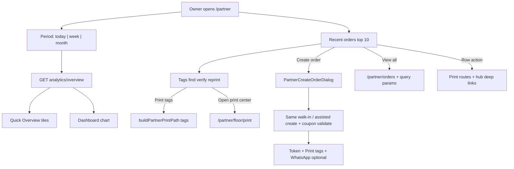
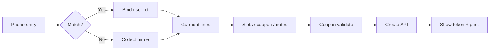

# Feature: Partner Laundry Dashboard Redesign (`/partner` command desk)

> Status: **review** (Prompt pack 0–8 — command desk on `/partner`; Playwright smoke + manual QA checklist)  
> Owner: product-manager + ui-ux-designer → frontend-architect + backend-architect  
> Last updated: 2026-08-10  
> Prompt pack: [`.cursor/prompts/partner-laundry-dashboard-redesign.md`](../../.cursor/prompts/partner-laundry-dashboard-redesign.md)  
> Related: [partner-owner-command-center.md](partner-owner-command-center.md), [partner-customers-orders-hub.md](partner-customers-orders-hub.md), [partner-washhouse-ops-visual.md](partner-washhouse-ops-visual.md), [partner-coupons.md](partner-coupons.md), [offline-booking-whatsapp.md](offline-booking-whatsapp.md), [partner-shop-floor.md](partner-shop-floor.md) (tokens + print only), [partner-dashboard-tags-section.md](partner-dashboard-tags-section.md) (Tags find · verify · reprint), [partner-dashboard.md](partner-dashboard.md)

## Problem

When a laundry owner opens **`/partner`**, they need a **period-aware business pulse** (orders, open work, revenue, unpaid ₹, customers), a **switchable analytics chart**, and the **latest queue** with fast **create-order** intake — all in one viewport — without rebuilding a second Orders Hub. Today the page mixes static KPIs (some UTC-based, some from unrelated APIs), an embedded full-page composer, and no shared period filter; counter staff still jump to **Customers & Orders** for queue depth and print lifecycle. The redesign makes `/partner` the owner’s **command desk** while **deep-linking** full queue, desk, and create workspace to `/partner/orders` and existing create brains.

## Persona

| Persona | Context | Primary jobs on `/partner` |
| ------- | ------- | --------------------------- |
| **Laundry owner** | Phone / laptop; morning check | Today / week / month pulse; chart; spot unpaid; create when counter is busy; open hub for full queue |
| **Counter staff** | Tablet at counter | Create by phone, color token tags, print immediately; **Tags** section (find · verify · reprint) + recent table + hub search |

**Design thesis:** Real metrics only · INR + GST · **Asia/Kolkata (IST)** for calendar periods · mobile-first · `PartnerOpsSurface` / ops-visual language · no invented KPIs.

## Why now

- **Customers & Orders Hub** is the daily workplace; `/partner` should **summarize and act**, not duplicate tabs/chips.
- **WashHouse ops-visual** landed demo-grade layout on `/partner` but still embeds a full composer and conflicting KPI sources (`GET analytics/summary`, operations dashboard, insights).
- Owner Command Center shipped money/growth elsewhere; this pack **consolidates period metrics + chart + recent 10** and moves primary create into a **90% modal** wired to the **same** walk-in / assisted APIs as hub create.
- Pagination standard (**10**) and IST `created_today` on orders list already exist — align overview periods with that truth.

## User stories

- As an **owner**, I want **Today | This week | This month** on one control, so every KPI and the chart use the same window.
- As an **owner**, I want **revenue (gross)** with **my net after commission** visible, so I trust the number without opening Money.
- As **counter staff**, I want **Create order** on the dashboard opening a large modal, so I don’t lose context on the home screen.
- As **counter staff**, I want **phone lookup** to bind an existing customer, so we don’t duplicate accounts.
- As an **owner**, I want **recent 10 orders** with the **same row actions** as the hub, so print and advance behave identically.
- As an **owner**, I want **View all** to open `/partner/orders` with matching filters, so the hub stays the system of record.

## Goals

- [x] Period-filtered **Quick Overview** + **Analytics chart** (Row A) sharing one period state
- [x] **Recent orders** table (Row B): Create CTA, status filter, top **10**, row actions menu, hub deep-link
- [x] **Tags** (Row C): server search by order no. / phone / token; verify inline; reprint via same print route as hub — [partner-dashboard-tags-section.md](partner-dashboard-tags-section.md)
- [x] **Create-order modal** (~90vw × 90vh) reusing walk-in composer + validate/create APIs
- [x] Post-create **print tags + token prominence** + optional WhatsApp rich body (later prompts)
- [x] New **`GET /api/v1/partner/analytics/overview`** (Prompt 1) without breaking `analytics/summary`
- [x] Docs + traceability; phased delivery Prompts **1–8**

## Non-goals

- Removing or replacing **`/partner/orders`** hub (dashboard **deep-links** only)
- Reintroducing **Shop Floor display mode** or a second partner shell
- New payment provider, **Bluetooth thermal SDK**, or Admin dashboard rebuild
- Fake / demo KPI numbers or client-side invented chart series
- Forking create/validate endpoints (must match hub **Create order** tab)
- 7-day revenue time-series without backend `chart_series` (Prompt 1 delivers buckets)

## Decision defaults

| Topic | Decision | Rationale |
| ----- | -------- | --------- |
| System of record for queue | `/partner/orders?tab=orders` | Hub hard-merge; chips/filters stay there |
| Primary create on dashboard | **Modal**; link “Open full workspace” → hub `?tab=create` or `/partner/new-order` | Power users keep Cloth Wall route |
| Period timezone | **`Asia/Kolkata`** for `today` / `week` / `month` bounds | India product; matches `created_today` on orders list |
| Revenue primary label | **Gross delivered** (`orders.total_inr`, GST-inclusive) | Matches existing partner analytics |
| Revenue secondary | **Partner net** = gross − snapshotted commission | Owner trust; same math as [partner-owner-command-center.md](partner-owner-command-center.md) |
| List page size | **10** (recent table + pagination standard) | [partner-admin-pagination-matrix.md](../qa/partner-admin-pagination-matrix.md) |
| Visual language | `PartnerOpsSurface`, ops-visual components, `formatInr` | [partner-washhouse-ops-visual.md](partner-washhouse-ops-visual.md) |
| Chart library | Recharts (Prompt 3) | Existing partner chart patterns |

---

## Information architecture — `/partner` layout

### Desktop (≥ `xl`)

```text
┌─────────────────────────────────────────────────────────────────┐
│ Page header: Command desk + shortcuts (Orders hub, Money)        │
├──────────────────────────────┬──────────────────────────────────┤
│ Row A — Quick Overview       │ Row A — Analytics chart          │
│ (period segmented control)   │ (type toggle: bar/line/pie/area) │
│ KPI tiles 2×3 or 3×2           │ series from overview API         │
├──────────────────────────────┴──────────────────────────────────┤
│ Row B — Recent orders: [Create order] + status filter + table 10 │
│ Footer link: View all → /partner/orders?…                        │
├─────────────────────────────────────────────────────────────────┤
│ Row C — Tags: search (order · phone · R-42) · verify · reprint │
│ Footer link: Open print center → /partner/floor/print            │
├─────────────────────────────────────────────────────────────────┤
│ Optional below fold: Owner brief strip (booking requests,        │
│ delayed logistics) — no duplicate KPIs (Prompt 8)                │
└─────────────────────────────────────────────────────────────────┘
```

### Mobile stack order (top → bottom)

1. Period control (full width)
2. KPI grid (**2 columns**)
3. Analytics chart (full width)
4. Recent orders: Create CTA + filter + **card list** (`sm`) / table (`md+`)
5. **Tags:** debounced search, verify accordion, print tags (below Recent orders; above create success strip)
6. Owner brief strip (optional)

**Remove from first viewport (Prompt 8):** embedded **`PartnerOrderDemoLiveComposer`** as primary intake — replaced by modal + optional link to full workspace.



---

## Metrics dictionary (authoritative for Prompt 1)

All queries: **`orders.laundry_id = partner’s laundry`**, **`orders.deleted_at IS NULL`**.

Period bounds (IST): let `now_ist = datetime.now(ZoneInfo("Asia/Kolkata"))`.

| Period key | `period_start_ist` | `period_end_ist` (exclusive) |
| ---------- | ------------------ | ---------------------------- |
| `today` | `now_ist.date()` at 00:00 IST | start + 1 day |
| `week` | Monday 00:00 IST of week containing `now_ist.date()` | start + 7 days |
| `month` | 1st of month 00:00 IST | 1st of next month 00:00 IST |

Convert bounds to UTC for SQL on `timestamptz` columns:  
`period_start_utc = period_start_ist.astimezone(UTC)`, same for end.

API response must include **`period_start_utc`**, **`period_end_utc`**, and display labels e.g. `"Today (10 Aug 2026, IST)"`.

### KPI: Total orders

| Attribute | Rule |
| --------- | ---- |
| **Label** | Total orders |
| **Definition** | Count of orders **created** in `[period_start_utc, period_end_utc)` |
| **SQL** | `COUNT(*)` WHERE `created_at >= start AND created_at < end` |
| **Timezone** | IST boundaries → UTC comparison |
| **Status set** | All statuses |
| **Payment field** | N/A |

### KPI: Pending orders

| Attribute | Rule |
| --------- | ---- |
| **Label** | Pending / In progress |
| **Definition** | Orders **created in period** that are **not terminal** (still open pipeline from period intake) |
| **Terminal statuses** | `delivered`, `cancelled` |
| **Non-terminal (pending) statuses** | `confirmed`, `pickup_assigned`, `picked_up`, `washing`, `ironing`, `ready`, `out_for_delivery` |
| **SQL** | `COUNT(*)` WHERE `created_at` in period AND `status NOT IN ('delivered','cancelled')` |
| **Note** | Differs from legacy `analytics_summary` **global** `orders_pending` (confirmed + pickup_assigned only). Dashboard tile uses **period-scoped open orders**; hub chips still show global queue. Document in UI subtitle: “Open from this period”. |

### KPI: Revenue (primary + secondary)

| Attribute | Rule |
| --------- | ---- |
| **Primary label** | Revenue (gross delivered) |
| **Primary value** | Sum `orders.total_inr` WHERE `status = 'delivered'` AND delivery timestamp in period |
| **Delivery timestamp** | **`orders.updated_at`** for `today` and `week`; **`orders.updated_at`** for `month` (Prompt 1 **aligns month to updated_at** — fixes legacy `analytics_summary` month using `created_at`) |
| **Secondary label** | Your net (after platform %) |
| **Secondary value** | `gross − SUM(total_inr * commission_rate / 100)` on same row set (snapshotted `commission_rate` per order) |
| **Payment field** | N/A (order totals; not cash-collected field) |
| **Not used** | Sum of `payments` rows (collected cash) — **deferred P2** [Daily cash summary](#laundry-owner-extras-backlog) |

### KPI: Pending payment

| Attribute | Rule |
| --------- | ---- |
| **Label** | Pending payment |
| **Count** | Orders with `payment_status IN ('pending','pending_cod')` AND `created_at` in period (same IST window) |
| **Optional ₹** | Sum `orders.total_inr` over same filter (outstanding order value, not partial payments) |
| **SQL** | Matches hub filter `payment_status=unpaid` semantics in `partner_service.list_orders` |
| **Status set** | Any order status (unpaid walk-in common at `confirmed`) |

### KPI: Customers

| Attribute | Rule |
| --------- | ---- |
| **Primary (period)** | Distinct customers with ≥1 order **created** in period |
| **Distinct key** | `COALESCE(user_id::text, customer_phone)` — count non-null keys only |
| **Secondary (optional tile footnote)** | All-time distinct customers for laundry (same key, no period filter) — reuse pattern from `analytics_summary.customers_count` (`COUNT(DISTINCT user_id)` only); extend in Prompt 1 to include phone-only guests for consistency |

---

## Chart series (`chart_series`)

Single query / grouped SQL — no N+1 per bucket (Prompt 1).

| Period | Default metric | Bucket granularity | Max buckets |
| ------ | -------------- | ------------------ | ----------- |
| `today` | Revenue gross (+ optional orders count) | **Hourly** in IST (24 buckets) | 24 |
| `week` | Revenue gross | **Daily** (Mon–Sun IST) | 7 |
| `month` | Revenue gross | **Daily** IST | 28–31 |

Each point: `{ bucket_label, bucket_start_utc, orders_count, revenue_gross_inr, revenue_net_inr }`.

**Default chart series:** revenue gross per bucket; UI toggle (Prompt 3) adds orders as second series for bar/line.

**Empty state:** No delivered revenue in period → illustration + link to `/partner/revenue`.

**Chart type persistence:** `localStorage` key `dlm.partner.dashboard.chartType` ∈ `bar | line | pie | area`.

---

## Create-order modal (`PartnerCreateOrderDialog`)

Dimensions: **`~90vw × 90vh`**, scrollable body, sticky footer **Cancel | Save order**.

### Customer (phone-first)

| Field | Required | Behavior |
| ----- | -------- | -------- |
| Phone | Yes | Indian +91 input; debounced lookup (Customer Desk / `getPartnerCustomerInsightsDashboard` / existing lookup APIs) |
| Name | Yes if no match | If match: show card (name, last orders, unpaid badge); bind **`customer_id` / `user_id`** — do not create duplicate user |
| Email | No | Optional |
| Gender | No | Optional; tag text only if product already supports |

### Services / garments

Reuse **`use-partner-walk-in-order-composer`** catalog + line items: garment type, qty, service (wash/iron/dry clean, etc.), color/note for tag, optional photo thumb.

### Order meta

Walk-in vs doorstep; address + slot; delivery charges; **coupon** (shop list + `POST /api/v1/partner/coupons/validate`); express flag; special instructions; internal staff note; **GST invoice requested** (B2B checkbox when supported on create payload).

### Pricing

Desktop: sticky sidebar; mobile: accordion — subtotal, discount, delivery, GST lines, total (composer `computePartnerCheckoutTotals`).

### Submit

- Walk-in: `POST /api/v1/partner/walk-in-orders` (optional `coupon_code`)
- Doorstep assisted: `POST /api/v1/partner/customer-desk/orders` (optional `coupon_code`)
- Same validation errors as hub create tab.

### Post-success (Prompts 6–7)

Non-blocking success region: **color token** (e.g. `R-42`), order id, item summary; primary **Print tags now**; secondary bag label, another order, order detail; WhatsApp sent / retry UI when implemented.



---

## Recent orders (Row B)

| Element | Spec |
| ------- | ---- |
| Header | “Recent orders” + **Create order** (opens modal) |
| Status filter | **All \| Needs action \| Processing \| Ready \| Delivered \| Cancelled** — map to existing list API filters/chips (no new backend enum) |
| Columns | Customer name, Phone, Delivery address (truncate + `title`), Created at (**IST**), Pickup/Delivery slot, Status badge, Actions |
| Page size | **10**; sort default `created_at` desc |
| View all | `/partner/orders?tab=orders` + equivalent `status` / chip query params |

**Actions menu** (reuse `partner-order-table-actions-menu.tsx` + `PrintOrderActions`):

- Print invoice / Print bill (lifecycle-gated)
- Print tags / Reprint labels
- Open order detail
- Open in Customers & Orders hub
- Advance status (hub rules)
- Copy tracking code / WhatsApp customer (`wa.me` prefilled stub → Prompt 7 body)

**Responsive:** card list on `sm`, table `md+`.

---

## Laundry-owner extras (backlog)

| Item | Priority | Notes |
| ---- | -------- | ----- |
| Color bag token (`R-42`) auto-assign on create | **P1** | Already on walk-in create; modal success must show prominently (Prompt 6) |
| Express vs standard + promised ready datetime | **P1** | If fields exist on create payload; else stub UI disabled with tooltip |
| Payment method at intake (Cash / UPI / Unpaid / Partial) | **P1** | Walk-in payment capture where API supports; partial = P2 |
| Stain / special instructions + internal staff note | **P1** | Map to existing order note fields |
| GST invoice requested (B2B) | **P1** | Checkbox + print GST route when allowed |
| Rush pin, reprint tags, open in hub, copy tracking link | **P1** | Row actions + success panel (Prompts 4–6) |
| WhatsApp rich summary on create + status templates on advance | **P1** | Prompt 7; extends [offline-booking-whatsapp.md](offline-booking-whatsapp.md) |
| Partial advance payment | **P2** | Cash drawer accuracy |
| Rush order → pinned in hub queue | **P2** | Hub queue feature |
| Item photos at intake | **P2** | Dispute prevention |
| Weight-based bulk bag | **P2** | Traditional pricing |
| Customer language pref (EN/HI) | **P2** | WhatsApp comprehension |
| Daily cash summary tile | **P2** | Needs payments aggregation |
| Low pickup/delivery SLA alerts | **P2** | Logistics pillar link |

---

## API surface

### New (Prompt 1)

| Method | Path | Purpose | Auth |
| ------ | ---- | ------- | ---- |
| GET | `/api/v1/partner/analytics/overview?period=today\|week\|month` | Period KPIs + `chart_series` + IST/UTC bounds | partner |

Response fields (minimum):  
`period`, `period_label_ist`, `period_start_utc`, `period_end_utc`,  
`orders_count`, `pending_orders_count`,  
`revenue_gross_inr`, `revenue_net_inr`, `commission_inr`, `effective_commission_rate`,  
`pending_payment_count`, `pending_payment_inr`,  
`customers_count_period`, `customers_count_all_time` (optional),  
`chart_series[]`.

Schemas: `backend/app/schemas/partner.py` (extend or add `PartnerAnalyticsOverviewResponse`).

### Existing (reuse — do not fork)

| Method | Path | Purpose |
| ------ | ---- | ------- |
| GET | `/api/v1/partner/analytics/summary` | Legacy dashboard / OCC money pulse — **unchanged** |
| GET | `/api/v1/partner/orders` | Recent table + hub queue |
| POST | `/api/v1/partner/walk-in-orders` | Walk-in create |
| POST | `/api/v1/partner/customer-desk/orders` | Assisted doorstep |
| POST | `/api/v1/partner/coupons/validate` | Coupon |
| GET | `/api/v1/partner/orders/{id}/tags` … | Print |

---

## Appendix A — `analytics_summary` vs overview (intentional differences)

| Topic | `GET analytics/summary` (today) | New `overview` (this spec) |
| ----- | ------------------------------- | --------------------------- |
| Period filter | Fixed multi-field (today/week/month in one payload) | Single selected period |
| “Today” boundary | UTC midnight on server `now` | **IST** midnight |
| Week start | UTC weekday Monday | **IST** Monday |
| Month revenue time column | `created_at` for month | **`updated_at`** for delivered (aligned with today/week) |
| Pending orders | Global counts by status buckets | **Period-scoped non-terminal** count (see dictionary) |
| Chart series | Not provided | **`chart_series`** buckets |
| Customers | `COUNT(DISTINCT user_id)` all-time | Period distinct + optional all-time with phone fallback |

Prompt 1 tests must lock IST boundary math (e.g. order created 23:30 IST vs 00:30 IST).

---

## Frontend surface

| Piece | Location (target) |
| ----- | ------------------- |
| Dashboard view | `frontend/features/partner/views/partner-laundry-dashboard-view.tsx` (refactor) |
| Period state | `PartnerDashboardPeriod` + context or lifted state on `/partner` |
| Quick Overview | `PartnerQuickOverview` + `usePartnerAnalyticsOverview(period)` |
| Chart | `PartnerDashboardAnalyticsChart` |
| Recent table | extend `partner-recent-orders-table.tsx` / wire on dashboard |
| Create modal | `PartnerCreateOrderDialog` |
| Composer brain | `use-partner-walk-in-order-composer.ts`, hub create tab parity |
| Print / success | `walk-in-success-panel.tsx`, `print-order-actions.tsx` |

Routes: **`/partner`** only (no new route for modal).

---

## Background work

- **Prompt 7:** Celery `send_order_status_whatsapp` — richer `order_received` body (item breakdown, token, ready window, total / balance).
- No new Beat schedules for overview KPIs.

---

## Phased delivery (Prompts 1–8)

| Prompt | Scope | Exit criteria |
| ------ | ----- | ------------- |
| **0** | This spec + traceability | No code |
| **1** | Backend `analytics/overview` + tests (IST, empty laundry) | Grouped SQL chart; summary API unchanged — **done** |
| **2** | `PartnerQuickOverview` + period state; remove conflicting KPI grid | One refetch per period change |
| **3** | Switchable chart + localStorage type | Shared query cache with overview |
| **4** | Recent orders table + filters + actions | View all → hub; page size 10 |
| **5** | Create-order modal 90% | Same validation as hub |
| **6** | Post-create token + print CTAs | Print URLs match hub |
| **7** | WhatsApp rich create message + row wa.me | Formatter unit tests |
| **8** | Invoice gating, layout polish, owner brief strip, Playwright, status docs | Light/dark 375 + 1280; hub regression free |

Manual QA: see checklist in [prompt pack](../../.cursor/prompts/partner-laundry-dashboard-redesign.md#qa-checklist-manual).

---

## Acceptance criteria (feature-level)

- [ ] Given partner on `/partner`, When they switch period, Then KPIs and chart reflect **`overview`** definitions (IST) and refetch once.
- [ ] Given create from modal, When save succeeds, Then same order as hub create would produce (API + token + print paths).
- [ ] Given recent table, When **View all**, Then hub opens with matching filter params; hub remains full queue.
- [ ] Given unpaid orders, When pending payment tile loads, Then count/₹ match `payment_status` unpaid semantics.
- [ ] Given no delivered revenue in period, Then chart empty state links to Money route.
- [ ] Given keyboard user, Then period control, modal trap, and actions menu are operable.
- [ ] **`GET analytics/summary`** behavior unchanged for existing consumers.
- [ ] Docs: this spec **shipped** status + one line in `current-status.md` after Prompt 8.

---

## Metrics & analytics (product)

| Event (optional FE) | Purpose |
| ------------------- | ------- |
| `partner_dashboard.period_change` | today / week / month |
| `partner_dashboard.chart_type_change` | bar / line / pie / area |
| `partner_dashboard.create_open` | modal vs hub link |
| `partner_dashboard.view_all_queue` | hub deep-link |

KPI: time from `/partner` open to first successful create (modal); % creates with tags printed same session.

---

## Risks & mitigations

| Risk | Likelihood | Impact | Mitigation |
| ---- | ---------- | ------ | ---------- |
| KPI mismatch vs owner mental model (IST vs UTC) | M | H | Dictionary + API tests; spot-check QA checklist |
| Duplicate KPI sources on dashboard | M | M | Remove static grid; single overview hook |
| Modal vs hub create drift | M | H | One composer hook; shared validation |
| OCC home composition crowded | M | M | Row A/B layout; brief strip optional below fold |
| Month revenue definition change | L | M | Document appendix; communicate in release notes |

---

## Open questions

1. **Pending orders tile:** period-scoped open vs global pipeline snapshot — **resolved:** period-scoped open (dictionary above); hub chips remain global.
2. **Owner brief on dashboard:** keep from OCC under fold? → **Yes, Prompt 8 optional**; no KPI duplication.
3. **Hourly buckets for today chart on low-end Android:** 24 points OK? → **Yes**; disable animation when `prefers-reduced-motion`.

---

## Handoff

- **Prompt 0 complete:** spec + traceability.
- **Next:** Prompt 1 — implement `GET /api/v1/partner/analytics/overview` per metrics dictionary and appendix alignment notes.
