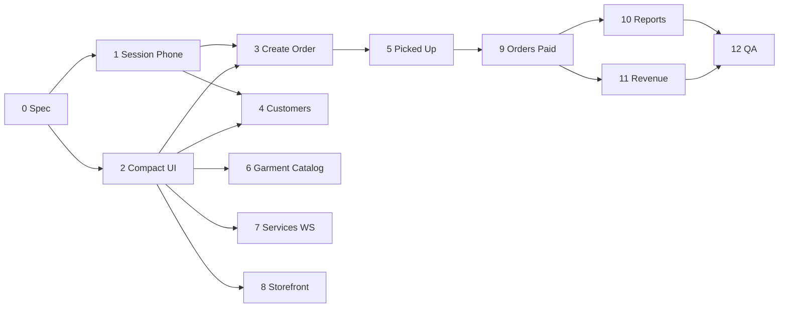

# Feature: Partner Ops Fixes + Compact UI

> Status: **review** (Prompts 0–12 — 2026-08-16)  
> Owner: product-manager + ui-ux-designer → frontend-architect  
> Last updated: 2026-08-16  
> QA matrix: [`docs/qa/partner-ops-fixes-compact-ui-matrix.md`](../qa/partner-ops-fixes-compact-ui-matrix.md)  
> Prompt pack: `.cursor/prompts/partner-ops-fixes-compact-ui.md` *(Prompt 0 creates spec; pack body lives in stakeholder session)*  
> Related: [partner-customers-orders-hub.md](partner-customers-orders-hub.md), [partner-customers-orders-hub-ui-polish.md](partner-customers-orders-hub-ui-polish.md), [partner-garment-service-catalog.md](partner-garment-service-catalog.md), [partner-washhouse-ops-visual.md](partner-washhouse-ops-visual.md), [PAGINATION_STANDARD.md](../qa/PAGINATION_STANDARD.md)

## Problem

WashHouse laundry partners reported **15 operational bugs and gaps** during counter use: session timeouts too short, phone validation inconsistent, create-order Step 1/2 broken, Customers sidebar blank, status transitions failing, garment catalog tools incomplete, storefront save broken, and Reports/Revenue/Orders missing date or payment breakdown filters. Separately, the partner portal still mixes **oversized chrome** (`rounded-3xl`, `min-h-[44px]`, `p-6`, `text-2xl` headings) from ops-visual demos with the denser hub polish — counter staff need one **compact, consistent** density system across all partner routes.

## Persona

| Persona | Context | Jobs |
| ------- | ------- | ---- |
| **Counter staff** | Phone/tablet 8+ hours | Create walk-in orders fast; find customer; mark picked up; print |
| **Laundry owner** | Laptop + phone | Review revenue/reports; edit customer CRM; manage catalog + storefront |
| **Returning device** | Shared shop tablet | Stay logged in through a shift; no surprise idle logout |

## Why now

- Stakeholder list (2026-08-15) blocks daily partner sign-off on ops flows already shipped in Customers & Orders Hub and garment catalog.
- Hub UI polish (2026-08-08) and WashHouse ops-visual (2026-08-09) introduced **conflicting radii and touch targets** — this pack **re-locks density** partner-wide without reopening IA.
- Garment catalog Prompt 9 shipped with `page_size=20`; stakeholder wants **10/page** aligned with pagination standard on list surfaces.

## Goals

- [x] Fix all **15 stakeholder items** (see [Bug/fix inventory](#bugfix-inventory))
- [x] Apply **compact UI density spec** across `frontend/features/partner/**` (Prompt 2)
- [x] Phased delivery Prompts **1–12** per [File map](#file-map-prompts-112)
- [x] QA matrix green @ **375px + dark mode** for every fix and density pass *(25 Pass, 5 staging deferrals)*
- [x] No customer/marketing app changes unless session env is global

## Non-goals

- Admin portal redesign or density pass
- New payment provider / Razorpay Checkout.js
- Bluetooth thermal SDK
- Shop Floor display mode revival
- Replacing Orders Hub tab IA (`orders` | `desk` | `requests` | `directory`)
- Full CSV export job infrastructure beyond Reports date-filtered export (reuse list/export endpoints)

---

## Bug/fix inventory (stakeholder list — 15 items)

| ID | Stakeholder ask | Root symptom | Target fix (Prompt) | Priority |
| -- | --------------- | ------------ | ------------------- | -------- |
| **F01** | Increase logout session timeout | Idle logout ~10 min interrupts counter shifts | Partner idle **60 min**, warning **5 min** via `NEXT_PUBLIC_SESSION_IDLE_MINUTES` / `NEXT_PUBLIC_SESSION_WARNING_MINUTES` | P0 |
| **F02** | Mobile number exactly **10 digits** | Inconsistent validation; 9/11 digits accepted on some forms | Shared `partner-phone-schema.ts`; block Continue until `/^[6-9]\d{9}$/`; store E.164 `+91…` | P0 |
| **F03** | **Step 1:** Total spent not displayed | Customer snapshot missing LTV after phone/search select | Enable insight fetch on valid E.164; show `₹0.00` for registered guests with null spend | P0 |
| **F04** | **Step 2:** Quantity entry broken; need **decimals** | Integer floor (`Math.max(1,…)`) blocks 0.5 kg / fractional pieces | `step=0.01`, min `0.01`, max `999.99`; decimal-safe line totals | P0 |
| **F05** | **Customers:** data not loading from sidebar | `/partner/customers` blank or silent failure on nav | Fix query enable/error states; skeleton + retry; sidebar → `PARTNER_CUSTOMERS_HREF` | P0 |
| **F06** | **Picked Up** status not updating | Advance action fails silently or 422 not surfaced | Fix transition rules + inventory gate messaging; invalidate order queries | P0 |
| **F07** | **Service Catalog** not working | `/partner/services` crash, empty error, or broken tabs | Fix API/query wiring; default `page_size=10` | P0 |
| **F08** | Add **“All Visible”** button | Bulk show hidden garments tedious | Toolbar **Make all visible (this page)** with confirm dialog | P1 |
| **F09** | **Services workspace:** search + **10/page** pagination | Hub `?workspace=services` modal lists all rows | Server search + paginated list (`page_size=10`) | P1 |
| **F10** | **Template download** broken | `downloadGarmentTemplate` fails on blob/JSON error | Fix FE blob handling + BE `Content-Disposition` | P0 |
| **F11** | **Select All** for visible items | Bulk actions missing page scope | Header checkbox **Select all on this page** | P1 |
| **F12** | **Storefront:** unable to save | PATCH never fires or validation rejects draft | Draft dirty detection; strip read-only fields; surface 422 | P0 |
| **F13** | **Reports:** Week · Month · Year · **Custom range** | Exports ignore date window | Filter bar (IST) on both CSV exports | P1 |
| **F14** | **Revenue:** **This year** + **Custom range** | Period tabs incomplete vs owner ask | Extend analytics summary + revenue view period tabs | P1 |
| **F15** | **Orders:** show **pending** + **paid** amounts | List/detail only show total | `paid_inr` + `pending_inr` on PartnerOrder schema + UI columns | P0 |

**Note:** Stakeholder listed Customers twice (load + editable details). Spec treats **load (F05)** and **edit sheet (F16 sub)** as one Prompt 4 slice.

| ID | Sub-fix | Target |
| -- | ------- | ------ |
| **F16** | Customer details **editable** (name, email, gender; phone read-only) | `PATCH /partner/customers/{user_id}` + `PartnerCustomerEditSheet` |

---

## Locked decisions (HARD)

| Topic | Decision | Rationale |
| ----- | -------- | --------- |
| Session timeout | **60 min** idle, **5 min** warning on partner portal | Counter shifts; env `NEXT_PUBLIC_SESSION_IDLE_MINUTES=60`, `NEXT_PUBLIC_SESSION_WARNING_MINUTES=5` |
| Session scope | Partner-friendly defaults; do **not** shorten customer/admin without env override | Stakeholder asked partner-only behavior |
| Mobile validation | **Exactly 10 digits**; Indian mobile starts **6–9** | India CRM key; display digits-only; persist **E.164 `+91XXXXXXXXXX`** |
| Phone error copy | `"Enter a valid 10-digit mobile number (starts with 6–9)"` | English-first, actionable |
| Total spent (Step 1) | Show when phone valid + lookup succeeds; registered with null → **₹0.00**; no profile → **—** | Honest guest handling |
| Quantity (Step 2) | **Decimals allowed**: `step=0.01`, `min=0.01`, `max=999.99` | kg / partial piece pricing |
| Qty parsing | Allow transient `"0."` while typing; validate on confirm | UX while editing |
| Customers load | Sidebar **Customers** → `/partner/customers` must always show list, skeleton, or **ErrorState + retry** | Never blank shell |
| Customer edit | PATCH: name (required), email, gender, notes optional; **phone immutable** | Partner-scoped AuthZ |
| Guest edit | Read-only banner: *Register on first order* | No phantom user PATCH |
| Picked up | Surface **specific** blocker (inventory/photos) via toast + disabled CTA reason | No silent 422 |
| Garment catalog page | `/partner/services`; default **`page_size=10`** | Align pagination standard |
| Select all | **Current page IDs only**; label *Select all on this page* | Prevent accidental full-catalog select |
| All Visible | **Current page only**; confirm *Make {n} garments visible on this page?* | Scoped bulk PATCH |
| Template download | Blob download; fallback filename `garment-catalog-template.xlsx` | POS onboarding |
| Services workspace | Hub `?workspace=services` — **legacy service CRUD**, not garment catalog | Do not conflate endpoints |
| Services pagination | **`page_size=10`**, debounced search **300ms** | Performance |
| Storefront save | Draft must dirty on section edit; strip `laundry_id`, `completeness_score` from PATCH | Fix silent no-op |
| Reports filters | **This week · This month · This year · Custom** (IST inclusive days) | Owner exports |
| Revenue filters | **Today · Week · Month · Year · Custom** | Extend existing period UX |
| Orders payment columns | **Total \| Paid \| Pending**; `pending = max(0, total - paid)` | Partial COD/advance |
| Timezone | **Asia/Kolkata** for date filters and exports | India product default |
| Touch targets | **44px (`min-h-11`) ONLY** on primary mobile checkout CTAs in create-order flow | Density elsewhere uses `h-9` |
| Density scope | **`frontend/features/partner/**` only** | No marketing/customer restyle |

---

## Compact UI density spec (partner portal)

Concrete Tailwind classes — **source of truth** for Prompt 2 sweep. Prefer shared constants in `frontend/features/partner/lib/partner-compact.ts`.

### Controls

| Element | Classes | Notes |
| ------- | ------- | ----- |
| Default button | `size="sm"` + `h-9 min-h-9 px-3` | shadcn `Button` |
| Default input / select | `h-9 min-h-9 text-sm` | Match filter bar baseline |
| Secondary / ghost header actions | `h-9` | Print, Requests, quiet links |
| Shortcut chip | `h-8 sm:h-9 rounded-full text-xs sm:text-sm gap-1.5` | Hub chips unchanged semantics |
| Filter toolbar gap | `gap-2` | Never `gap-3` inside single toolbar row |
| Table row action | `h-9` primary; `h-8 w-8` icon-only print | `PrintOrderActions layout="compact"` |
| FAB (mobile hub) | `h-12` | Mobile-only primary intake |
| **Checkout primary CTA (mobile)** | `min-h-11` (44px) | Create order sticky footer only — **exception** |

**Remove** blanket `min-h-[44px]` on partner hub/shell controls.

### Surfaces

| Element | Classes | Replace |
| ------- | ------- | ------- |
| Card / panel | `rounded-xl border border-border bg-card p-3 sm:p-4` | `rounded-3xl`, `p-6`, `sm:p-6` |
| Ops hero outer (dashboard only) | May keep `rounded-[32px]` on **`PartnerOpsSurface` hero variant** | Do not re-radius tables/lists |
| Section internal gap | `gap-3` | `gap-5`, `gap-6` |
| Page vertical rhythm | `space-y-4` | `space-y-5`, `space-y-6` |
| Page shell padding | `px-4 py-3 sm:px-5 sm:py-3` via `PartnerContent` | Loose `py-6` page wrappers |

### Typography

| Element | Classes | Replace |
| ------- | ------- | ------- |
| Page title | `.page-title` → `text-lg font-semibold tracking-tight text-foreground` | Ad-hoc `text-2xl`, `text-3xl` on partner views |
| Section title | `.section-title` or `text-base font-semibold` | Oversized section headers |
| Table meta / payment cols | `text-xs tabular-nums` | — |
| KPI value | `text-lg font-semibold tabular-nums` | `text-2xl` KPI numbers |

**Action (Prompt 2):** Align `.page-title` in `globals.css` to `text-lg` if still `text-xl` — partner views must not use larger one-offs.

### Avatar / chips

| Element | Classes |
| ------- | ------- |
| Customer avatar | `h-9 w-9 max` (was `h-12 w-12`) |
| Avatar fallback text | `text-xs` |
| Status badge | `text-[11px] px-2 py-0.5 rounded-full` (per hub polish) |

### Shared constants (Prompt 2)

```ts
// frontend/features/partner/lib/partner-compact.ts
export const PARTNER_CARD = 'rounded-xl border border-border bg-card p-3 sm:p-4';
export const PARTNER_SURFACE_GAP = 'gap-3';
export const PARTNER_PAGE = 'space-y-4';
export const PARTNER_INPUT = 'h-9 min-h-9';
export const PARTNER_BTN = 'h-9 min-h-9';
export const PARTNER_CHECKOUT_CTA = 'min-h-11'; // mobile create-order only
```

### Anti-patterns (partner tree)

❌ `rounded-3xl` on list cards, tables, modals  
❌ `min-h-[44px]` on filter inputs, chips, sidebar items  
❌ `text-2xl` / `text-3xl` page headings  
❌ `p-6` default card padding  
❌ One-off `h-10` / `h-11` buttons without justification  

### Verification viewports

Every density change: **375px width**, **light + dark**, **`prefers-reduced-motion`** unchanged.

---

## Information architecture (unchanged)

Partner sidebar per [`partner-nav.ts`](../../frontend/features/partner/lib/partner-nav.ts):

| Section | Item | Route |
| ------- | ---- | ----- |
| Dashboard | Dashboard | `/partner` |
| Operations | Customers | `/partner/customers` |
| Operations | Orders | `/partner/orders` |
| Your shop | Service catalog | `/partner/services` |
| Your shop | Storefront builder | `/partner/storefront` |
| Money | Revenue, Reports | `/partner/revenue`, `/partner/reports` |

Create order entry: `/partner/orders?tab=create` (legacy `/partner/new-order` aliases).  
Garment catalog ≠ Services workspace modal (`?workspace=services`).

---

## File map (Prompts 1–12)

| Prompt | Scope | Primary paths |
| ------ | ----- | ------------- |
| **0 — Spec** | This doc + QA matrix + logs | `docs/features/partner-ops-fixes-compact-ui.md`, `docs/qa/partner-ops-fixes-compact-ui-matrix.md` |
| **1 — Session + phone** | Idle 60m; shared phone schema | `frontend/lib/session-config.ts`, `frontend/lib/idle/*`, `frontend/features/partner/lib/partner-phone-schema.ts`, `customer-desk/phone.ts`, `customer-desk/schemas.ts`, `frontend/.env.example` |
| **2 — Compact UI** | Density sweep + constants | `frontend/features/partner/lib/partner-compact.ts`, `partner-content.tsx`, `ops-visual/*`, `owner/*`, `features/partner/views/*`, `globals.css` (`.page-title`) |
| **3 — Create order** | Total spent + decimal qty | `use-partner-walk-in-order-composer.ts`, `partner-walk-in-order-workspace.tsx`, `partner-customer-snapshot-cards.tsx`, `partner-new-order-service-add-dialog.tsx`, `cloth-wall-qty.ts`, `partner-new-order-view.tsx` |
| **4 — Customers** | Load fix + edit sheet | `partner-customers-view.tsx`, `owner-customer-card.tsx`, `customer-insights.ts`, `backend/.../customer_desk.py`, `partner_customer_service.py` |
| **5 — Picked up** | Status transition | `partner-order-card.tsx`, `use-partner-operations.ts`, `partner_service.py`, `operations_service.py` |
| **6 — Garment catalog** | Fix page + template + bulk | `garment-catalog/**`, `services/partner-garment-catalog.ts`, `backend/.../partner_garment_catalog.py` |
| **7 — Services workspace** | Search + 10/page | `partner-hub-services-workspace.tsx`, `partner-service-catalog.ts`, `backend/.../partner_service_catalog.py` |
| **8 — Storefront** | Save fix + compact | `partner-storefront-builder-view.tsx`, `services/storefront.ts`, `storefront_service.py` |
| **9 — Orders paid/pending** | Payment columns | `services/partner.ts`, `partner-orders-table.tsx`, `partner-hub-orders-workspace.tsx`, `partner-order-detail-view.tsx`, order payment schemas |
| **10 — Reports filters** | Date range exports | `partner-reports-view.tsx`, export endpoints |
| **11 — Revenue filters** | Year + custom | `partner-revenue-view.tsx`, `partner_analytics_period.py` |
| **12 — QA ship** | Matrix + Playwright | `frontend/tests/e2e/partner-ops-fixes.spec.ts`, QA matrix status, logs |

**Do not touch:** `frontend/features/admin/**`, `frontend/features/marketing/**` (except shared session config docs).

---

## API surface (new or extended)

| Method | Path | Prompt | Purpose |
| ------ | ---- | ------ | ------- |
| PATCH | `/api/v1/partner/customers/{user_id}` | 4 | Edit customer profile (partner-scoped) |
| GET | `/api/v1/partner/garment-catalog/template` | 6 | Fix download headers |
| POST | `/api/v1/partner/garment-catalog/bulk-visible` *(or PATCH batch)* | 6 | Make page visible |
| GET | `/api/v1/partner/services` | 7 | Add `page`, `page_size`, `search` |
| PATCH | `/api/v1/partner/storefront` | 8 | Fix validation / partial update |
| GET | `/api/v1/partner/orders` | 9 | Include `paid_inr`, `pending_inr` on list items |
| GET | `/api/v1/partner/orders/{id}` | 9 | Same on detail |
| GET | `/api/v1/partner/orders/export` | 10 | `date_from`, `date_to` (IST) |
| GET | `/api/v1/partner/analytics/summary` | 11 | `period=year` + custom range query params |

---

## Phased delivery



**Parallel after Prompt 2:** 6, 7, 8, 10, 11 in separate chats.

---

## Acceptance criteria

- [x] All **F01–F16** pass QA matrix @ 375px + dark mode *(5 staging-only deferrals documented)*
- [x] Partner portal uses compact density constants; no stray `rounded-3xl` / `min-h-[44px]` except checkout mobile CTA
- [x] Session idle 60m with 5m warning (partner); documented in `.env.example`
- [x] Phone blocked until 10 valid digits on all partner phone fields
- [x] Create order shows total spent + accepts decimal qty
- [x] Customers sidebar load + edit sheet shipped
- [x] Picked up transitions with clear error when blocked
- [x] Garment catalog: template download, select-all-page, all-visible-page, 10/page
- [x] Services workspace: search + 10/page
- [x] Storefront save persists all tabs
- [x] Orders show paid + pending; Reports/Revenue filters work in IST
- [x] Tests: Jest + pytest + Playwright `partner-ops-fixes.spec.ts`
- [x] Docs: this spec, matrix, traceability, feature-progress, current-status

---

## Risks & mitigations

| Risk | Likelihood | Impact | Mitigation |
| ---- | ---------- | ------ | ---------- |
| Compact UI clashes with ops-visual 32px hero | M | L | Hero variant only on `/partner`; lists stay `rounded-xl` |
| PATCH customer on guest phones | M | M | Phone-keyed guests read-only until registered |
| Paid/pending math wrong on partial COD | M | H | Backend single source; pytest fixtures |
| Garment `page_size` 20→10 confuses existing QA | L | L | Update garment matrix G15 note |
| Storefront PATCH shape drift | M | M | Integration test per tab |

---

## Supersession notes

| Spec | Relationship |
| ---- | ------------ |
| [partner-customers-orders-hub-ui-polish.md](partner-customers-orders-hub-ui-polish.md) | Hub-specific density; **this spec extends partner-wide** |
| [partner-washhouse-ops-visual.md](partner-washhouse-ops-visual.md) | Ops hero radii preserved; cards/tables follow **this** `rounded-xl` rule |
| [partner-garment-service-catalog.md](partner-garment-service-catalog.md) | Adds F08/F10/F11 + `page_size=10` override for stakeholder pass |
