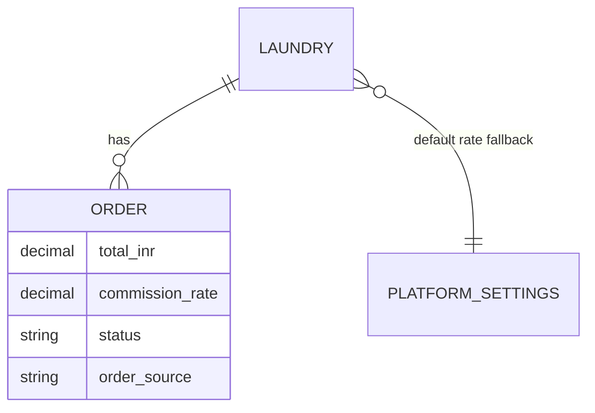

# Feature: Partner Owner Command Center

> Status: **in-progress** (P4 logistics board shipped — 2026-08-08)  
> Owner: product-manager + ui-ux-designer → frontend-architect + backend-architect  
> Last updated: 2026-08-08  
> Related: [partner-dashboard.md](partner-dashboard.md), [partner-customers-orders-hub.md](partner-customers-orders-hub.md) (single shell + Operations slim), [partner-shop-floor.md](partner-shop-floor.md) (mode retiring), [orders-hub.md](orders-hub.md), [partner-staff.md](partner-staff.md), [commission.md](commission.md), [customer-desk.md](customer-desk.md)  
> Prompt pack: [`.cursor/prompts/partner-owner-command-center.md`](../../.cursor/prompts/partner-owner-command-center.md)  
> Product: India laundry **owner** cockpit (gross / platform % / net / growth + people + logistics) — **only partner shell** after Shop Floor display mode retirement  
> **IA note (2026-08-08):** Operations collapses to **Customers & Orders** per [partner-customers-orders-hub.md](partner-customers-orders-hub.md); evolve this nav, don’t fork.

## Problem

Laundry owners who already run WashHouse day-to-day still open Advanced Mode and see a **dense sidebar** (Overview, Operations center, New Order, Orders, Walk-in, Pickups, Deliveries, Storefront, Services, Pricing, Reviews, Staff, Revenue, Settlements, Reports, Notifications, Audit, Settings) plus an Overview that is an **8-equal KPI wall**. They cannot answer in one glance: *What should I do next? How much did we make? What % goes to the platform? Are we growing? Who delivers today?* Money screens show gross buckets but **not commission transparency or growth**. Staff, pickups, and customers feel like separate tools, not one business to maintain. Shop Floor Mode already solves counter literacy — owners need a calm, picture-led **command center**, not more enterprise chrome.

## Persona

| Persona | Mode | Context | Primary jobs |
| ------- | ---- | ------- | ------------ |
| **Laundry owner** | **Advanced → Owner Command Center** | Phone/laptop; cares about money, people, reputation, coverage | Check today, clear actions, see net ₹ + platform %, grow revenue, manage staff & customers |
| **Counter / floor staff** | **Shop Floor** (unchanged) | Tablet at counter; Hinglish; picture-first | Naya Order, Aaj ka Kaam, Ready/Diya, Print — **out of scope for this feature** |

**Mode rule (non-negotiable):** `partner_ui_mode=shop_floor` keeps the 4-tile home and `/partner/floor/*`. Owner Command Center applies only when Advanced Mode renders `/partner` and the Advanced shell nav.

## Why now

- Partner Ops Phase 1 (A+B+C) and Shop Floor Mode shipped the floor path; **owner trust and retention** now depend on money clarity and maintainability.
- Commission is already snapshotted on orders (`orders.commission_rate`) and configured per laundry — partners just **cannot see it** in their UI.
- Nav sprawl fights the Orders Hub hard-merge win; owners still hunt Pickups vs Deliveries vs Staff vs Revenue.
- Low-end Android + 4G: fewer equal KPIs and more guided actions beat chart walls.

## User stories

- As an **owner**, I want a calm **“do next” brief** on home, so I clear the morning without scanning eight cards.
- As an **owner**, I want to see **gross ₹, platform %, commission ₹, and my net**, so I trust WashHouse and plan cash.
- As an **owner**, I want **growth vs yesterday / last week / last month**, so I know if the shop is moving up.
- As an **owner**, I want **Logistics** (pickups + deliveries) in one mental place, so riders leave on time.
- As an **owner**, I want **People** (customers + staff) together, so relationships and coverage are obvious.
- As an **owner**, I want **illustrated pillars and empty states**, so non-tech family members can use Advanced Mode too.
- As a **floor staffer**, I want Shop Floor **unchanged**, so counter speed is not hurt by owner analytics.

## Goals

- [x] Collapse Advanced nav into **5 owner pillars** (+ secondary Shop / System) without breaking existing hrefs *(P1)*
- [x] Rebuild Advanced `/partner` as an **agentic, picture-led Owner home** (one first-viewport composition) *(P2)*
- [x] Expose **money intelligence**: gross · effective platform % · commission ₹ · partner net · period growth (real data only) *(P3)*
- [x] Unify **Logistics** UX for pickups + deliveries (shared board language; optional `/partner/logistics` hub) *(P4)*
- [x] Polish **People**: customers (Orders Hub directory/desk) + staff roster with role imagery + assign-to-run *(P5–P6)*
- [x] Every pillar card + empty state has a **concrete image/illustration** reference *(P1 pillar cards + empty primitive; more empties in P4–P7)*
- [ ] Ship in P1–P7 slices mapped to the Cursor prompt pack; document + test

## Non-goals

- Redesigning **Shop Floor** 4-tile home or floor boards
- Admin dashboard rebuild
- Invented / demo metrics or fake growth
- New payment provider or changing commission **admin** config APIs
- Rewriting Orders Hub tab IA (`orders` \| `desk` \| `requests` \| `directory`) unless a thin People landing wrapper is required
- Map SDK / route optimization (v2)
- LLM chatbot (optional deterministic “smart chips” only — Bonus A)
- New garment photo shoot before exhausting `frontend/public/catalog/` + marketing heroes

## Decision defaults

| Topic | Default | Rationale |
| ----- | ------- | --------- |
| Scope surface | Advanced Mode only | Shop Floor already owns counter UX |
| Pillars | Today · Orders · Logistics · People · Money | Matches owner mental model; ≤5 primary |
| Orders | Keep `/partner/orders` hub | Hard-merge already shipped |
| Logistics route | Prefer **shared layout** on `/partner/pickups` + `/partner/deliveries`; optional `/partner/logistics?tab=` if cleaner | Avoid orphan routes; redirects OK |
| People | Staff at `/partner/staff`; Customers stay in Orders Hub `?tab=directory` (+ desk); optional `/partner/people` landing with tabs | Don’t resurrect competing `/partner/customers` product |
| Money home | `/partner/revenue` as Money cockpit; Settlements + light Reports linked | One place for “what I earn” |
| Revenue basis | **Delivered** order `total_inr` (same as today’s analytics) | Consistent with existing partner truth |
| Commission math | Prefer **sum of order-snapshotted** `total_inr * commission_rate / 100` for period ₹; show **effective_commission_rate** from laundry resolve for “your rate” explainer | Matches settlements calculator; honest if rates changed over time |
| Growth | vs yesterday / prev week / prev month; `%` null-safe when prior = 0 | No fake baselines |
| Images | Reuse catalog/marketing heroes first; add `frontend/public/partner-ops/*` only for 6–8 missing metaphors | Fast + on-brand |
| Visual anti-patterns | No purple neon gradients; no cream+terracotta cliché; no broadsheet density | Brand tokens + fresh laundry aesthetic |

## Information architecture

### Target Advanced sidebar

```
Dashboard
  Today                  → /partner

Operations (slim)
  New Order              → /partner/new-order
  Orders                 → /partner/orders   (badges: orders + bookingRequests)
  Walk-in orders         → /partner/walk-in-orders   (keep; floor intake list)

Owner pillars
  Logistics              → /partner/logistics  OR  Pickups + Deliveries grouped under one section label
                           (hrefs: /partner/pickups, /partner/deliveries; badge: pickups)
  People                 → /partner/people?tab=customers|staff
                           (aliases: directory → customers tab; /partner/staff → staff tab)
  Money                  → /partner/revenue
                           (child links / deep sections: Settlements, Reports)

Your shop (secondary)
  Storefront / Services / Garment prices / Reviews

System (secondary)
  Notifications / Audit / Settings

Optional keep (de-emphasized)
  Operations center      → /partner/operations  (power users; link from delayed brief item)
```

**Nav implementation notes (P1):**

- Regroup `PARTNER_NAV_SECTIONS` in `frontend/features/partner/lib/partner-nav.ts`.
- Preserve `PARTNER_ORDERS_HUB_ALIASES` and badge keys.
- Floor routes (`/partner/floor/*`) remain reachable from mode toggle / More — not primary Advanced pillars.
- Active-state helpers (`isPartnerNavActive`, `resolvePartnerNavPathname`) must treat People/Money aliases correctly.

### Pillar → route map

| Pillar | Primary route | Also |
| ------ | ------------- | ---- |
| Today | `/partner` (Advanced overview) | Shop Floor still hijacks same URL when mode=shop_floor |
| Orders | `/partner/orders` | New Order, Walk-in |
| Logistics | `/partner/pickups` + `/partner/deliveries` (shared chrome) | Optional `/partner/logistics` |
| People | `/partner/people` or staff + hub directory | Desk via `/partner/orders?tab=desk` |
| Money | `/partner/revenue` | `/partner/settlements`, `/partner/reports` |

## UX flow

### Advanced home (`/partner`) — first viewport = one composition

```mermaid
flowchart TD
  A[Owner opens /partner Advanced] --> B[Greeting + laundry name + CTAs]
  B --> C[Owner brief: max 5 Do-next items]
  C --> D[Money pulse: gross / platform % / net / growth]
  D --> E[Illustrated pillar map: Orders Logistics People Money]
  E --> F[Below fold: floor strip + recent orders + trust]
  C -->|item tap| G[Deep link: orders / logistics / staff / settlements]
  D -->|Open Money| H[/partner/revenue]
  E -->|pillar tap| I[Pillar route]
```

**Owner brief priority (deterministic, real counts only):**

1. Needs-action orders (accept/reject)
2. Booking requests waiting
3. Pickups due / delayed
4. Deliveries out or ready-to-dispatch
5. Settlement ready / attention (if API exposes)
6. Staff coverage gap (optional when schedule data exists)
7. Else calm empty: illustration “Floor is clear”

**Money pulse (compact):** Today gross · Platform cut X% · Your net · Growth chip → Money.

**Pillar cards:** Large `OwnerPillarCard` with image — not equal mini-KPIs.

### Money (`/partner/revenue`)

1. Period toggle: Today / Week / Month  
2. Hero: **Your net** (largest)  
3. Row: Gross | Platform % | Commission ₹  
4. Growth vs prior period (% + ₹), accessible (not color-only)  
5. Commission explainer card (plain language) → Settlements  
6. Optional walk-in vs doorstep split + service breakdown  

### Logistics

Shared board language: Needs pickup · Out for delivery · Done today; run cards with status (color+icon+label), phone, address, token, assignee, primary action.

### People

- **Customers:** Orders Hub directory cards (avatar initials, phone, LTV, order count, Regular/New/At risk soft tags + Call / WhatsApp / New order / History) with **server-paginated** insights list (default 10, search) + desk for find/create; insights strip (new this week, repeat rate, top 5)  
- **Staff:** Illustrated roster; coverage “who can pickup / deliver”; **paginated** activity log (default 10); assign into logistics runs (deep-link filter + on-card assign)  

## Visual system (reference images)

### Brand / aesthetic

- Tokens from `frontend/styles/tokens.css` (`--brand-500` #2D7BFF, `--accent-500` #FF7A59)
- Fresh, clean India laundry: cotton, bags, scooter delivery, calm money — **premium mobile-first**
- Status = **color + icon + short label** (never color alone)
- Motion: 2–3 subtle enters; respect `prefers-reduced-motion`
- No 3D in partner shell

### Image inventory (P1–P7)

| Slot | Temp reuse (ship now) | Target `frontend/public/partner-ops/` |
| ---- | --------------------- | -------------------------------------- |
| Pillar Orders | `catalog/heroes/fresh-laundry.webp` | `orders-stack.webp` |
| Pillar Logistics | `catalog/services/on-time-delivery.webp` or `marketing/heroes/delivery.webp` | `scooter-run.webp` |
| Pillar People | `catalog/heroes/store-interior.webp` | `team-customers.webp` |
| Pillar Money | brand mark / wallet metaphor | `money-net.webp` |
| Pillar Shop (below fold) | `catalog/services/premium-laundry.webp` | optional |
| Brief calm / clear | `catalog/services/hygienic-safe.webp` | `today-calm.webp` |
| Empty customers | store interior | `empty-customers.webp` |
| Empty staff | store interior | `empty-staff.webp` |
| Empty logistics | delivery hero | `empty-runs.webp` |
| Settlement | — | `settlement.webp` |

Use `next/image`, lazy below fold; keep files small. Full art direction: Bonus C in prompt pack → `docs/design/partner-owner-illustrations.md` (optional).

### Shared FE primitives (P1)

Under `frontend/features/partner/components/owner/`:

| Component | Role |
| --------- | ---- |
| `OwnerPillarCard` | Illustrated entry card → href + badge |
| `OwnerBriefItem` | Do-next row: image/icon, title, count, CTA |
| `OwnerMoneyStat` | Amount + optional delta + caption |
| `OwnerEmptyState` | Illustration + title + one CTA |
| `OwnerSectionHeader` | Page purpose one-liner |
| `OwnerLogisticsLayout` | Shared pickups/deliveries chrome (P4) |

## Money model (authoritative)

**Gross (period):** sum of `orders.total_inr` where `status = delivered` and laundry-scoped, period filter aligned with existing analytics (today uses `updated_at` day window today; document any alignment fixes in P3).

**Effective rate (display):** resolve like platform config — override → `laundries.commission_rate` → `platform_settings.default_commission_rate` (typically **10** meaning 10%). Unit: **percent** as string `"10.00"` in API (match admin).

**Commission ₹ (period):** prefer  
`sum(total_inr * order.commission_rate / 100)` for delivered orders in period  
(so historical snapshots stay honest if rate later changes).

**Partner net (period):** `gross − commission_₹`  
(Do not invent extra fees; settlements may show payout timing separately.)

**Growth:**

| Window | Current | Prior | Fields |
| ------ | ------- | ----- | ------ |
| Today | today gross | yesterday gross | `growth_today_pct`, absolute delta |
| Week | this week | previous week | `growth_week_pct` |
| Month | this month | previous month | `growth_month_pct` |

If prior = 0 and current > 0 → treat `%` as `null` and show “New” / absolute only (no fake 1000%).

**Optional split:** walk-in vs doorstep/online via `order_source` when present.

**Explainer copy (example):**  
“Platform keeps about **X%** of delivered order value (your rate). Settlements pay your **net** after that cut.”

## API surface

### Existing (reuse)

| Method | Path | Purpose | Auth |
| ------ | ---- | ------- | ---- |
| GET | `/api/v1/partner/analytics/summary` | KPI summary | partner |
| GET | `/api/v1/partner/orders` | Queue | partner |
| GET | `/api/v1/partner/customers` | Customer summaries (`order_count`, `total_spent_inr`, …) | partner |
| GET | `/api/v1/partner/settlements` | Settlement list | partner |
| * | `/api/v1/partner/staff*` / staff-management | Roster CRUD | partner |
| GET | operations dashboard | Pickups/deliveries/delayed | partner |

Schemas today: `PartnerAnalyticsResponse` in `backend/app/schemas/partner.py` — **missing** commission, net, prior periods, growth.

### Gap — extend summary (preferred P3)

Extend `GET /api/v1/partner/analytics/summary` (same envelope) with:

| Field | Type | Notes |
| ----- | ---- | ----- |
| `effective_commission_rate` | string | Percent, e.g. `"10.00"` |
| `commission_today_inr` | string | |
| `commission_week_inr` | string | |
| `commission_month_inr` | string | |
| `partner_net_today_inr` | string | gross − commission |
| `partner_net_week_inr` | string | |
| `partner_net_month_inr` | string | |
| `revenue_yesterday_inr` | string | |
| `revenue_prev_week_inr` | string | |
| `revenue_prev_month_inr` | string | |
| `growth_today_pct` | string \| null | |
| `growth_week_pct` | string \| null | |
| `growth_month_pct` | string \| null | |
| `revenue_walk_in_*` / `revenue_doorstep_*` | optional | if cheap |

Alternative: `GET /api/v1/partner/analytics/money` only if summary payload size becomes a concern — **default is extend summary** to avoid dual sources on Overview.

**No new tables required** for P3 money fields (computed from `orders` + laundry/platform rate resolve).



### Other API gaps (later slices)

| Need | Slice | Approach |
| ---- | ----- | -------- |
| Assign staff → order on pickup/delivery | P6 (+ staff.md AC) | Wire existing staff list + order status fields if assignee column exists; else thin PATCH — **confirm in P6 discovery** |
| Settlement “ready” signal for brief | P2/P3 | Use settlements list summary if already returned; else omit brief item |
| Customer insights strip | P5 | Reuse `listPartnerCustomers` / customer-insights APIs |

## Data model

- **No migration for money intelligence** (aggregations only).
- Staff assign-to-order: only add columns if P6 proves no existing assignee FK — prefer existing inventory/staff models first (`docs/features/partner-staff.md`).
- Optional later: `users.partner_ui_mode` already deferred in shop-floor spec — out of scope here.

## Frontend surface

| Area | Path |
| ---- | ---- |
| Nav | `frontend/features/partner/lib/partner-nav.ts` |
| Shell | `frontend/components/layout/partner-shell.tsx` |
| Overview | `frontend/features/partner/views/partner-overview-view.tsx` |
| Owner primitives | `frontend/features/partner/components/owner/*` |
| Money | `partner-revenue-view.tsx` (+ settlements banner) |
| Logistics | `partner-pickups-view.tsx`, `partner-deliveries-view.tsx`, shared layout |
| Staff | `partner-staff-view.tsx` |
| Customers | Orders Hub directory / insights (not a new competing page) |
| Hooks | extend `usePartnerAnalytics` types |
| Assets | `frontend/public/catalog/**`, `frontend/public/marketing/heroes/**`, later `partner-ops/**` |

## Background work

- None required for P1–P7 core.
- Optional: none for commission (already snapshotted at order create).

## Phased slices (Prompt map)

| Slice | Prompt | Deliverable | Exit criteria |
| ----- | ------ | ----------- | ------------- |
| **P0** | 0 | This spec + index updates | ✅ Spec accepted |
| **P1** | 1 | Nav pillars + owner primitives + temp images | ✅ Nav scannable; primitives demoed on Advanced overview |
| **P2** | 2 | Agentic Advanced overview | ✅ Do-next + money pulse + pillars; Shop Floor OK |
| **P3** | 3 | Analytics money fields + Revenue UI | ✅ Platform % + net + growth real |
| **P4** | 4 | Logistics shared board | ✅ Pickup/delivery clear in one place |
| **P5** | 5 | Customer directory polish | ✅ Human cards + Call/WhatsApp/New order/History + insights strip |
| **P6** | 6 | Staff roster + assign | ✅ Coverage + illustrated roster + Logistics deep links |
| **P7** | 7 | Polish, a11y, perf, Playwright, docs | QA checklist green |

## Acceptance criteria

- [x] Given Advanced Mode, When owner opens `/partner`, Then first viewport shows **brief + money pulse + illustrated pillars** as one composition (not 8 equal KPI cards) *(P2)*
- [x] Given Shop Floor Mode, When owner opens `/partner`, Then **4-tile Shop Floor home** still renders (regression) *(unchanged PartnerHomeView)*
- [x] Given delivered orders, When owner opens Money, Then they see **platform %**, **commission ₹**, and **net ₹** within **5 seconds** of load *(P3)*
- [x] Given prior-period revenue, When Money/Overview loads, Then **growth** shows % and/or absolute ₹ without invented baselines *(P3; null when prior=0)*
- [x] Given pickups and deliveries, When owner uses Logistics, Then both queues share visual language and deep-link to order detail *(P4)*
- [x] Given customers and staff, When owner uses People, Then they can reach directory/desk and staff roster without hunting old nav labels *(P5 customers + P6 staff)*
- [x] Every pillar card and primary empty state has a **working image** (`next/image`) *(P1–P2; P5–P6 empties)*
- [x] Status cues use **color + icon + label** *(floor strip + brief; P5 soft tags; P6 Active/Suspended/Offline)*
- [x] Real data only; empty laundry shows zeros / calm empty — never fake demos *(P2–P6)*
- [x] Partner-scoped IDOR-safe APIs; tests for money math + growth null cases *(P3 unit + API tests; API needs local DB)*
- [ ] Playwright smoke: overview pillars, revenue commission %, logistics, staff list
- [ ] Dark mode + 375px usable; Lighthouse mindset (dynamic charts, lean images)
- [x] Docs: this spec, `partner-dashboard.md` cross-link, logs, `current-status.md`
- [ ] Prompt pack P1–P7 can implement without re-litigating IA

## Metrics & analytics

| Metric | Target |
| ------ | ------ |
| Time-to-comprehension (“what to do today”) | ≤ **10 s** (owner test) |
| Find platform commission % | ≤ **5 s** |
| “Morning check” (brief + money + open logistics) | ≤ **30 s** |
| Advanced nav top-level scan | ≤ **5 primary destinations** in first screen of sidebar |
| Shop Floor regression | 0 broken floor journeys in Playwright |

Product events (optional FE): `owner_cc.brief_click`, `owner_cc.pillar_click`, `owner_cc.money_period_change`.

## Risks & mitigations

| Risk | Likelihood | Impact | Mitigation |
| ---- | ---------- | ------ | ---------- |
| Nav regroup breaks Orders Hub aliases / badges | M | H | Keep hrefs; extend resolvers; Playwright hub matrix |
| Shop Floor `/partner` conflict | M | H | Mode gate first; CC only in Advanced view branch |
| Revenue period definitions disagree (created_at vs updated_at) | M | M | Document basis in P3; align today/week/month + tests |
| Illustration gap slows P1 | L | L | Temp reuse catalog/marketing heroes |
| Staff assign needs schema | M | M | Discover in P6; defer column if not trivial |
| Scope creep into Admin / maps / LLM | M | H | Non-goals + prompt pack boundaries |

## Open questions

1. **Logistics URL:** shared layout only vs new `/partner/logistics`? → Default shared layout; promote hub URL if P4 feels split.
2. **People landing:** `/partner/people` tabs vs nav group only? → Prefer light `/partner/people` redirecting tabs if sidebar needs one click; else section with two items.
3. **Gross timing:** keep today’s `updated_at` for “delivered today” vs `delivered_at` if field exists? → Confirm in P3 against schema.
4. **Walk-in commission:** same snapshot path already — confirm walk-in orders included in delivered sums (expected yes).
5. **Operations center:** hide from primary nav or keep de-emphasized? → De-emphasize; brief links when delayed > 0.

## Handoff

- **Done (P1–P6):** Pillar nav; agentic Overview; money; logistics hub; customer CRM; **Staff roster** (illustrated cards, coverage checklist, dialog add/edit, Logistics → `/partner/staff?capability=…`)
- **Next:** Prompt 7 — Aesthetic polish, a11y, Playwright, docs ship
- Shop Floor `/partner` branch unchanged via `PartnerHomeView`
