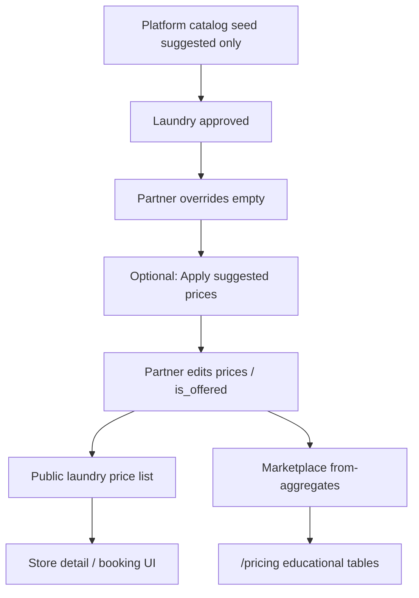
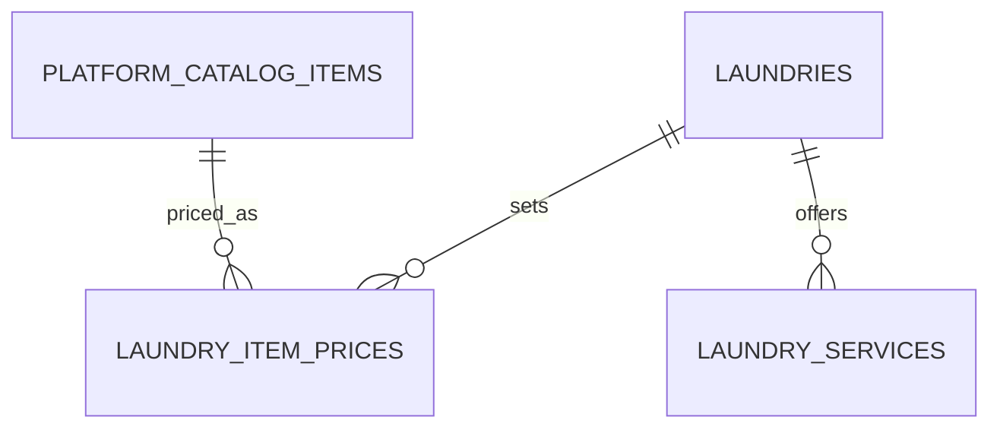

# Feature: Partner garment price list (marketplace catalog)

> Status: shipped (Slice D + Slice 5 discovery compare)  
> Owner: product-manager + backend-architect + frontend-architect  
> Last updated: 2026-07-20  
> Related: [marketing-pricing.md](marketing-pricing.md), [pricing-model.md](../business/pricing-model.md), [customer-discovery.md](customer-discovery.md)
## Problem

Customers need transparent, comparable garment prices across laundries, but every partner runs different rates. Today partners invent free-form `laundry_services` rows, marketing `/pricing` shows coarse indicative bands, and there is no shared item vocabulary (Shirt vs “Formal shirt wash”). Shoppers cannot scan FebriWash-style category tables, and partners cannot set competitive prices against a common catalog.

## Persona

| Persona | Context |
| ------- | ------- |
| **Partner** | Approved laundry owner who wants to publish competitive Men / Women / Kids / Winter / Household rates without inventing item names. |
| **Customer** | Comparing nearby stores; wants “from ₹X” education on marketing, exact partner rates on store detail / booking. |
| **Admin** (light) | Owns the platform master catalog (names, categories, suggested defaults); not day-to-day price setting. |

## Why now

- Marketing `/pricing` shipped as educational copy; next step is real category tables + marketplace “from” aggregates.
- Discovery/detail already expose per-laundry services, but without a shared SKU list customers cannot compare like-for-like.
- The WashHouse item list is the agreed **platform default catalog** (suggested INR defaults only — never city-wide fixed prices).

## User stories

- As a **partner**, I want to **set my own dry-clean / press prices (or per-kg rates) on a shared catalog**, so that **I stay competitive without renaming every garment**.
- As a **partner**, I want to **disable items I do not offer**, so that **customers only see what I actually take**.
- As a **customer**, I want to **see category tables with “from ₹X” on `/pricing`**, so that **I understand the market range without mistaking it for one fixed price**.
- As a **customer**, I want to **see this laundry’s full price list on store detail**, so that **I know exactly what I will pay before calling/booking**.
- As an **admin**, I want to **seed and maintain the master catalog**, so that **all partners share the same item vocabulary**.

## Goals

- [x] Platform owns master catalog (names, categories, units, optional suggested prices). *(Slice A)*
- [x] Each laundry owns its own prices; partners can enable/disable items. *(Slice B API + `/partner/pricing` editor)*
- [x] Public `/pricing` shows FebriWash-style tables with “from ₹X” + CTA to `/stores`; never implies one fixed city-wide price.
- [x] Laundry detail (and booking when online) shows **that partner’s list only**. *(Slice C)*
- [x] Money: INR; DB `NUMERIC(12,2)`; API edge integer paise per [pricing-model.md](../business/pricing-model.md). *(DB shape Slice A; partner API Slice B)*
- [x] Seed The WashHouse list as suggested defaults (see appendix). *(Slice A)*

## Non-goals

- Out of scope: GST calculation changes, surge pricing, AI price recommendation.
- Out of scope: Partner inventing brand-new catalog SKUs (admin-only catalog mutations in v1).
- Out of scope: Multi-currency.
- Deferred: Curtain (per panel) prices — columns nullable until product confirms rates.
- Deferred: Rewiring walk-in / order `order_items` to catalog SKUs (Slice D+; v1 list is display + partner editor; booking still uses existing `laundry_services` until wired).

## Decision defaults (no blocker)

| Topic | Default | Rationale |
| ----- | ------- | --------- |
| Schema shape | **New** `platform_catalog_items` + `laundry_item_prices`; do **not** overload `laundry_services` | `LaundryService` is coarse process/offering rows (walk-in, booking). Garment SKUs need dual dry-clean/press columns + shared identity. |
| Relationship to `laundry_services` | Keep both; document bridge later | Avoid breaking Phase 2–3 booking. Slice E can add `catalog_item_id` on services or map kg services → catalog rows. |
| Schema table `laundry_pricing` | Treat as superseded by `laundry_item_prices` | Planned name in `schema.md` never shipped as a separate model; prices live on catalog override rows. |
| Partner bootstrap | **Empty overrides** on laundry create/approve. Slice B: explicit **“Apply suggested prices”** (copies suggested → `laundry_item_prices`). | Do **not** silently lock partners to WashHouse rates; suggested defaults stay platform-only until opted in. |
| Missing partner row | Item not shown on public laundry list | No implicit “use suggested as live price”. |
| Marketplace “from ₹X” | `MIN(partner price)` among **approved + active** laundries with `is_offered` and non-null price for that column; if none, fall back to **suggested** default | Matches “min across active laundries OR suggested defaults”. |
| Dual prices `69/15` | `dry_clean_inr` + `press_inr` (nullable) | Matches WashHouse / FebriWash tables. `-` → `null`. |
| Single-rate rows | `price_inr` only (`dry_clean`/`press` null) | `laundry_by_kg` + household items without a press split. CHECK enforces XOR with dual columns. |
| By-kg rates | Category `laundry_by_kg`; Wash & Fold / Wash & Iron; `unit=kg`; rate in `price_inr` | Clearer than overloading dry-clean semantics. |
| Categories | `laundry_by_kg` \| `men` \| `women` \| `kids` \| `winter` \| `household` | Replaces earlier `global` label. |
| Curtain | Catalog rows allowed; suggested prices `null` until confirmed | Per product note. |
| API money | Responses expose `*_paise` (int) **and** `*_inr` (string decimal) for FE convenience in v1; DB always NUMERIC | Align with pricing-model; FE already uses INR strings in places. |
| Catalog writes | Admin-only create/update/deactivate items; partners only CRUD **prices + `is_offered`** | Platform owns vocabulary. |

## UX flow

### Partner — price editor

1. Partner opens Partner → Pricing.
2. System loads catalog grouped by category (By kg / Men / Women / Kids / Winter / Household).
3. Each row: item name, unit, price inputs (dry-clean/press or single rate), offered toggle. Optional **Apply suggested prices**.
4. Partner edits prices / disables items → Save (bulk patch preferred).
5. Confirmation toast; public store list updates.

### Customer — marketing `/pricing`

1. Visitor opens `/pricing`.
2. Sees how-pricing-works + **category tables** with “from ₹X” (and press column when relevant).
3. Copy states rates vary by laundry; CTA → `/stores`.

### Customer — store detail

1. Opens laundry detail.
2. Sees **this partner’s** enabled items only, FebriWash-style tables.
3. Disabled / missing items omitted.



## API surface

Auth roles: `partner` (own laundry), `admin` (catalog), public (read aggregates + laundry list).

| Method | Path | Purpose | Auth |
| ------ | ---- | ------- | ---- |
| GET | `/api/v1/catalog/items` | Platform catalog (optional `?category=`) | public |
| GET | `/api/v1/catalog/marketplace-from` | Per-item min “from” aggregates (+ suggested fallback) | public |
| GET | `/api/v1/laundries/{id}/price-list` | Enabled items + this laundry’s prices | public |
| GET | `/api/v1/partner/price-list` | Full catalog + partner overrides (incl. disabled) | partner |
| PUT | `/api/v1/partner/price-list` | Bulk upsert prices + `is_offered` | partner |
| PATCH | `/api/v1/partner/price-list/{catalog_item_id}` | Single-item update | partner |
| POST | `/api/v1/admin/catalog/items` | Create catalog item | admin |
| PATCH | `/api/v1/admin/catalog/items/{id}` | Update / soft-deactivate | admin |
| POST | `/api/v1/admin/catalog/seed-washhouse` | Idempotent seed The WashHouse defaults | admin |

### Contract sketches

**Catalog item (response)**

```json
{
  "id": "uuid",
  "slug": "men-shirt-tshirt",
  "name": "Shirt / T-shirt",
  "category": "men",
  "unit": "piece",
  "sort_order": 10,
  "suggested_dry_clean_inr": "69.00",
  "suggested_press_inr": "15.00",
  "suggested_dry_clean_paise": 6900,
  "suggested_press_paise": 1500,
  "is_active": true
}
```

**Partner price row**

```json
{
  "catalog_item_id": "uuid",
  "dry_clean_inr": "75.00",
  "press_inr": "20.00",
  "dry_clean_paise": 7500,
  "press_paise": 2000,
  "is_offered": true
}
```

**Marketplace “from” row**

```json
{
  "catalog_item_id": "uuid",
  "from_dry_clean_inr": "69.00",
  "from_press_inr": "15.00",
  "source": "aggregate | suggested"
}
```

Validation: prices `>= 0`; at least one applicable money column required when `is_offered=true`. Currency always `INR`.

Schemas: `backend/app/schemas/catalog.py`, `partner_price_list.py` (to add).

## Data model

### New tables

**`platform_catalog_items`**

| Column | Type | Notes |
| ------ | ---- | ----- |
| `id` | UUID PK | |
| `slug` | VARCHAR(120) UNIQUE | Stable seed key |
| `name` | VARCHAR(120) | Display name |
| `category` | enum `catalog_category` | `laundry_by_kg` \| `men` \| `women` \| `kids` \| `winter` \| `household` |
| `unit` | enum `catalog_unit` | `piece` \| `kg` \| `panel` \| `set` \| `pair` |
| `suggested_dry_clean_inr` | NUMERIC(12,2) NULL | Dual-process suggested dry clean |
| `suggested_press_inr` | NUMERIC(12,2) NULL | Dual-process press; null when N/A |
| `suggested_price_inr` | NUMERIC(12,2) NULL | Single-rate suggested (by-kg / household no-press) |
| `currency` | VARCHAR(3) | default `INR` |
| `sort_order` | INT | |
| `is_active` | BOOL | Platform hide |
| `created_at` / `updated_at` / `deleted_at` | timestamptz | Soft delete |

**`laundry_item_prices`**

| Column | Type | Notes |
| ------ | ---- | ----- |
| `id` | UUID PK | |
| `laundry_id` | UUID FK → laundries ON DELETE CASCADE | |
| `catalog_item_id` | UUID FK → platform_catalog_items | |
| `dry_clean_inr` | NUMERIC(12,2) NULL | Dual-process partner override |
| `press_inr` | NUMERIC(12,2) NULL | Nullable when N/A |
| `price_inr` | NUMERIC(12,2) NULL | Single-rate partner override |
| `currency` | VARCHAR(3) | default `INR` |
| `is_offered` | BOOL | default true |
| `sort_order` | INT NULL | Optional partner sort |
| `created_at` / `updated_at` / `deleted_at` | | |

Unique: `(laundry_id, catalog_item_id)` WHERE `deleted_at IS NULL`.  
Indexes: `ix_laundry_item_prices_laundry_id`, `ix_platform_catalog_items_category_sort`.  
Price shape: dual XOR single (documented in `docs/database/schema.md`).

### Existing

- `laundry_services` — unchanged in Slice A–C; still used for booking/walk-in.
- Planned `laundry_pricing` in schema.md → document as replaced by `laundry_item_prices`.



Migration: `20260717_0034_platform_catalog_and_laundry_item_prices` (Alembic; reversible).

## Frontend surface

| Surface | Route / folder | Notes |
| ------- | -------------- | ----- |
| Partner price editor | `/partner/pricing` | `frontend/features/partner-price-list/` — category tabs, table/stacked rows, bulk save, apply suggested |
| Store price list | Laundry detail **Prices** tab + storefront section | FebriWash-style tables; partner prices only; empty state + `laundry_services` fallback |
| Marketing upgrade | `/pricing` | Replace coarse `SERVICE_CATEGORIES` bands with catalog “from” tables + keep how-it-works + CTA `/stores` |
| Discovery compare (Slice 5) | `/discover` cards | `wash_fold_from_*` + `shirt_dry_clean_from_*` on list/search; marketing `/stores` is name+city only |
| Types / API | `features/partner-price-list/api/`, `features/laundries/` | TanStack Query |

UI rules: one job per section; tables not hero cards; copy must say **prices vary by laundry**; never present aggregate as the user’s checkout price.

## Imagery

`/pricing` rack photos and category heroes use the same WashHouse catalog collage tiles as the homepage.

| Piece | Path |
| ----- | ---- |
| Assets | `frontend/public/catalog/` |
| Registry | `frontend/features/marketing/catalog/washhouse-catalog-photos.ts` |
| Pricing resolver | `frontend/features/marketing/pricing/pricing-product-images.ts` → `resolvePricingProductImage(slug, name, category)` |

Resolver maps catalog `slug` + `name` via `resolve-catalog-photo-key.ts`; unknown garments fall back to the category hero (`pricing-category-images.ts`).

**New catalog SKU (backend seed):** (1) add row in `seed_washhouse_catalog.py` with a stable `slug`; (2) crop WebP → `public/catalog/<category>/`, entry in `manifest.json`, run `frontend/scripts/extract-catalog-photos.py`; (3) if a new garment family, add a `CatalogPhotoKey`, slug rule in `resolve-catalog-photo-key.ts`, and path + alt in `washhouse-catalog-photos.ts`; (4) size/weight variants can share an existing key (e.g. both saree weights → `saree`). Details: `frontend/public/catalog/README.md`.

## Background work

- Celery: none required for v1 (aggregates computed on read; cache later if needed).
- Optional: Redis cache key `catalog:marketplace-from` TTL 5–15 min after partner writes (Slice C+).

## Delivery slices (PR-sized)

| Slice | Deliverable | Exit criteria |
| ----- | ----------- | ------------- |
| **A — Schema + seed** | Models, migration `20260717_0034`, WashHouse seed script, unit/repo tests (uniqueness, nullable press, seed idempotency) | Tables + seed; **no UI/API yet** (API in B) |
| **B — Partner CRUD** | Partner GET/PUT/PATCH price-list, “Apply suggested prices”, partner editor UI | Partner can edit & toggle `is_offered`; persisted *(API + FE editor done 2026-07-17)* |
| **C — Public laundry list** | `GET .../price-list`, store-detail tables | Customer sees partner-specific tables *(done 2026-07-17)* |
| **D — Marketplace “from” + `/pricing`** | Aggregate endpoint; marketing tables upgrade | `/pricing` shows from-prices + CTA; no fixed-price claim *(done 2026-07-17)* |
| **5 — Discovery compare affordances** | List/search price hints; discover cards “from ₹”; filter/sort real prices; pricing CTA → `/stores` | Cards on `/discover` show Wash & Fold and/or shirt dry-clean when offered; marketing `/stores` is directory-only *(updated 2026-07-17)* |
| **E — Booking bridge (optional follow-up)** | Map `laundry_by_kg` items and/or garment lines into order flow | Only after product confirms booking UX |

## Acceptance criteria

- [x] Given an approved laundry, When created/approved, Then it has **zero** `laundry_item_prices` until the partner applies suggested or adds rows. *(Slice A)*
- [x] Given “Apply suggested prices” (Slice B), When run, Then every active catalog item gets a `laundry_item_prices` row from suggested INR values. *(API)*
- [x] Given a partner disables an item, When a customer opens that laundry’s price list, Then the item is absent. *(Slice C)*
- [x] Given two laundries price Shirt dry-clean at ₹69 and ₹89, When marketplace-from is requested, Then Shirt shows from ₹69 (aggregate).
- [x] Given no partner has priced an item, When marketplace-from is requested, Then suggested default is used and `source=suggested`.
- [x] Given `/pricing`, When rendered, Then copy + CTA make clear rates are not city-wide fixed prices.
- [x] Given store detail, When price list loads, Then only that laundry’s enabled prices appear. *(Slice C)*
- [x] Given discover cards, When a laundry offers Wash & Fold and/or Shirt dry-clean, Then the card shows “from ₹X” for those items only (no suggested invent). *(Slice 5)*
- [x] Given price filter/sort on `/discover`, When applied, Then it uses `start_price_inr` from owner compare hints (unpriced last on lowest-price sort). *(Slice 5)*
- [x] Given marketing `/stores`, When listed, Then each row shows name + city only (no compare prices, rating filters, or “compare stores” copy). *(2026-07-17)*
- [x] Money stored as `NUMERIC(12,2)` INR; API documents paise + INR string fields. *(partner API)*
- [x] Curtain items may exist with null suggested prices and are hidden from “from” until priced (or shown as “Ask store”).
- [x] Tests: seed idempotency; partner authz (cannot edit another laundry); public list omits disabled *(Slice C)*; marketplace-from MIN + suggested fallback *(Slice D)*
- [x] Docs: this spec, `docs/database/schema.md` table list, `logs/feature-progress.md`.
- [x] Out of scope verified: no GST engine changes, no surge, no AI recommendations.

## Test plan

| Layer | Cases |
| ----- | ----- |
| Unit | Price validation; min-aggregate with nulls; seed slug idempotency |
| API | Partner CRUD 401/403; bulk PUT; public price-list omits disabled; marketplace-from fallback |
| Integration | Apply suggested → override count matches active catalog; approve alone leaves overrides empty |
| E2E | Partner edits price → appears on store detail; `/pricing` shows “from ₹” + link to `/stores` |
| Regression | Existing walk-in / `laundry_services` booking paths unchanged |

## Metrics & analytics

- Activation: `partner.price_list.saved`
- Engagement: `pricing.from_table.view`, `laundry.price_list.view`
- KPI: % approved laundries with ≥1 customized (non-suggested) price within 7 days of approval

## Risks & mitigations

| Risk | Likelihood | Impact | Mitigation |
| ---- | ---------- | ------ | ---------- |
| Dual systems (`laundry_services` vs catalog) confuse partners | M | M | Partner UI copy: “Garment price list” vs “Service offerings”; Slice E bridge |
| Seed on approve surprises partners with full list | M | L | All enabled but editable; bulk disable by category |
| Aggregate stale or expensive | L | M | Simple SQL MIN first; cache in Slice D if needed |
| Marketing implies fixed price | M | H | Explicit “from” + CTA + disclaimer (existing services FAQ pattern) |

## Open questions

- Curtain per-panel rates — **deferred** (nullable); confirm with product before seeding numbers.
- Exact partner nav label (“Pricing” vs “Price list”) — follow existing partner dashboard IA.
- Whether purse S/M/L are three catalog rows or one row with size variants — **default: three rows** (`women-purse-s|m|l`) for simpler MIN aggregates.

---

## Appendix A — WashHouse seed (suggested defaults, INR)

Format: `Name — dry_clean / press` (`-` = null). Currency INR. Categories as below.

### Laundry by kg (`category=laundry_by_kg`, `unit=kg`, `price_inr`)

| Item | Rate |
| ---- | ---- |
| Wash & Fold | 79 |
| Wash & Iron | 109 |

### Men (`unit=piece` unless noted)

| Item | Dry clean | Press |
| ---- | --------- | ----- |
| Shirt / T-shirt | 69 | 15 |
| Trouser / Jeans | 79 | 15 |
| Lower | 69 | 15 |
| Jogger / Cargo | 79 | 15 |
| Shorts | 59 | 15 |
| Dhoti / Lungi | 79 | 25 |
| Kurta | 79 | 25 |
| Cap (fabric) | 39 | — |
| Cap (leather) | 89 | — |
| Turban | 99 | 39 |
| Sherwani (cotton) | 219 | 59 |
| Sherwani (wedding) | 499 | 99 |
| Coat (formal) | 149 | 39 |
| Coat (heavy) | 199 | 49 |
| Suit 2 pcs | 249 | 59 |
| Suit 3 pcs | 299 | 69 |
| Vest | 39 | 15 |
| Waistcoat | 99 | 35 |
| Wallet | 49 | — |
| Tie | 39 | 10 |
| Hanky | 10 | — |

### Women

| Item | Dry clean | Press |
| ---- | --------- | ----- |
| Saree (normal) | 139 | 49 |
| Saree (heavy) | 299 | 99 |
| Lehenga (normal) | 399 | 49 |
| Lehenga (heavy) | 449 | 99 |
| Blouse / Choli (normal) | 49 | 15 |
| Blouse / Choli (heavy) | 69 | 25 |
| Gown / Anarkali | 399 | 119 |
| Skirt (short) | 69 | 15 |
| Skirt (long) | 129 | 39 |
| Full Dress (normal) | 89 | 20 |
| Full Dress (party) | 249 | 69 |
| Top / Kurti | 69 | 15 |
| Dupatta | 59 | 15 |
| Frock (normal) | 129 | 39 |
| Frock (heavy) | 199 | 49 |
| Petticoat | 39 | 15 |
| Kameez (normal) | 79 | 20 |
| Kameez (fancy) | 139 | 39 |
| Burkha | 99 | 29 |
| Patiala / Salwar | 79 | 20 |
| Kurta | 79 | 20 |
| Bathrobe | 99 | 39 |
| Purse S | 99 | — |
| Purse M | 149 | — |
| Purse L | 299 | — |

### Kids

| Item | Dry clean | Press |
| ---- | --------- | ----- |
| Shirt / T-shirt | 59 | 15 |
| Trouser / Jeans | 69 | 15 |
| Lower | 59 | 15 |
| Jogger / Cargo | 69 | 15 |
| Shorts | 49 | 15 |
| Dhoti / Lungi | 59 | 20 |
| Kurta | 59 | 20 |
| Sherwani (cotton) | 179 | 49 |
| Sherwani (wedding) | 399 | 79 |
| Coat (formal) | 119 | 29 |
| Coat (heavy) | 149 | 39 |
| Suit 2 pcs | 179 | 49 |
| Suit 3 pcs | 219 | 59 |
| Waistcoat | 69 | 25 |
| Skirt | 59 | 15 |
| Girl Dress | 79 | 20 |
| Dupatta | 49 | 15 |
| Frock | 99 | 25 |
| Full jacket (normal) | 129 | 39 |
| Full jacket (leather) | 299 | 59 |
| Half jacket (normal) | 109 | 29 |
| Half jacket (leather) | 249 | 59 |

### Winter

| Item | Dry clean | Press |
| ---- | --------- | ----- |
| Sweater (kids) | 99 | 19 |
| Sweater (men/women) | 149 | 29 |
| Overcoat (kids) | 149 | 29 |
| Overcoat (men/women) | 199 | 49 |
| Overcoat (leather) | 499 | 99 |
| Jacket (cotton/denim) | 149 | 49 |
| Jacket (puffer) | 199 | 59 |
| Jacket (leather) | 299 | 89 |
| Half Jacket (cotton/denim) | 119 | 29 |
| Half Jacket (puffer) | 149 | 39 |
| Half Jacket (leather) | 249 | 79 |
| Shawl | 89 | 25 |
| Winter Cap | 49 | — |
| Hoodie | 169 | 49 |

### Household

| Item | Dry clean | Press | Notes |
| ---- | --------- | ----- | ----- |
| Blanket 4×6 | 169 | — | |
| Blanket double | 299 | — | |
| Blanket king | 349 | — | |
| Toy S / M / L | 99 / 149 / 299 | — | three rows |
| Bedsheet single | 99 | 29 | |
| Bedsheet double | 149 | 39 | |
| Pillow / Cushion Cover | 29 | — | |
| Shoes (sports) | 249 | — | |
| Shoes (leather) | 349 | — | |
| Heels | 299 | — | |
| Bag small / large | 149 / 299 | — | two rows |
| Trolley S / M / L | 199 / 299 / 399 | — | three rows |
| Carpet S / M / L | 79 / 149 / 219 | — | three rows |
| Bath Towel | 59 | — | |
| Comforter single / double | 249 / 349 | — | two rows |
| Gloves cotton / leather | 39 / 89 | — | two rows |
| Curtain (per panel) | null | null | deferred |

---

## Appendix B — Files to touch (implementation, not this PR)

- `backend/app/models/catalog.py` (or extend laundry domain)
- `backend/app/services/catalog_service.py`, `partner_price_list_service.py`
- `backend/app/api/v1/endpoints/catalog.py`, partner/admin routes
- `backend/scripts/seed_washhouse_catalog.py`
- `frontend/features/partner-price-list/`
- `frontend/features/marketing/pricing/` (upgrade tables)
- `docs/database/schema.md`
