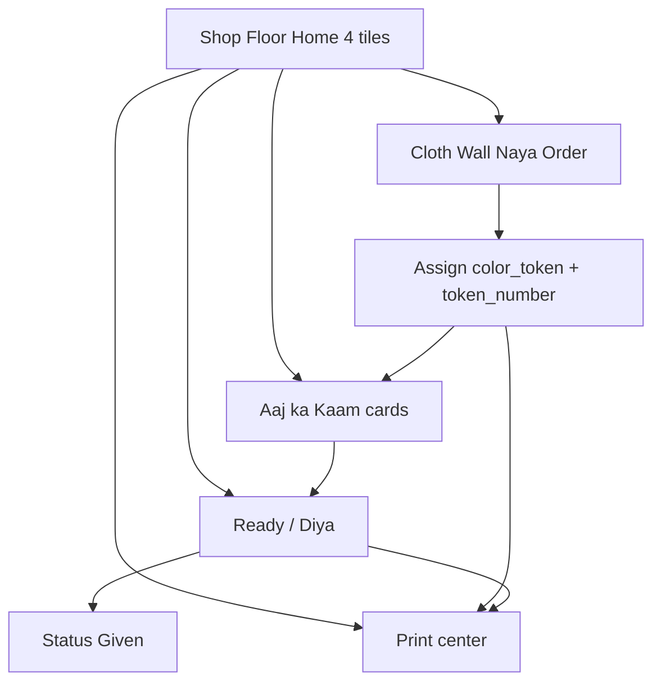
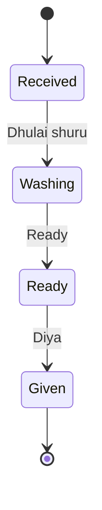

# Feature: Partner Shop Floor Mode

> Status: **in progress** (P1 Cloth Wall + tokens/tags; P2 bill/GST invoice; **Today + Ready Diya boards**; **literacy polish**)  
> Owner: product-manager + frontend-architect + ui-ux-designer  
> Last updated: 2026-08-08  
> Related: [partner-dashboard.md](partner-dashboard.md), [partner-price-list.md](partner-price-list.md), [partner-inventory.md](partner-inventory.md), [partner-qr-tracking.md](partner-qr-tracking.md), [orders-hub.md](orders-hub.md), [order-placement.md](order-placement.md), [offline-booking-whatsapp.md](offline-booking-whatsapp.md)  
> Product: India laundry counter ops; literacy-tolerant UX

## Problem

India laundry **counter staff** (often non-tech, low literacy, Hindi/Hinglish primary) must intake garments, track bags on a busy floor, mark work ready, and hand orders back — while the current Partner shell is an **Advanced Mode** dashboard: dense sidebar (Overview, Operations center, New Order, Orders Hub, Walk-in, Pickups, Deliveries, Pricing, Reports…), text-heavy tables, and English ops jargon.

Owners need analytics and settings; **floor staff need four big picture buttons** and a color+number bag system they already understand from local shops — not KPI charts.

## Personas

| Persona | Context | Primary jobs |
| ------- | ------- | ------------ |
| **Counter staff** | Tablet/phone at counter; may not read English fluently; works walk-ins all day | New order (tap clothes), see today’s bags, mark ready, hand over + print tags/bill |
| **Laundry owner** | Same shop; wants control + money view | Toggle Shop Floor vs Advanced; pricing, staff, settlements, reports, storefront |

**Default for partner staff role (when roles land):** open **Shop Floor Mode**.  
**Default for owner login:** remember last mode; first visit can prompt “Shop Floor / Advanced”.

## Why now

Partner Ops Phase 1 (A+B+C) shipped Overview + New Order + detail stepper. Invoice/tags were explicitly **Phase 2** in [partner-dashboard.md](partner-dashboard.md). Floor mix-ups and slow intake are the next partner activation risk after CRM (Desk / Orders Hub).

## Goals

- [x] Picture-first Shop Floor home with **exactly 4** primary actions *(P0 FE)*
- [x] Cloth Wall new-order flow using existing catalog photos + `CatalogGarmentThumb` *(P1 FE — success panel; tokens deferred)*
- [x] Color token + token number (`R-42`) on bag + per-item tags *(P1 — assign on walk-in create; print HTML)*
- [x] Today’s work cards with 4 simplified statuses *(FE — map + advance via existing accept/status APIs)*
- [x] Ready handoff list + Print center (thermal tag/bill + A4 GST invoice) *(Diya confirm + Call shipped; print jobs shipped)*
- [x] Advanced Mode keeps current nav unchanged *(P0 FE)*
- [x] Spec → phased P0–P4 delivery with non-tech usability tests *(checklist + Playwright journey — [partner-shop-floor-usability.md](../qa/partner-shop-floor-usability.md))*

## Non-goals

- Replacing Advanced Mode (Overview, Orders Hub, Pricing, Revenue, etc.)
- Inventing new garment photo assets before exhausting `frontend/public/catalog/`
- Full POS cash drawer / barcode hardware drivers in P0–P1
- Changing customer-facing tracking labels (customer still sees full DLM statuses)
- Admin Shop Floor (partner-only)
- Offline-first PWA sync (defer; online + optimistic UI only in early phases)

## Decision defaults

| Topic | Default | Rationale |
| ----- | ------- | --------- |
| Mode switch | Per-device preference in `localStorage` (`dlm.partner_ui_mode`) + Settings / More toggle; optional `users.partner_ui_mode` later | Staff tablets stay on Shop Floor; owner laptop can stay Advanced |
| Entry route | Shop Floor **home** = `/partner` (4 tiles when `partner_ui_mode=shop_floor`); floor boards under `/partner/floor/*`; Advanced Overview also `/partner` when mode=`advanced` | One home URL; mode picks chrome + content |
| Garment source | Platform catalog + partner `is_offered` prices; fallback to active `laundry_services` if no catalog price | Reuse price-list work; don’t invent SKUs |
| Photos | `frontend/public/catalog/**` via `washhouse-catalog-photos` + `CatalogGarmentThumb` | No new art first; extend thumb sizes (`xl` / shop) when implementing |
| Status UX | 4 labels only; map to existing `OrderStatus` | Avoid new enum until proven |
| Token display | `{COLOR_LETTER}-{token_number}` e.g. `R-42` | Spoken + printed; matches Indian shop practice |
| Print | Browser print / HTML routes first; native Bluetooth thermal later | Ship value without hardware SDK lock-in |
| GST invoice | Reuse `invoice_number`, `cgst_inr`, `sgst_inr`, `gst_rate` on `orders` | Already on create path |

---

## UX principles

1. **Picture-first.** Clothes, bags, and status colors over paragraphs. Icons + photos beat long labels.
2. **Max 4 home actions.** Home grid is exactly four tiles — no fifth “more” strip on the first viewport.
3. **64px+ targets.** Every primary tap target ≥ 64×64 CSS px (WCAG + gloved/wet hands). Prefer 72–88 px on counter tablets.
4. **Hinglish labels.** Primary label Hinglish; optional small English subtitle. Examples: *Naya Order*, *Aaj ka Kaam*, *Ready / Diya*, *Print*.
5. **Color tokens.** High-contrast named palette; token chip always visible on cards and tags.
6. **One job per screen.** No nested sidebars on Shop Floor.
7. **Confirm big actions.** “Given / Diya” and cancel need a clear confirm (name + token + amount).
8. **Motion light.** Status advance: brief color flash + check; respect `prefers-reduced-motion`.
9. **Literacy affordances.** Prefer photos + color + number; avoid dense tables; search is phone digits + token (`R-42`), not free-text English.
10. **Calm success.** Soft check + Hinglish “Order save हो गई” — no confetti / loud motion.
11. **Color ≠ only cue.** Token swatches and tag color bars use stripe/dot/hatch patterns plus letter+number.
12. **Optional voice.** Web Speech one-liners opt-in via More/Settings; never speak when reduced-motion or Sound OFF.

### Color & status tokens (UI)

| Role | Token / meaning | Notes |
| ---- | --------------- | ----- |
| Received | `--floor-received` (info blue family) | New bag on shelf |
| Washing | `--floor-washing` (warning amber) | In process (wash + iron collapsed) |
| Ready | `--floor-ready` (success green) | Customer can take |
| Given | `--floor-given` (neutral muted) | Closed / handed over |
| Danger | existing `--danger` | Missing / damage flag |

Shop Floor may use a slightly larger type scale than Advanced (`text-lg`+ for primary labels) while still using design tokens from `tokens.css` (extend, don’t hardcode hex in components).

---

## Screens

### 1. Home — 4 tiles (`/partner` when Shop Floor mode)

| Tile (Hinglish) | English | Goes to |
| --------------- | ------- | ------- |
| **Naya Order** | New order | `/partner/floor/new` (Cloth Wall); also `/partner/new-order` |
| **Aaj ka Kaam** | Today’s work | `/partner/floor/today` |
| **Ready / Diya** | Ready handoff | `/partner/floor/ready` |
| **Print** | Print center | `/partner/floor/print` |

Shop Floor chrome: bottom nav (mobile) / side nav (lg+) = those **4 destinations + More** (`/partner/floor/more` → settings, pricing, revenue, Advanced Mode). No KPI charts on home.

Footer on home: mode toggle (Shop Floor / Advanced). Owner tools live under **More**.

### 2. Cloth Wall — new order (`/partner/floor/new` + `/partner/new-order`)

Picture grid of offered catalog garments (category chips: Men / Women / Kids / Winter / Household).

Flow:

1. **Step A** — Enter **phone** (required) + name (big inputs).
2. **Step B** — Tap garment photos to add qty (+ / − large steppers); sticky bar shows piece count + ₹ subtotal. Dual-priced tiles: Dry clean / Press toggles. **List mode** toggle keeps the Advanced text service picker.
3. **Step C** — Review lines → **Save order** via `POST /partner/walk-in-orders`.
4. **Success** — Panel with token chip + **Print Tags / Print Bill / Print GST Invoice** → print routes (`window.print`); Start wash + links to order detail / Today.

Garment source: partner `is_offered` price-list rows first; if none, fall back to active `laundry_services` with photo resolver. Catalog lines submit `catalog_item_id` + `process`; backend find-or-creates a bridged `laundry_services` row (description `catalog:{id}:{process}`) so `order_items.service_id` stays valid without full Slice E.

Deep-link: Advanced Overview **New Order** → `/partner/new-order` (same Cloth Wall). Assisted doorstep stays `?mode=assisted`.

### 3. Today’s work — cards (`/partner/floor/today`)

Card per open order (not a data table):

- Large **color swatch + `R-42`**
- Customer name / last-4 phone
- Photo stack of top items (thumbs) + piece count
- One primary CTA: advance simplified status (*Dhulai shuru* / *Ready* / accept for online confirmed)
- Filters: All / Received / Washing / Ready (Given hidden by default; “Aaj diya” toggle)

**Shipped:** `ShopFloorTodayView` + `floor-status` map; advances via `POST …/accept` + `PATCH …/status` (doorstep `washing→ironing→ready` chained in FE).

### 4. Ready handoff (`/partner/floor/ready`)

Queue of `Ready` only. Staff selects card → confirm **Diya / Given** (shows name + token + total) → walk-in → `delivered`; doorstep → `out_for_delivery` → optional print bill + **Call** (`tel:`).

**Shipped:** Ready cards with Give clothes + Print Bill + Call; Diya confirm dialog; empty state with catalog picture + Hinglish instruction.

### 5. Print center (`/partner/floor/print` or `?orderId=`)

Search by phone last-4 / tracking / token → open tags / bill / GST invoice. Tag print route: `/partner/floor/print/[orderId]/tags` (58mm CSS + `window.print()`). Bill: `/…/bill`. A4 GST: `/…/invoice`.

Three print jobs (same order):

| Job | Form factor | Content |
| --- | ----------- | ------- |
| **Bag master tag** | Thermal ~58/80 mm | Color block, `R-42`, phone last-4, item count, laundry name, date |
| **Per-item tags** | Thermal small | Same color/`R-42`, garment name/photo cue, qty index `2/5` |
| **Thermal bill** | Thermal | Items (thumb + name + qty + rate + amt), CGST, SGST, huge total, color token, `invoice_number` |
| **A4 GST invoice** | A4 HTML | Formal invoice; reuse GST fields + frozen totals |

Print implementation: FE print routes + API HTML `GET /api/v1/partner/orders/{id}/tags/print` and `…/invoice/print?variant=bill|gst`; JSON `GET …/tags` and `GET …/invoice`. Default **one tag per line**; `per_piece=true` / localStorage `dlm.partner_tag_per_piece` for per-unit. No Bluetooth SDK yet. **Reprint is idempotent** — never recalculates GST/totals; allocates `invoice_number` once if null.

---

## Color Token system

### Palette (v1 — fixed 10)

Distinct, spoken colors for Indian shop floors (Hinglish name + letter):

| Key | Letter | Name (EN / Hinglish cue) | Swatch intent |
| --- | ------ | ------------------------ | ------------- |
| `red` | R | Red / Lal | High contrast |
| `blue` | B | Blue / Neela | |
| `green` | G | Green / Hara | |
| `yellow` | Y | Yellow / Peela | Avoid tiny text on yellow |
| `orange` | O | Orange / Narangi | |
| `purple` | P | Purple / Baingani | |
| `pink` | K | Pink / Gulabi | Letter **K** (avoid clash with Purple P) |
| `teal` | T | Teal / Harrā-neela | |
| `brown` | W | Brown / Bhura | Letter **W** (brown) |
| `grey` | E | Grey / Slehri | Letter **E** (grey) — avoid G clash |

Letters are stable API enums; UI shows color chip + spoken name always, not letter alone. **Color-blind safety:** each palette key maps to a stripe/dot/hatch overlay on the swatch and print color bar (`ColorTokenBar`) so hue is never the only signal.

### Literacy polish (P3 FE — 2026-08-08)

| Affordance | Behavior |
| ---------- | -------- |
| Success | Soft check + **Order save हो गई**; focus moves to heading; `aria-live` |
| Voice prompts | Opt-in `dlm.partner_floor_voice_prompts`; success + tags/bill speak one line; gated by setting + `prefers-reduced-motion` + Sound OFF |
| Phone entry | Huge numeric keypad (≥64px keys) on Cloth Wall Step A |
| Coach mark | Sticky “Show my next step” for first **3** successful creates (`dlm.partner_floor_coach_orders`) |
| Perf | Catalog tiles beyond first 6 lazy-mount; images `loading="lazy"` except first row; **no charts** on Shop Floor home; TTI budget **≤2.5s** mid Android for 4-tile home |

### Assignment algorithm

On order create (Shop Floor or when token fields null on first print):

1. Consider **active** orders for this laundry where simplified status ∈ {Received, Washing, Ready} (not Given/cancelled).
2. Count usage per `color_token`.
3. Pick color with **lowest active count**; tie-break by fixed palette order.
4. Allocate `token_number` = laundry-scoped daily sequence (`1…N` reset local midnight shop TZ, default `Asia/Kolkata`) **or** monotonically increasing per laundry (prefer **daily reset** for short spoken codes).
5. Persist `color_token` + `token_number`; display `R-42`.
6. Tokens are **immutable** after create (reprint only). Owner override in Advanced is a later escape hatch.

Collision rule: unique `(laundry_id, color_token, token_number, token_day)` where `token_day` is the IST date of assignment.

### Tags

- **Bag master:** one tag per order — full color block + `R-42` + count.
- **Per-item:** one tag per unit (or per line with qty if thermal time-constrained — default **per unit** for mix-up prevention; P1 may allow “one tag per line”).

Relate to [partner-qr-tracking.md](partner-qr-tracking.md): QR may encode `tracking_code` **and** human token; Shop Floor does not require scan in P0–P1.

---

## Print details

### Data reused from `orders`

| Field | Use |
| ----- | --- |
| `invoice_number` | Bill + A4 header |
| `gst_rate` | Tax % display |
| `cgst_inr` / `sgst_inr` | Split GST lines (India) |
| `subtotal` / totals | Amounts |
| Laundry GSTIN / address | From laundry profile when present |

If `invoice_number` is null at print time, allocate once via `InvoiceService.ensure_invoice_number` (`WH-{year}-{tracking_code}`) before render — do not invent a parallel number series; never mutate money fields on reprint.

### Endpoints / routes

| Method | Path | Purpose |
| ------ | ---- | ------- |
| GET | `/partner/floor/print/[orderId]/tags` | HTML thermal tags (FE) |
| GET | `/partner/floor/print/[orderId]/bill` | HTML thermal counter bill (FE) |
| GET | `/partner/floor/print/[orderId]/invoice` | HTML A4 GST invoice (FE) |
| GET | `/api/v1/partner/orders/{id}/tags` | Tag JSON |
| GET | `/api/v1/partner/orders/{id}/tags/print` | Optional 58mm tags HTML |
| GET | `/api/v1/partner/orders/{id}/invoice` | Invoice JSON (token + lines + GST + invoice_number) |
| GET | `/api/v1/partner/orders/{id}/invoice/print?variant=bill\|gst` | Thermal bill or A4 GST HTML |

PDF generation is **optional P3+**; HTML print is P1–P2.

Print CSS: `globals.css` only hides partner chrome (`.no-print`, nav/aside). Each print view injects its own `@page` size (58mm vs A4) so tags/bill and GST invoice do not share one page size.

---

## Catalog photos & components

**Do not invent new assets first.**

| Piece | Path |
| ----- | ---- |
| Photos | `frontend/public/catalog/` (+ `README.md` pipeline) |
| Registry | `frontend/features/marketing/catalog/washhouse-catalog-photos.ts` |
| Resolver | existing `resolve-catalog-photo-key.ts` / pricing resolvers |
| Thumb | `CatalogGarmentThumb` in `frontend/features/laundry-price-list/components/catalog-garment-thumb.tsx` |

Implementation notes (when coding):

- Add a Shop Floor size (e.g. `xl` ~72–96 px) on `CatalogGarmentThumb` or a thin `ShopFloorGarmentTile` wrapper — still same `src`/`alt`.
- Unknown slug → category hero fallback (same as price list).
- Cloth Wall filters by partner `is_offered` rows; if partner never applied prices, show empty state CTA → Advanced **Garment prices** (owner) or limited `laundry_services` photo map.

---

## Simplified status mapping

Shop Floor shows **four** labels only. Underlying `OrderStatus` unchanged.

| Shop Floor | Walk-in / counter | Doorstep / assisted |
| ---------- | ----------------- | ------------------- |
| **Received** | `confirmed` | `confirmed`, `pickup_assigned`, `picked_up` |
| **Washing** | `washing` | `washing`, `ironing` |
| **Ready** | `ready` | `ready` |
| **Given** | `delivered` | `out_for_delivery`, `delivered` |

### Advance rules (Shop Floor CTAs)

| From | CTA | Walk-in writes | Doorstep writes |
| ---- | --- | -------------- | --------------- |
| Received | *Dhulai shuru* | → `washing` | → `washing` (from picked_up/confirmed as allowed by existing service rules) |
| Washing | *Ready* | → `ready` (skip forcing `ironing` in UI; may auto-pass ironing if required by backend) | → `ready` (service may transition washing→ironing→ready in one partner action or two; Shop Floor **one tap** should call an orchestration that lands on `ready`) |
| Ready | *Diya / Given* | → `delivered` | Prefer → `delivered` for counter handover; if logistics still need rider, → `out_for_delivery` then separate Advanced delivery flow |

**Cancelled** is not a floor column; hide or show under Advanced only.

Align with existing maps in `order_service.py`:

- `WALK_IN_NEXT_STATUS`: confirmed → washing → ready → delivered  
- `PARTNER_NEXT_STATUS`: … → washing → ironing → ready → out_for_delivery  

Shop Floor may add a partner helper `advance_shop_floor(order_id, floor_action)` that maps the 3 forward actions onto those graphs without exposing ironing/out_for_delivery to staff.

---

## API / schema needs

### Schema (`orders` columns — additive)

| Column | Type | Notes |
| ------ | ---- | ----- |
| `color_token` | enum `color_token` NULL | `red`, `blue`, … |
| `token_code` | VARCHAR(16) NULL | Display e.g. `R-42` |
| `token_day_number` | INT NULL | Laundry daily sequence (IST) |
| `token_assigned_on` | DATE NULL | IST calendar day for uniqueness |

Unique index: `(laundry_id, color_token, token_day_number, token_assigned_on)` WHERE token columns NOT NULL.

Migration: `20260808_0040_order_color_token.py`. Documented in `docs/database/schema.md`.

### API (shipped + proposed)

| Method | Path | Purpose | Auth |
| ------ | ---- | ------- | ---- |
| GET | `/api/v1/partner/orders/{id}/tags` | Token + bag/item tag lines JSON (`per_piece` query) | partner |
| GET | `/api/v1/partner/orders/{id}/tags/print` | Optional 58mm HTML print view | partner |
| GET | `/api/v1/partner/orders/{id}/invoice` | Invoice JSON; allocates `invoice_number` once if null | partner |
| GET | `/api/v1/partner/orders/{id}/invoice/print` | HTML `variant=bill` (thermal) or `gst` (A4) | partner |
| GET | `/api/v1/partner/floor/today` | Open orders + floor_status + token + thumb keys | partner |
| POST | `/api/v1/partner/floor/orders/{id}/advance` | Body: `action=start_wash\|mark_ready\|mark_given` | partner |
| PATCH | `/api/v1/partner/orders/{id}/token` | Owner reassign (Advanced only; P3+) | partner |

Reuse: `POST /api/v1/partner/walk-in-orders` assigns token on create; responses include `color_token` / `token_code` / `token_day_number`.

### Frontend surface (when built)

| Surface | Route | Feature folder |
| ------- | ----- | -------------- |
| Shop Floor home | `/partner` (mode=`shop_floor`) | `frontend/features/partner-shop-floor/` |
| Floor boards / More | `/partner/floor/today\|ready\|print\|more` | same |
| Mode switch | Settings + More + home footer; `dlm.partner_ui_mode` | `store/partner-ui-mode.store.ts` |

Routes stay thin; organisms live under the feature module.

### P0 FE shipped (2026-08-08)

- Preference `partner_ui_mode`: `'shop_floor' \| 'advanced'` (Zustand + localStorage; default `shop_floor`)
- `/partner` → 4 giant Hinglish tiles (no charts) vs `PartnerOverviewView`
- Shop Floor nav: 4 destinations + More; Advanced keeps `PARTNER_NAV_SECTIONS`
- Stubs: today / ready / print empty states; New Order → existing `/partner/new-order`
- Jest: mode toggle + nav item counts (4 tiles / 5 nav / 18 Advanced)

### P1 Cloth Wall + tokens (2026-08-08)

- Routes: `/partner/floor/new` + `/partner/new-order` (Cloth Wall wizard); `?mode=assisted` keeps desk assisted
- Steps A→B→C→success; List mode toggle; catalog `is_offered` preferred, services fallback
- Walk-in API accepts `catalog_item_id` + `process`; assigns `color_token` / `token_code` / `token_day_number`
- Success → Print Tags opens `/partner/floor/print/[orderId]/tags`; Print center reprint by phone/tracking
- Jest qty + tile RTL; Playwright create → tags page shows `R-42` + Print CTA
- **Remaining:** dedicated `GET /partner/floor/today` DTO (optional); QR image (see [partner-qr-tracking.md](partner-qr-tracking.md)); token/phone search keypad on Ready

### P2 bill + GST invoice (2026-08-08)

- API: `GET /partner/orders/{id}/invoice` + `/invoice/print?variant=bill|gst`; `InvoiceService` allocates `WH-{year}-{tracking}` once
- FE: `/partner/floor/print/[orderId]/bill` + `/invoice`; Success / Order detail / Ready / Print center CTAs
- Lines: garment thumb + name + qty + rate + amount; huge total; color token; frozen GST display
- Tests: unit GST math/HTML; API idempotent reprint; Jest invoice-display; Playwright bill + A4 render

### Today + Ready boards (2026-08-08)

- FE: `/partner/floor/today` card list (filters + Aaj diya); `/partner/floor/ready` Give + Print Bill + Call + Diya confirm
- Map Received/Washing/Ready/Given → existing statuses; advance via accept + PATCH (walk-in 1:1; doorstep Ready chains ironing)
- Home tiles: needs-attention badges (`todayAttention` = Received+Washing; `readyAttention` = Ready)
- Empty states: catalog picture + one Hinglish instruction
- Jest: `floor-status.test.ts`; Playwright: advance walk-in through Dhulai → Ready → Diya

### Literacy polish (2026-08-08)

- Calm success panel (soft check + “Order save हो गई”); optional Web Speech (More/Settings)
- ColorTokenBar patterns on chips + tag print bars
- Phone numeric keypad; FloorCoachMark first 3 orders
- Lazy catalog tiles; home explicitly chart-free (TTI ≤2.5s)
- Jest: `floor-voice`, `floor-coach`, keypad, pattern maps
---

## What stays in Advanced Mode (current nav)

Shop Floor does **not** replace these. Current `PARTNER_NAV_SECTIONS` remains Advanced Mode:

| Section | Items (stay Advanced) |
| ------- | --------------------- |
| Dashboard | Overview (`/partner`) — KPI grid, charts, recent table |
| Operations | Operations center, New Order (form), Orders Hub (desk/requests/directory), Walk-in orders list, Pickup requests, Deliveries |
| Your shop | Storefront builder, Service catalog, Garment prices, Reviews |
| Management | Staff |
| Business | Pricing & revenue, Settlements, Reports |
| System | Notifications, Audit logs, Settings |

Cross-links:

- Advanced Overview **New Order** may deep-link Cloth Wall.
- Shop Floor footer → Advanced Overview.
- Pricing / GSTIN / staff management **only** in Advanced.

---

## Phased delivery

| Phase | Deliverable | Exit criteria |
| ----- | ----------- | ------------- |
| **P0 — Spec & shell** | Spec + FE mode preference; `/partner` 4-tile home; floor stubs; Shop Floor nav (4+More) | Mode toggle works; Advanced nav unchanged; no Cloth Wall/print yet |
| **P1 — Cloth Wall + tokens** | Cloth Wall create (FE+walk-in catalog bridge shipped 2026-08-08); DB token columns + **Today cards** | Staff can create order from photos; `R-42`; advance Received→Washing on Today |
| **P2 — Ready + Print HTML** | Ready list + **Diya confirm** + print CTAs; bag + item thermal HTML; thermal bill with CGST/SGST; A4 invoice HTML | Phase 2 print gap from partner-dashboard closed for floor path; handoff Given mapping |
| **P3 — Polish & hardware** | Bluetooth/thermal presets, token reassign, ironing one-tap orchestration hardened, empty/offline toasts | Usability test pass (below) |
| **P4 — Roles & defaults** | Staff role defaults to Floor; owner analytics nudge; optional server `partner_ui_mode` | Staff login lands on Floor |

**Dependency:** Partner dashboard Phase 1 shipped. Catalog photos + price list shipped. Walk-in create + GST fields shipped.

---

## Acceptance criteria

- [x] Given Shop Floor home, When rendered on 375px and tablet, Then exactly **4** primary tiles and no Advanced sidebar chrome. *(P0)*
- [x] Given Cloth Wall, When staff taps catalog photos, Then qty updates with ≥64px controls and Hinglish labels. *(P1 FE)*
- [x] Given create, When order saves, Then `color_token` + `token_day_number` persist and UI shows `R-42` form.
- [x] Given active orders, When tokens assign, Then algorithm prefers least-used color; uniqueness holds per laundry/day.
- [x] Given Today’s work, When staff advances, Then only Received→Washing→Ready→Given appear; backend statuses match mapping table.
- [x] Given Ready handoff, When **Diya** confirmed, Then order reaches Given mapping (`delivered` or agreed doorstep status).
- [x] Given Print center / tags / bill / invoice pages, When printed, Then token + frozen GST appear; reprint keeps same `invoice_number` and totals.
- [x] Given catalog SKU with photo, When shown on Cloth Wall, Then image comes from `public/catalog` via existing registry/`CatalogGarmentThumb` (or size extension) — no placeholder stock art. *(P1 FE)*
- [x] Given Advanced Mode, When owner opens `/partner`, Then current nav IA unchanged. *(P0)*
- [x] Given `prefers-reduced-motion`, When home tiles hover/press, Then motion is gated (`motion-safe` / global reduce). *(P0)*
- [x] Given success, When order saves, Then calm check + “Order save हो गई” (no loud celebration); optional voice only if setting ON and not reduced-motion/sound-off.
- [x] Given color token UI/print, When shown, Then stripe/dot/hatch pattern accompanies hue + `R-##`.
- [x] Given Cloth Wall phone step, When staff enters mobile, Then huge keypad is available (≥64px keys).
- [x] Given first 3 creates on a device, When wizard runs, Then sticky “Show my next step” coach appears; hides after 3.
- [x] Given Shop Floor home, When rendered, Then no charts; catalog wall lazy-loads off-screen tiles.
- [x] Tests: mode toggle + Shop Floor nav; Cloth Wall qty; token assign + uniqueness; Playwright tags/bill/invoice pages show token + GST + print CTA; **Playwright advance walk-in through simplified Today→Ready→Diya**; **usability journey** (3 shirts + saree → tags → bill → wash/ready → phone reprint) + Practice mode unit test.

## Non-tech usability test plan

**Canonical timed checklist:** [docs/qa/partner-shop-floor-usability.md](../qa/partner-shop-floor-usability.md) (Practice mode flag + staging seed steps + Playwright twin).

**Participants:** 3–5 counter staff (or proxies) who do **not** use the current Partner dashboard daily; Hindi/Hinglish OK; mix of literacy levels.

**Setup:** Tablet in shop-like lighting; sample catalog photos; thermal printer optional (paper HTML preview OK for P1). Enable **Practice mode** (`More` / Settings) for training banner; data from QA/staging seed (no offline fake orders).

| # | Task | Pass |
| - | ---- | ---- |
| 1 | Create walk-in **3 shirts + 1 saree** pictures only | **&lt; 90 s**; correct SKUs |
| 2 | Print tags; color token visible | **&lt; 30 s**; `R-##` readable |
| 3 | Print bill | **&lt; 20 s**; total + GST |
| 4 | Mark washing then ready without help | **&lt; 45 s**; Today board only |
| 5 | Find by phone + reprint tags | Print center search → same token |
| 6 | Hand over on **Ready / Diya** | Confirms Given; understands done |
| 7 | From home, find **Naya Order** | ≤ 10 s (warm-up) |
| 8 | Switch to Advanced and back (owner) | No panic; Floor still default on staff device |

**Fail criteria:** Needs another person to explain a screen; mis-handover of two same-color bags; cannot complete create in 90 s.

**Metrics (soft):** task success ≥ 4/5 participants; critical errors (wrong customer handover) = 0.

**Automation:** `frontend/tests/e2e/partner-shop-floor-journey.spec.ts` (mocked APIs; skip with `E2E_SKIP_AUTH=1`).

---

## Risks & mitigations

| Risk | Mitigation |
| ---- | ---------- |
| Dual UX maintenance | Shared order APIs; Floor is a thin presentation + token/print layer |
| Ironing hidden → ops confusion | One-tap Floor advance orchestrates backend; Advanced stepper still shows full path |
| Yellow/pink contrast | Large type + dark text; don’t rely on color alone (number + name) |
| Catalog empty for new partners | Empty state → Apply suggested prices / Garment prices |
| Thermal CSS variance | Fixed mm layouts + print CSS `@page`; device QA matrix in P3 |

## Open questions

- Staff role gating: wait for richer `partner-staff` permissions vs device pin?
- Daily token reset vs perpetual counter — **default daily IST** unless owners request perpetual.
- Per-unit vs per-line item tags under time pressure — default per-unit; setting later.
- Should doorstep **Given** always mean `delivered` at counter collection, skipping `out_for_delivery`?

## Files to touch (implementation)

### P0 FE (shipped)

- `frontend/features/partner-shop-floor/**`
- `frontend/components/layout/partner-shell.tsx` — mode-aware nav
- `frontend/app/(partner)/partner/page.tsx` — home gate
- `frontend/app/(partner)/partner/floor/{today,ready,print,more}/page.tsx`
- `frontend/styles/tokens.css` — `--floor-*` tokens
- Jest under `features/partner-shop-floor/`

### Later (P1+ remaining / P2+)

- `docs/database/schema.md` — token columns
- `backend/alembic/versions/<ts>_order_color_token.py`
- `backend/app/models/order.py`, `schemas/partner_floor.py`, `services/partner_floor_service.py`, `api/v1/endpoints/partner_floor.py`
- Print HTML routes under `/partner/floor/print/[orderId]/…`

### P1 Cloth Wall shipped

- `frontend/features/partner-shop-floor/views/cloth-wall-new-order-view.tsx`
- `frontend/app/(partner)/partner/floor/new/page.tsx`
- `backend/app/schemas/walk_in_order.py`, `services/walk_in_order_service.py`
- Playwright: `frontend/tests/e2e/partner-shop-floor.spec.ts`

---

## Appendix — Current Advanced surfaces (baseline)

| Surface | Route | Notes |
| ------- | ----- | ----- |
| Overview | `/partner` | KPI 2×4, chart, recent orders — [partner-dashboard.md](partner-dashboard.md) |
| New Order | `/partner/new-order` | Walk-in + assisted; service list form |
| Orders Hub | `/partner/orders` | Today / desk / requests / directory |
| Detail | `/partner/orders/[id]` | Full stepper |
| Pricing | `/partner/pricing` | Catalog editor |

Shop Floor Mode is **Phase 2+** relative to Partner Ops UX Phase 1 (A+B+C).
