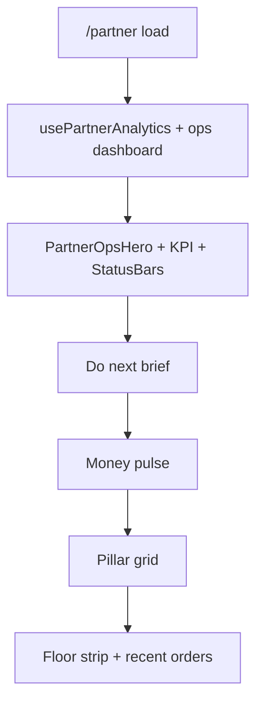

# Feature: Partner WashHouse Ops Visual System

> Status: **review** (Prompt 6 — QA ship 2026-08-09)  
> Owner: ui-ux-designer + product-manager → frontend-architect  
> Last updated: 2026-08-09  
> Visual reference (patterns only): `frontend/features/admin/views/admin-order-demo-view.tsx`  
> Related: [partner-owner-command-center.md](partner-owner-command-center.md), [partner-customers-orders-hub.md](partner-customers-orders-hub.md), [partner-customers-orders-hub-ui-polish.md](partner-customers-orders-hub-ui-polish.md), [orders-hub.md](orders-hub.md)  
> Prompt pack (implementation): `.cursor/prompts/partner-washhouse-ops-visual.md` *(create in Prompt 1)*

## Problem

WashHouse partners already have a capable Owner Command Center and Customers & Orders Hub, but the **visual language is split**: marketing-grade rounded “demo” surfaces live only on an Admin reference screen, while partner routes still mix compact SaaS cards (`rounded-xl`) with occasional ad-hoc radii. Owners and counter staff need **one coherent ops aesthetic**—hero bands, KPI strips, status bars, and create-order layout—that feels premium and picture-led **without** duplicating navigation or inventing metrics.

## Persona

| Persona | Context | Jobs |
| ------- | ------- | ---- |
| **Laundry owner** | Laptop / tablet; `/partner` home | Glance KPIs, status mix, money pulse, jump to pillars |
| **Counter staff** | Phone @ 375px; hub + new order | Find customer, create order, print—dense, touch-safe |
| **Owner-operator** | Same device all day | Same shell; no second sidebar nav |

## Why now

- Admin `admin-order-demo-view` encodes stakeholder-approved **WashHouse ops chrome** (radii, hero, KPI grid, status bars, two-column create).
- Customers & Orders **UI polish** (2026-08-08) locked density; this feature **layers visual hierarchy** without reopening IA or chip semantics.
- Owner Command Center P7 polish is next; ops-visual components should compose into `/partner` rather than fork a third dashboard.

## Goals

- [x] Extract typed **ops-visual** components under `frontend/features/partner/components/ops-visual/` (Prompt 1 — 2026-08-09)
- [x] Apply surface + hero + KPI + status language on **`/partner`** (compose with existing Owner home) (Prompt 2–6)
- [x] Align **`/partner/new-order`** and hub **desk/directory** first viewports with demo layout patterns (real data only)
- [x] Preserve Orders Hub tab IA: `orders` | `desk` | `requests` | `directory`
- [x] Document API gaps; no silent fake numbers
- [x] **`/partner` home** — order-demo main column layout + `PartnerOrderDemoLiveComposer` (live walk-in create; invoice/tag panels always visible; no dummy INV) (2026-08-09)

## Non-goals

- New API endpoints **unless** documented gap blocks a KPI (see [Optional follow-up tickets](#optional-follow-up-tickets))
- Admin route or `admin-order-demo-view` productionization changes
- Removing or renaming Orders Hub tabs / chips
- Shop Floor display mode revival or second shell
- 7-day revenue time-series without backend series
- Hardcoded customer names, invoice numbers, or demo sidebar nav

---

## Decision: Admin demo adoption checklist

Patterns extracted from `admin-order-demo-view.tsx`; **never copy dummy state** (`Rahul Sharma`, `INV-WH-*`, static sidebar counts).

| Admin demo pattern | Adopt? | Partner decision |
| ------------------ | ------ | ---------------- |
| Surface radius **32px outer / ~24px (3xl) inner** on hero shells | ✅ | **Ops shells only** on `xl+`: outer `rounded-[32px]` (or future `--radius-ops-outer` in `tokens.css`); inner tiles `rounded-3xl`. Default list/table surfaces stay **`rounded-xl`** per hub polish—do not re-radius entire app. |
| Hero band (copy + optional photo + inline badges) | ✅ | `PartnerOpsHero` on `/partner` (below greeting, above KPI strip) and slim variant on `/partner/new-order`. Photo from `frontend/public/marketing/heroes/*` or `partner-ops/*`; badges from real queue counts only. |
| **4-up KPI strip** | ✅ | `PartnerOpsKpiGrid` — see [KPI field map](#kpi-field-map). |
| Order status **progress bars** | ✅ | `PartnerOpsStatusBars` — map to lifecycle buckets (see [Status bar map](#status-bar-map)). |
| Weekly sales trend | ⚠️ **Defer** | No `GET …/analytics/daily` series. Ship `PartnerOpsTrendStrip` **empty state** + link to `/partner/revenue`; optional **2-bar** compare: `revenue_week_inr` vs `revenue_prev_week_inr` (not Mon–Sun bars). |
| Service catalog **icon cards** + Add dialog | ✅ **partial** | Reuse `listPartnerServices` + existing line-item logic on new-order; add `PartnerServiceTile` + dialog **only** where it replaces inline list—not duplicate `/partner/services` admin. |
| Two-column **create order** (main + sticky summary) | ✅ | Refactor `partner-new-order-view.tsx` layout; sticky summary `md:sticky md:top-4` on `xl+`; mobile bottom CTA unchanged. |
| Customer search + **profile / value sub-cards** | ✅ | `PartnerCustomerSnapshotCards` on desk tab + assisted new-order; data from desk lookup + customer-insights row fields. |
| Invoice / tag **preview cards** | ✅ | Post-create only: `OrderCreateSuccessPanel` / `WalkInSuccessPanel` + `PrintOrderActions`; **link buttons** to existing print routes—**no** fake INV numbers on draft state. |
| Inline demo **sidebar** + duplicate nav + “Live metrics” column | ❌ | **REJECT.** Single nav = `partner-shell.tsx` sidebar (lg+) + mobile drawer. Live metrics live on **`/partner` only** (see shell strategy). |

---

## Shell strategy (HARD — pick one)

**Chosen: overview-only live metrics on `/partner` dashboard composition.**

| Viewport | Behavior |
| -------- | -------- |
| **Desktop `xl+`** | No second nav column. `partner-shell.tsx` sidebar unchanged. **`PartnerOpsKpiGrid` + `PartnerOpsStatusBars` (+ optional trend empty)** compose into `partner-overview-view.tsx` first viewport—not a sticky shell rail. |
| **Mobile / tablet** | Same metrics collapse into **dashboard KPI strip** (2×2 grid @ `sm`, 4-up @ `md+`). Nav stays **hamburger + existing sidebar** (`lg:hidden` drawer)—no bottom duplicate of Operations links. |
| **Non-home routes** | Hub badges + GlobalNavbar title only; **no** persistent live-metrics panel in shell (avoids stale cross-route polling). |

**Explicitly not doing:** Admin-demo `xl:grid-cols-[280px_minmax(0,1fr)]` inner sidebar with WashHouse menu + live metrics—that duplicates `PARTNER_NAV_SECTIONS`.

**Optional shell enhancement (Prompt 2, non-blocking):** Footer of `PartnerAdvancedSidebar` may show **one line** “Today · {orders_today} orders” linking to `/partner`—not a metrics panel.

---

## KPI field map

Demo labels → real fields on **`GET /api/v1/partner/analytics/summary`** and related reads.

| Demo KPI tile | Partner label (EN) | Primary source | Fallback / note |
| ------------- | ------------------ | -------------- | ----------------- |
| Total Orders | **Orders today** | `orders_today` | Not `orders_total` (all-time)—honest “today” semantics |
| Today’s Sales | **Delivered today (gross)** | `revenue_today_inr` | Tooltip: delivered, UTC day window |
| Pending Payments | **Unpaid orders** | `GET /partner/orders?payment_status=unpaid&page_size=1` → `total_records` | **Gap:** no `unpaid_total_inr` on summary—show count + link to `?chip=unpaid`; sum deferred (ticket below) |
| New Customers | **New this week** | `GET /partner/customer-insights/dashboard` → `new_this_week` | Label must say “this week”, not “today” |

Secondary KPI swaps (owner home, below fold or tooltip—not 4-up): `partner_net_today_inr`, `growth_today_pct`, `pickup_requests`, `completed_orders_today` from **`GET /partner/operations/dashboard`**.

---

## Status bar map

Demo buckets (New / Processing / Ready / Delivered) → **DLM order lifecycle** (analytics + operations).

| Bar label (UI) | Includes statuses / rule | Count source |
| -------------- | ------------------------ | ------------ |
| **Awaiting pickup** | `confirmed`, `pickup_assigned` | `orders_pending` |
| **In shop** | `picked_up`, `washing`, `ironing` | `max(0, orders_in_progress - orders_ready - out_for_delivery†)` — prefer **derived client-side** from analytics fields; †if out count unavailable, use `orders_in_progress - orders_ready` (same as `OwnerFloorStrip` inProcess) |
| **Ready** | `ready` | `orders_ready` |
| **Delivered today** | `delivered` with updated_at today | `completed_orders_today` (`OperationsDashboard`) |

Bar width = `count / max(counts, 1)` (normalized); show numeric label always (a11y: text, not color-only).

---

## Component extraction plan

New shared components — **typed props only**, no embedded fetch (views pass data from TanStack Query hooks).

Directory: `frontend/features/partner/components/ops-visual/`

| Component | Admin demo section | Props (sketch) |
| --------- | ------------------ | -------------- |
| `PartnerOpsSurface` | Outer `rounded-[32px]` shell | `children`, `variant?: 'hero' \| 'panel'`, `className?` |
| `PartnerOpsSectionLabel` | Uppercase tracking labels | `children`, `id?` (for `aria-labelledby`) |
| `PartnerOpsHero` | Hero band + photo + badges | `title`, `description`, `imageSrc?`, `badges?: { label, href? }[]`, `actions?` |
| `PartnerOpsKpiGrid` | 4-up muted tiles | `items: { label, value, href?, loading? }[]` |
| `PartnerOpsStatusBars` | Order status overview card | `segments: { label, count, tone? }[]`, `loading?` |
| `PartnerOpsTrendStrip` | Sales trend Mon–Sun | `mode: 'empty' \| 'week-compare'`, `currentWeekInr?`, `prevWeekInr?`, `href?` |
| `PartnerServiceTile` | Service catalog card | `service: PartnerService`, `onAdd`, `disabled?` |
| `PartnerCustomerSnapshotCards` | Profile + value cards | `profile: DeskProfile`, `stats?: { order_count, total_spent_inr, … }` |

Barrel: `frontend/features/partner/components/ops-visual/index.ts`

**Prompt 1 shipped:** Presentational primitives + demo route `/partner/ops-visual-demo` + unit smoke `partner-ops-visual.test.tsx`.

### Example composition (static props — no fetch in primitives)

```tsx
import {
  PartnerOpsHero,
  PartnerOpsKpiGrid,
  PartnerOpsSectionLabel,
  PartnerOpsStatusBars,
  PartnerOpsSurface,
  PartnerOpsTrendStrip,
} from '@/features/partner/components/ops-visual';

<PartnerOpsSurface>
  <PartnerOpsHero
    title="Owner command center"
    description="Real KPIs wired in Prompt 2."
    imageSrc="/marketing/heroes/services.webp"
    imageAlt="Laundry services"
  />
  <PartnerOpsKpiGrid
    loading={isLoading}
    error={isError ? 'Could not load analytics.' : undefined}
    onRetry={() => refetch()}
    items={[
      { label: 'Orders today', value: String(ordersToday) },
      { label: 'Unpaid orders', value: String(unpaidCount), href: '/partner/orders?chip=unpaid' },
    ]}
  />
  <PartnerOpsSectionLabel>Order status overview</PartnerOpsSectionLabel>
  <PartnerOpsStatusBars
    rows={[
      { label: 'Awaiting pickup', value: pending, colorToken: 'primary' },
      { label: 'Ready', value: ready, colorToken: 'success' },
    ]}
  />
  <PartnerOpsTrendStrip data={weekPoints} emptyHref="/partner/revenue" />
</PartnerOpsSurface>
```

**Composition targets (existing views—do not new routes):**

- `partner-overview-view.tsx` — hero + KPI + status (+ trend empty) **above** “Do next” / integrate without hiding brief
- `partner-new-order-view.tsx` — two-column + service tiles
- `partner-orders-hub.tsx` — `tab=orders` chrome density only (Prompt 3)
- Desk / directory — snapshot cards via existing desk + `PartnerCustomersView`

---

## Route map

| Route | Composition (first viewport) |
| ----- | ---------------------------- |
| `/partner` | `PartnerOpsHero` + `PartnerOpsKpiGrid` + `PartnerOpsStatusBars` → existing Do next · Money pulse · Pillars · Floor strip |
| `/partner/orders` | Hub header + tabs; **`tab=orders`**: chips + filter toolbar + table head (polish spec wins on density) |
| `/partner/orders?tab=desk` | Desk find + `PartnerCustomerSnapshotCards` when profile loaded |
| `/partner/orders?tab=directory` | Insights strip + CRM cards (wrap with `PartnerOpsSurface` section optional) |
| `/partner/new-order` | Hero slim + two-column create + sticky summary |
| `/partner/customers` | Redirect → `?tab=directory` (unchanged) |

---

## UX flow (dashboard)



---

## API surface (existing — no new endpoints in v1)

| Method | Path | Used for |
| ------ | ---- | -------- |
| GET | `/partner/analytics/summary` | KPI grid, status bar inputs, money pulse |
| GET | `/partner/operations/dashboard` | Delivered today, pickups/deliveries, delayed |
| GET | `/partner/orders` | Unpaid count (list `total_records`), recent orders |
| GET | `/partner/customer-insights/dashboard` | New this week KPI |
| GET | `/partner/customer-insights/customers` | Directory CRM |
| GET | `/partner/services` (catalog) | Service tiles on new-order |
| Desk lookup hooks | customer-desk API | Snapshot cards |

Schemas: `backend/app/schemas/partner.py`, `frontend/services/partner.ts`, `frontend/services/operations.ts`, `frontend/services/customer-insights.ts`.

---

## Optional follow-up tickets

| Ticket | Blocker | Proposal |
| ------ | ------- | -------- |
| **OPS-VIS-API-1** | “Pending payments ₹” tile | Add `unpaid_orders_count` + `unpaid_total_inr` to `PartnerAnalyticsResponse` (single aggregate query) |
| **OPS-VIS-API-2** | Mon–Sun trend strip | `GET /partner/analytics/revenue-daily?days=7` returning `{ date, gross_inr }[]` |
| **OPS-VIS-API-3** | “New customers today” | `new_customers_today` on customer-insights dashboard |

Until shipped, UI uses **count-only unpaid**, **week compare or empty trend**, and **new this week** label.

---

## ASCII wireframes

### `/partner` — first viewport (1280×800, desktop)

```text
┌─ partner-shell sidebar ─┬─ main (PartnerContent max-w-7xl) ─────────────────────────────┐
│ Today                    │  Owner command center · Good afternoon, {Laundry}            │
│ Customers & Orders (3)     │  [New Order] [Find customer] [Logistics]                     │
│ Logistics                │  ┌─ PartnerOpsHero (32px radius) ───────────────────────────┐ │
│ …                        │  │ [badge: {needs_action}]  Picture │ Headline + subcopy       │ │
│                          │  └──────────────────────────────────────────────────────────┘ │
│                          │  ┌ KPI ─┬ KPI ─┬ KPI ─┬ KPI ─┐  ┌ Status bars ─────────────┐ │
│                          │  │Today │Sales │Unpaid│New/wk│  │ Awaiting pickup ████  12   │ │
│                          │  └──────┴──────┴──────┴──────┘  │ In shop         ██    8   │ │
│                          │                                  │ Ready           █     4   │ │
│                          │                                  │ Delivered today ███  16   │ │
│                          │                                  │ [Trend: empty → Revenue]   │ │
│                          │                                  └────────────────────────────┘ │
│                          │  ┌ Do next ──────────────┐ ┌ Money pulse ──────────────────┐ │
│                          │  │ brief items…          │ │ gross · % · net · growth      │ │
│                          │  └───────────────────────┘ └───────────────────────────────┘ │
└──────────────────────────┴──────────────────────────────────────────────────────────────┘
```

### `/partner/new-order` — first viewport (375×812, mobile)

```text
┌ GlobalNavbar: New order ────────────────────────────────┐
│ Walk-in | Doorstep assisted                             │
│ ┌─ slim PartnerOpsHero ───────────────────────────────┐ │
│ │ Add services · customer at top                      │ │
│ └─────────────────────────────────────────────────────┘ │
│ Customer name [________]  Phone [________]              │
│ ┌ service tile ┐ ┌ service tile ┐  (scroll)             │
│ └──────────────┘ └──────────────┘                       │
│ Line items…                                             │
├─ sticky bottom ─────────────────────────────────────────┤
│ Subtotal ₹…          [ Create order ]                   │
└─────────────────────────────────────────────────────────┘
```

### `/partner/orders?tab=orders` — first viewport (1280, desktop)

```text
┌ Customers & Orders ────────────── [Print] [New order ▾] ─┐
│ Orders | Find customer | Requests (2) | Customers         │
│ [Needs action] [Ready today] [Unpaid] … chips             │
│ [ search……………… ] [Status▾] [Source▾] [Payment▾]  compact  │
│ ┌ recent customers strip (collapsed if polish says so) ─┐ │
│ └───────────────────────────────────────────────────────┘ │
│ #  Customer      Status      Total    [Advance] [Print]   │
│ ─────────────────────────────────────────────────────────│
│ 1  …             Ready       ₹…       …                   │
└───────────────────────────────────────────────────────────┘
```

---

## Admin demo → Partner component → Data source

| Admin demo section | Partner component | Data source |
| ------------------ | ----------------- | ----------- |
| Outer 32px dashboard shell | `PartnerOpsSurface` | — (layout) |
| Hero + photo + badges | `PartnerOpsHero` | Badges: `usePartnerOrders` bucket action count, booking badge, optional `orders_today` |
| 4-up summary tiles | `PartnerOpsKpiGrid` | `orders_today`, `revenue_today_inr`, unpaid list `total_records`, `new_this_week` |
| Order status overview bars | `PartnerOpsStatusBars` | `orders_pending`, derived in-shop, `orders_ready`, `completed_orders_today` |
| Sales trend Mon–Sun | `PartnerOpsTrendStrip` | Empty or `revenue_week_inr` / `revenue_prev_week_inr`; link `/partner/revenue` |
| Service icon grid + Add dialog | `PartnerServiceTile` + existing dialogs | `listPartnerServices` |
| Create order 2-col + summary | `partner-new-order-view` layout | Walk-in / assisted mutations (unchanged API) |
| Search customer + profile/value cards | `PartnerCustomerSnapshotCards` | `usePartnerCustomerDeskLookup`, insights row |
| Invoice & tags card | Success panels + print actions | `PrintOrderActions`, `/partner/floor/print`, order id routes |
| Demo sidebar nav + live metrics | **None** — `partner-shell.tsx` | Nav badges: `usePartnerAnalytics` via `partnerBadges` |

---

## Phased file map (Prompts 1–6)

| Prompt | Scope | Primary paths |
| ------ | ----- | ------------- |
| **1 — Primitives** | Surface, section label, hero, KPI grid skeleton + Storybook/tests optional | `frontend/features/partner/components/ops-visual/*`, `index.ts`, `.cursor/prompts/partner-washhouse-ops-visual.md` |
| **2 — Dashboard** | Wire `/partner` first viewport | `frontend/features/partner/views/partner-overview-view.tsx`, optional `tokens.css` `--radius-ops-outer` |
| **3 — Orders tab chrome** | Hero optional off; KPI strip N/A; status N/A; align header with ops surfaces | `frontend/features/partner/orders-hub/partner-orders-hub.tsx`, `partner-orders-filter-bar.tsx`, `partner-orders-shortcut-chips.tsx` |
| **4 — New order layout** | Two-column + service tiles + sticky summary | `frontend/features/partner/views/partner-new-order-view.tsx`, extract subcomponents under `ops-visual/` if >200 LOC |
| **5 — Desk & directory** | Snapshot cards | `frontend/features/partner/customer-desk/*`, `frontend/features/partner/views/partner-customers-view.tsx`, hub `tab=desk` panel |
| **6 — QA ship** | a11y, Playwright smoke, docs | `frontend/tests/e2e/partner-*.spec.ts`, `docs/qa/partner-washhouse-ops-visual-matrix.md`, update this spec → **review** |

**Do not touch:** `frontend/features/admin/**`, Orders Hub tab routing in `lib/navigation/orders-hub.ts` (semantics frozen).

---

## Acceptance criteria

- [x] Given partner on `/partner`, When analytics loads, Then 4 KPI tiles show **real** fields from [KPI field map](#kpi-field-map) with loading skeletons and error retry (existing patterns).
- [x] Given no daily revenue API, When trend strip renders, Then empty state explains “Weekly chart coming soon” with link to Revenue—**no** fake Mon–Sun bars.
- [x] Given `/partner/new-order`, When viewport ≥ `xl`, Then main column + sticky summary match two-column demo; mobile keeps bottom CTA.
- [x] Given order not yet created, When user views new-order sidebar, Then **no** invoice number preview.
- [x] Given any route, When shell renders, Then **no** duplicate Operations nav column like admin demo.
- [x] Orders Hub tabs remain `orders` | `desk` | `requests` | `directory`.
- [x] WCAG: one `h1` per view; status bars have visible counts; reduced motion respected.
- [x] Docs: this file + `current-status.md` + `logs/feature-progress.md` updated; Lighthouse mobile ≥ 90 on touched routes (verify on staging).

---

## Manual QA checklist (Prompt 6)

Executed 2026-08-09 (code + unit smoke; full browser pass on staging recommended).

- [x] `/partner` KPIs match API (`orders_today`, `revenue_today_inr`, unpaid list count, `new_this_week`)
- [x] `/partner/new-order` create flow (walk-in + assisted layout; service tiles + dialog; no draft invoice)
- [x] `/partner/orders` filter + open detail (hub chips retain focus rings; ops chrome on tab shell)
- [x] Customer desk lookup + new order prefill (`?tab=desk`, snapshot cards)
- [x] Keyboard focus visible on chips and dialogs (`focus-visible:ring-2` on hub chips + KPI links + Radix dialog)
- [x] No Shop Floor regression (display mode retired; print routes unchanged)

Matrix: [partner-washhouse-ops-visual-matrix.md](../qa/partner-washhouse-ops-visual-matrix.md)

---

## Metrics & analytics

- Engagement: `partner.ops_visual.hero_cta_click`, `partner.ops_visual.kpi_click` (optional PostHog later—non-blocking).
- KPI to watch: unpaid chip CTR from KPI tile; new-order completion rate after layout change.

---

## Risks & mitigations

| Risk | Likelihood | Impact | Mitigation |
| ---- | ---------- | ------ | ---------- |
| `/partner` first viewport too tall | M | M | Hero optional compact; KPI 2×2 on mobile; brief stays above fold on 375 via collapsible hero |
| Unpaid KPI extra list query | M | L | Cache with analytics staleTime; merge into API ticket OPS-VIS-API-1 |
| Radius clash with hub polish | L | M | Ops 32px **only** on hero shell; tables stay `rounded-xl` |
| New-order layout regression | M | H | Playwright new-order smoke; assisted + walk-in paths |

---

## Open questions

- Should KPI “Unpaid” show **count only** or hide until API-1 ships? **Default: count + hub deep link.**
- Collapse `PartnerOpsHero` on repeat visits (localStorage)? **Default: no—keep simple for v1.**
